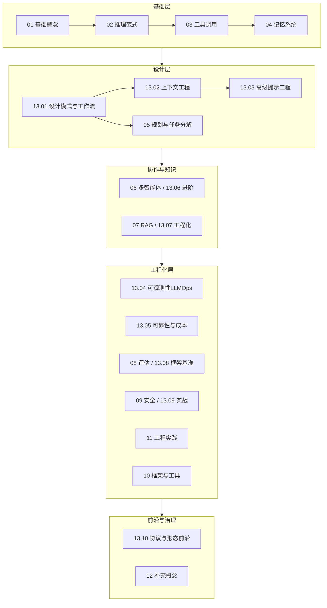

# Agent 开发知识体系 · 全景与补遗地图

> 本文是《Agent 开发知识》体系的**导航与补遗说明**。原有 01–12 模块保持不变，本文与 `13-进阶与工程化/` 下其余文档均为**新增补项**，用于补齐关键知识盲区、打通工程化闭环。

---

## 1. 现有体系（01–12）覆盖评估

| 模块 | 深度 | 已覆盖要点 | 评价 |
|------|------|-----------|------|
| 01 基础概念 | 中 | Agent 定义、四组件、能力边界、分类 | 扎实，可作为入口 |
| 02 推理范式 | 中 | CoT、ReAct、Reflexion、Plan-and-Solve、ToT、Self-Consistency | 推理范式覆盖较全 |
| 03 工具调用 | 深 | Function Calling、MCP 协议/工程/接入、并行调用、模型锁定 | **本体系最完整的部分之一** |
| 04 记忆系统 | 极深 | 三层记忆、检索/召回/重排、跨 embedding 模型、Memory.md | **本体系最完整的部分** |
| 05 规划与任务分解 | 极深 | 规划形态、重规划、LangGraph 全 API、人在环上、图治理 | **本体系最完整的部分** |
| 06 多智能体 | 浅 | 编排模式、角色、协作机制 | ⚠️ 偏概念，缺通信/共识/框架实战 |
| 07 RAG 与知识集成 | 浅 | Agentic RAG 作为工具、集成模式 | ⚠️ 缺 RAG 工程化（切分/混合检索/GraphRAG/评测） |
| 08 评估与调试 | 浅 | 评估方式、指标、失败模式 | ⚠️ 缺具体评测框架与基准详解 |
| 09 安全与护栏 | 浅 | 三层护栏、Prompt Injection 防御 | ⚠️ 缺 OWASP Top10、防护工具、红队 |
| 10 框架与工具 | 中 | 框架对比、OpenAI API 协议 | 够用，OpenAI.md 很实用 |
| 11 工程实践 | 浅 | 部署、成本、监控、迭代 | ⚠️ 偏提纲，缺可靠性/可观测性/成本工程深挖 |
| 12 补充概念 | 中 | Skill、Agent.md/Memory.md、Skill Router | 视角独特，偏"配置治理" |

**结论**：基础概念 → 推理 → 工具 → 记忆 → 规划这条"主干链路"非常扎实；**薄弱点在工程化闭环**（可观测、可靠性、成本）、**评测落地**、**安全实战**、**多智能体/RAG 的进阶工程细节**，以及若干 2025–2026 的新兴主题（上下文工程、Agent 设计模式、A2A 协议、Computer Use、语音 Agent）。

---

## 2. 关键知识遗漏点（补项清单）

按重要性分级，对应本目录下新增文档：

### 🔴 高优先（结构性缺失，建议必读）
- **Agent 设计模式 / 工作流模式** —— Anthropic 提出的 5 类模式（Prompt Chaining / Routing / Parallelization / Orchestrator-Worker / Evaluator-Optimizer）与"Workflow vs Agent"边界判断。当前零散出现在规划篇，无独立体系。→ `01-Agent设计模式与工作流.md`
- **上下文工程（Context Engineering）** —— 2025 起的独立学科：如何构造/压缩/管理上下文窗口。当前隐含在记忆篇，无专论。→ `02-上下文工程.md`
- **高级提示工程** —— 系统提示设计、few-shot、约束生成、分隔符、角色设定。全体系依赖 prompt 却无专篇。→ `03-高级提示工程.md`

### 🟠 中优先（工程化闭环补全）
- **可观测性与 LLMOps** —— Trace/Span、生产监控、评估上线。当前仅一两句。→ `04-可观测性与LLMOps.md`
- **可靠性与成本工程** —— 重试/降级/熔断/幂等；token 经济、Prompt Caching、模型路由、Batch。→ `05-可靠性与成本工程.md`
- **多智能体进阶** —— 通信协议、共识/辩论、具体框架（AutoGen GroupChat、CrewAI Process）、失败模式。→ `06-多智能体进阶.md`
- **RAG 工程化与 GraphRAG** —— 切分策略、混合检索、Self-RAG、GraphRAG、RAG 评测（补 07 模块）。→ `07-RAG工程化与GraphRAG.md`
- **评测框架与基准详解** —— Ragas/DeepEval/PromptFoo；SWE-bench/τ-bench/AgentBench/WebArena（补 08 模块）。→ `08-评测框架与基准详解.md`
- **安全实战：OWASP 与防护** —— LLM Top 10、越狱、数据外泄、护栏工具（补 09 模块）。→ `09-安全实战OWASP与防护.md`

### 🟡 前瞻（了解即可，拓宽视野）
- **Agent 协议与形态前沿** —— A2A、Computer Use/GUI Agent、语音/实时 Agent、Agent UX。→ `10-Agent协议与形态前沿.md`

---

## 3. 完整知识体系全景（建议的 13 大模块）

> 阅读顺序建议：**基础层 → 设计层 → 协作与知识 → 工程化层 → 前沿**。原有 01–12 主干已能让你"搭起来"，13 模块让你"搭得稳、测得准、上得了生产"。

---

## 4. 推荐学习路径（补项视角）

1. **先补范式判断**：读 `01-Agent设计模式与工作流`，建立"什么时候该用 Agent、什么时候只是 Workflow"的判断力——这是避免过度工程的第一步。
2. **再补上下文与提示**：`02-上下文工程` + `03-高级提示工程`，这是所有节点"内在智能"的来源。
3. **打通工程化闭环**：`04 可观测` → `05 可靠性与成本` → `08 评测框架` → `09 安全实战`，让 Agent 从 demo 走向生产。
4. **补强协作与知识**：`06 多智能体进阶` + `07 RAG 工程化`。
5. **开阔视野**：`10 协议与形态前沿`，了解 Agent 生态走向（A2A、Computer Use、Voice）。

---

## 5. 与原有文档的关系

- **不修改**原有 01–12 任何文件，所有补项为新增。
- 补项与原有模块的对应（避免重复阅读）：
  - `13.01 设计模式` ⊕ `05 规划`（规划篇重 LangGraph 实现，本篇重模式选型）
  - `13.02 上下文工程` ⊕ `04 记忆`（记忆篇重"记忆存取"，本篇重"上下文构造与压缩"）
  - `13.06 多智能体进阶` ⊕ `06 多智能体`（原篇重概念，本篇重机制与框架）
  - `13.07 RAG工程化` ⊕ `07 RAG`（原篇重"作为工具"，本篇重"RAG 本身怎么做"）
  - `13.08 评测框架` ⊕ `08 评估`（原篇重方法论，本篇重工具与基准）
  - `13.09 安全实战` ⊕ `09 安全`（原篇重"三层护栏"，本篇重"威胁清单与防护工具"）

---

## 6. 学习要点
- 现有体系主干扎实，补项是"工程化闭环 + 新兴主题"的填空。
- 优先级：设计模式 / 上下文工程 / 提示工程 > 可观测 / 可靠性成本 / 评测 / 安全 > 前沿。
- 补项之间也存在依赖：先理解设计模式，再谈可靠性与可观测。

## 7. 参考资料
- Anthropic, "Building Effective Agents"（设计模式分类的源头）
- "Context Engineering for AI Agents"（2025 上下文工程综述性讨论）
- OWASP LLM Top 10 (2025)
- LangSmith / Langfuse / Ragas / DeepEval 官方文档
