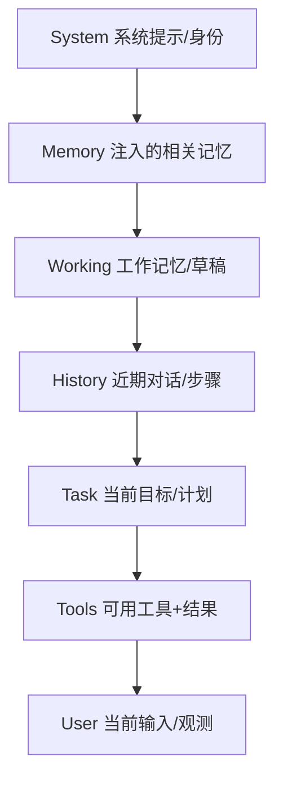

# 上下文工程（Context Engineering）

> 一句话定义：上下文工程是"为每一次 LLM 调用，动态构造最优输入上下文"的学科——比提示词更系统，是 Agent 可靠性的核心杠杆。

## 1. 为什么从"提示工程"升级到"上下文工程"

- 单轮对话：写好 system + user 即可（提示工程）。
- 多步 Agent：每一步要注入**工具结果、记忆、历史、计划、当前状态**——靠手写好提示已不可能，需**程序化地拼装与裁剪上下文**。
- 名言（Shannon Vallor / 社区共识）："提示工程是写一次提示；上下文工程是为每一步动态构造正确的上下文。"

核心矛盾：**上下文窗口有限 vs 信息需求无限**。上下文工程解决"放什么、放多少、放哪里、何时丢"。

---

## 2. 上下文的构成层（每步调用该拼什么）

注入顺序遵循 `04-记忆系统`：靠前的位置权重更高，把"硬约束/背景"放在 system 之后、history 之前。

---

## 3. 四大上下文操作

### 3.1 选择（Selection）
只把**与当前任务相关**的信息放进上下文。
- 记忆：向量召回 Top-K（见 04 模块）。
- 工具：当前步骤只暴露相关工具（10–20 个上限，见 03 模块）。
- 历史：只保留最近 N 轮 + 关键决策摘要。

### 3.2 压缩（Compression）
信息太多时压缩，而非丢弃。
- **摘要**：把旧对话/长文档压成短摘要（04 模块已有）。
- **结构化抽取**：只取字段（如"订单号、金额"而非整页 HTML）。
- **裁剪工具返回**：长 JSON 只留关键字段（03 模块原则）。

### 3.3 分层（Layering）
不同信息用不同策略（详见 `12-补充概念/02-Agent.md与Memory.md规范` 的 L1–L5 分层）：
- 稳定硬约束（用户偏好）→ 全量注入。
- 历史决策 → 摘要注入。
- 海量过往 → 按需召回（向量库）。

### 3.4 淘汰（Eviction）
超出预算时丢弃最低价值信息。
- 按"时间衰减 + 重要性分数"淘汰（04 模块遗忘机制）。
- 预算控制：注入总量占上下文 10–20%，留空间给对话。

---

## 4. 上下文工程的反模式

| 反模式 | 后果 | 对策 |
|--------|------|------|
| 全量注入 Memory.md | 撑爆窗口、淹没任务 | 分层按需注入 |
| 把整页 HTML/长日志丢给 LLM | 注意力分散、成本飙升 | 结构化抽取 + 裁剪 |
| 工具一次暴露 50+ | 模型误选、遵从下降 | 按场景分组、动态装载 |
| 历史无压缩无限累积 | 早期信息被挤出、目标漂移 | 定期摘要（见 05、08 模块失败模式） |
| 系统提示塞满所有约束 | 重要约束被稀释 | 分文件 + 按需加载（Agent.md/子图） |

---

## 5. 与记忆系统的关系
- **记忆系统**解决"信息如何存、如何跨会话召回"（04 模块：存/取/忘）。
- **上下文工程**解决"召回到的信息如何组装进这一次调用"（本篇：选/压/层/淘）。
- 二者是上下游：记忆的产出 → 上下文工程的输入。

---

## 6. 实战清单
1. 画出你的 Agent 每步调用的上下文构成层。
2. 给每层设"预算上限"（token 数）。
3. 超预算时优先压缩/淘汰**历史**，保住**硬约束**与**当前任务**。
4. 对长工具返回做结构化裁剪（只取 LLM 下一步需要的字段）。
5. 可观测：记录每次实际注入的 token 数（见 `04-可观测性与LLMOps`）。

---

## 7. 学习要点
- 上下文工程 = "为每步调用程序化构造最优上下文"，是 Agent 可靠性的核心。
- 四大操作：选择、压缩、分层、淘汰。
- 与记忆系统互补：记忆管"存取"，上下文工程管"组装"。

## 8. 参考资料
- "Context Engineering for AI Agents"（2025 社区讨论集大成）
- Anthropic Engineering Blog（上下文/长任务相关）
- `04-记忆系统`、`12-补充概念/02-Agent.md与Memory.md规范`
