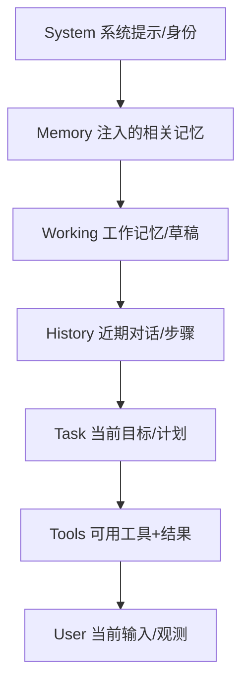

# 上下文工程（Context Engineering）

> 一句话定义：上下文工程是"为每一次 LLM 调用，动态构造最优输入上下文"的学科——比提示词更系统，是 Agent 可靠性的核心杠杆。

## 1. 为什么从"提示工程"升级到"上下文工程"

- 单轮对话：写好 system + user 即可（提示工程）。
- 多步 Agent：每一步要注入**工具结果、记忆、历史、计划、当前状态**——靠手写好提示已不可能，需**程序化地拼装与裁剪上下文**。
- 名言（Shannon Vallor / 社区共识）："提示工程是写一次提示；上下文工程是为每一步动态构造正确的上下文。"

核心矛盾：**上下文窗口有限 vs 信息需求无限**。上下文工程解决"放什么、放多少、放哪里、何时丢"。

---

## 2. 上下文的构成层（每步调用该拼什么）


```mermaid
flowchart TD
    S[System 系统提示/身份] --> M[Memory 注入的相关记忆]
    M --> W[Working 工作记忆/草稿]
    W --> H[History 近期对话/步骤]
    H --> T[Task 当前目标/计划]
    T --> TO[Tools 可用工具+结果]
    TO --> U[User 当前输入/观测]
```

注入顺序遵循 `04-记忆系统`：靠前的位置权重更高，把"硬约束/背景"放在 system 之后、history 之前。

---

## 3. 四大上下文操作

### 3.1 选择（Selection）
只把**与当前任务相关**的信息放进上下文。
- 记忆：向量召回 Top-K（见 04 模块）。
- 工具：当前步骤只暴露相关工具（10–20 个上限，见 03 模块）。
- 历史：只保留最近 N 轮 + 关键决策摘要。

### 3.2 压缩（Compression）
信息太多时压缩，而非丢弃。
- **摘要**：把旧对话/长文档压成短摘要（04 模块已有）。
- **结构化抽取**：只取字段（如"订单号、金额"而非整页 HTML）。
- **裁剪工具返回**：长 JSON 只留关键字段（03 模块原则）。

### 3.3 分层（Layering）
不同信息用不同策略（详见 `12-补充概念/02-Agent.md与Memory.md规范` 的 L1–L5 分层）：
- 稳定硬约束（用户偏好）→ 全量注入。
- 历史决策 → 摘要注入。
- 海量过往 → 按需召回（向量库）。

> 工程化实现：OpenViking 把「分层」做成 L0 摘要 / L1 概览 / L2 正文三级渐进加载，见 §6。

### 3.4 淘汰（Eviction）
超出预算时丢弃最低价值信息。
- 按"时间衰减 + 重要性分数"淘汰（04 模块遗忘机制）。
- 预算控制：注入总量占上下文 10–20%，留空间给对话。

### 3.5 落地示例：一次调用里的四个操作

场景：电商客服 Agent 「小智」，单次回答前要组装上下文。上下文窗口 128k，预算按 15% 计，约 19 200 **Token** /ˈtəʊkən/ （此处指计费与上下文的最小文本单位）。

| 构成层 | 预算 | 不做工程（实测） | 做过工程（实测） | 用到的操作 |
|---|---|---|---|---|
| System 身份/边界 | 1 500 | 1 420 | 1 420 | 选择 |
| Memory 用户 + 任务记忆 | 3 000 | 6 800（全量注入偏好与事件） | 1 900（只注入命中的偏好 + 最近 3 条事件） | 分层 + 压缩 |
| Resource 知识 | 8 000 | 12 400（Top-K 全文 chunk） | 3 100（摘要筛选 → 概览导航 → 只读 1 篇正文） | 分层 |
| History 对话历史 | 4 000 | 8 600（无限累积） | 2 400（摘要 + 最近 6 轮） | 压缩 + 淘汰 |
| Task + Tools | 2 000 | 2 100 | 2 100 | 选择 |
| **合计** | **19 200** | **31 320（超窗，被迫硬截断）** | **10 920** | — |

四个操作组合后，同一次调用的注入量从 31 320 降到 10 920 token（降约 65%），同时把「硬约束 + 当前任务」完整保住。这套人工纪律，正是 §6 里 OpenViking 想用「目录即索引 + L0/L1/L2」自动化掉的部分。

---

## 4. 上下文工程的反模式

| 反模式 | 后果 | 对策 |
|--------|------|------|
| 全量注入 Memory.md | 撑爆窗口、淹没任务 | 分层按需注入 |
| 把整页 HTML/长日志丢给 LLM | 注意力分散、成本飙升 | 结构化抽取 + 裁剪 |
| 工具一次暴露 50+ | 模型误选、遵从下降 | 按场景分组、动态装载 |
| 历史无压缩无限累积 | 早期信息被挤出、目标漂移 | 定期摘要（见 05、08 模块失败模式） |
| 系统提示塞满所有约束 | 重要约束被稀释 | 分文件 + 按需加载（Agent.md/子图） |

---

## 5. 与记忆系统的关系
- **记忆系统**解决"信息如何存、如何跨会话召回"（04 模块：存/取/忘）。
- **上下文工程**解决"召回到的信息如何组装进这一次调用"（本篇：选/压/层/淘）。
- 二者是上下游：记忆的产出 → 上下文工程的输入。

---

## 6. 工程化实例：OpenViking —— 把上下文做成数据库

> **一句话** ：字节跳动火山引擎开源的 **OpenViking** /ˈəʊpən ˈvaɪkɪŋ/ ，把「选择 / 压缩 / 分层 / 淘汰」从一个函数实现升级为一个 **上下文数据库（ Context Database /ˈkɒntekst ˈdeɪtəbeɪs/ ）** ——用文件系统范式统一管理记忆、资源、技能三类上下文。2026-01 开源，GitHub 约 3.6 万 Star（2026-09），服务端 AGPLv3、SDK 与 CLI 为 Apache-2.0，Python + Rust 实现。

### 6.1 为什么它属于「上下文工程」

§5 讲了记忆与上下文工程的分工。OpenViking 的价值在于：它不满足于「帮你召回几段文本」，而是把 §2 的上下文构成层中 Memory、Resource、Skill 三块收敛到**同一套存储 + 同一套 API**：

| 本篇的操作 | 传统做法 | OpenViking 的做法 |
|---|---|---|
| 选择 | 向量 Top-K 一把抓 | 先按目录定位（ `grep` / `find` ），再在子树内检索 |
| 压缩 | 摘要、截断 | 写入时自动生成 L0/L1（ `.abstract.md` / `.overview.md` ） |
| 分层 | 手写注入规则 | 内置 L0/L1/L2 渐进加载，按需深入 |
| 淘汰 | 按时间/重要性丢 | 目录递归检索 + 预算控制，天然「只读有关的」 |

### 6.2 文件系统范式：路径即索引

所有上下文分配唯一 **URI** /ˌjuː ɑːr ˈaɪ/ （ **Uniform Resource Identifier** /ˈjuːnɪfɔːm rɪˈsɔːs aɪˈdentɪfaɪə/ ，统一资源标识符），形如 `viking://`：

```text
viking://
├── resources/                 # 知识资源：项目文档、代码库、网页
├── user/{user_id}/
│   ├── memories/              # 用户记忆：preferences / events / entities / profile
│   ├── skills/                # 用户私有技能
│   └── sessions/              # 会话上下文
└── agent/skills/              # 全局共享技能
```

Agent 对上下文的操作变成文件操作：`ls`、`tree`、`read`、`grep`、`find`。三个直接收益：

- **路径自带语义**：「哪个项目、什么类型」写在目录里，不必靠猜。
- **统一接口**：记忆、知识、技能共用一套命令。
- **可追踪**：每次操作都有路径与轨迹，出错能定位到具体一环。

> 类比：传统 **RAG** /ˌɑːr eɪ ˈdʒiː/ （ **Retrieval-Augmented Generation** /rɪˈtriːvl ˈɔːɡmentɪd ˌdʒenəˈreɪʃn/ ，检索增强生成）像搜索引擎——返回片段，不知出处；OpenViking 像文件管理器——左边目录树、右边内容，每段知识都知道自己住在哪个目录。

### 6.3 L0/L1/L2 渐进加载

| 级别 | 对应文件 | 默认上限 | 用途 |
|---|---|---|---|
| **L0** Abstract 摘要 | `.abstract.md` | 256 字符（约 10 token） | 向量召回、快速过滤 |
| **L1** Overview 概览 | `.overview.md` | 4 000 字符（约 350 token） | 重排、内容导航 |
| **L2** Details 正文 | 正文文件 | 无统一上限 | 真正需要时才读 |

两个易踩的细节：L0/L1 是**目录级** **sidecar** /ˈsaɪdkɑː/ （不是每个文件都有），且由 LLM 异步自底向上生成，因此不保证同时存在。

**数字对比**（查询「怎么部署」）：

| 步骤 | 传统 RAG | OpenViking |
|---|---|---|
| 第一轮 | 全部 chunk 约 2 000 token | L0 摘要约 10 token |
| 第二轮 | — | L1 概览约 350 token |
| 第三轮 | — | L2 正文约 120 token |
| **合计** | **约 2 000** | **约 480（省 76%）** |

### 6.4 目录递归检索与可观测

检索是「先锁定高分目录、再精细探索」：意图分析 → 初始定位（全局向量 Top-10）→ 目录内二次检索 → 有子目录就递归下探 → 汇总结果。

| 命令 | 语义 | 返回内容 |
|---|---|---|
| `ov grep "OpenViking" --uri viking://resources/tech-docs/ai` | 精确匹配，限定子树 | 命中的完整 URI 路径 |
| `ov find "cost effective embedding model"` | 语义搜索 | `context_type` / `uri` / `level` / `score` / `abstract` |

检索轨迹可视化（对应 §7 实战清单里的「可观测」）：`ov observer retrieval`（查询数、结果数、空结果率、延迟）、`ov observer queue`（Pending / Errors）、`ov observer filesystem`（读操作延迟分布）。传统 RAG 的黑盒链路，在这里变成了可审计的路径记录。

### 6.5 会话结束就沉淀：记忆自迭代

会话生命周期是 Create → Interact → **Commit**：`commit` 同步归档原始消息（ `messages.jsonl` ），异步做摘要与记忆抽取：

```text
Messages → LLM 抽取 → 候选记忆 → 向量预过滤找相似项
         → LLM 去重决策（skip / create / merge / delete）→ 写入存储 → 向量化
```

内置记忆类型分三组（可按业务扩展）：

- 用户与环境：`profile`、`preferences`、`entities`、`events`
- 助手连续性：`identity`、`soul`
- 任务执行与学习：`cases`、`trajectories`、`experiences`、`tools`、`skills`

每次 commit 都会写 `memory_diff.json` 审计日志并支持回滚——这正是 §3.4「淘汰」需要的「可审计的遗忘」：删了什么、合并了什么，都有据可查。

### 6.6 落地示例

**示例 A：一次调用里的 L0 → L1 → L2（Node.js + TypeScript）**

官方提供 TypeScript SDK，HTTP-only，适合嵌进 Agent 的上下文装配流程：

```typescript
import { OpenVikingClient } from "@openviking/sdk";

const BASE_URL = process.env.OPENVIKING_URL ?? "http://localhost:1933";
const API_KEY = process.env.OPENVIKING_API_KEY ?? "";

const viking = new OpenVikingClient({ baseUrl: BASE_URL, apiKey: API_KEY });

interface Hit {
  uri: string;
  level: "L0" | "L1" | "L2";
  score: number;
  abstract: string;
}

/** L0/L1/L2 走同一套 content 端点，仅路径不同 */
async function readLevel(uri: string, level: "L0" | "L1" | "L2"): Promise<string> {
  const path = level === "L0" ? "abstract" : level === "L1" ? "overview" : "read";
  const res = await fetch(
    `${BASE_URL}/api/v1/content/${path}?uri=${encodeURIComponent(uri)}`,
    { headers: { "X-API-Key": API_KEY } },
  );
  const body = (await res.json()) as { status: string; result?: { content?: string } };
  return body.result?.content ?? "";
}

/**
 * 渐进加载：先用 search 拿候选（自带 L0 摘要），
 * 只有预算还够、且确实需要细节时才读 L1/L2。
 */
export async function loadResourceContext(query: string, budgetTokens = 1_500) {
  const hits = (await viking.search(query, {
    targetUri: "viking://resources",
  })) as unknown as Hit[];

  const picked: Array<{ uri: string; level: string; text: string }> = [];
  let used = 0;

  for (const hit of hits.slice(0, 8)) {
    if (used + 10 > budgetTokens) break; // L0 摘要约 10 token，几乎总是放得下
    picked.push({ uri: hit.uri, level: "L0", text: hit.abstract });
    used += 10;
  }

  const top = hits[0];
  if (top && used + 350 <= budgetTokens) {
    // L1 概览约 350 token：先导航，再决定要不要读 L2
    picked.push({ uri: top.uri, level: "L1", text: await readLevel(top.uri, "L1") });
    used += 350;
  }

  return { picked, used, budget: budgetTokens };
}
```

会话结束后提交，让记忆自动沉淀：

```typescript
const sessionId = "sess_2026_09_18__001"; // 由创建会话时返回

// 归档原始消息，并异步抽取 preferences / events / cases 等记忆
await fetch(`${BASE_URL}/api/v1/sessions/${sessionId}/commit`, {
  method: "POST",
  headers: { "X-API-Key": API_KEY },
});
```

命令行等价写法（脚本与 Agent 工具里更好用）：

```bash
ov tree viking://                            # 一条命令看清全部上下文
ov find "部署文档"                            # 语义检索
ov add-memory "新服务统一用 protobuf 定义接口"   # 追加一条记忆
ov observer retrieval                        # 检索质量
```

**示例 B：官方基准（接入前后，2026 年官方 README 口径）**

| 基准 | 被测 Agent | 指标 | 接入前 | 接入后 | 变化 |
|---|---|---|---|---|---|
| LoCoMo | OpenClaw | 跨会话记忆准确率 | 24.20% | 82.08% | **+57.9pp** |
| LoCoMo | Hermes | 跨会话记忆准确率 | 33.38% | 82.86% | **+49.5pp** |
| LoCoMo | Claude Code | 跨会话记忆准确率 | 57.21% | 80.32% | +23.1pp |
| LoCoMo | 全部 | 输入 Token | — | — | 降 34.3%~91.0% |
| LoCoMo | 全部 | 查询延迟 | — | — | 降 58.45%~66.10% |
| tau2-bench | — | 零售任务成功率 | 70.94% | 77.81% | +6.87pp |
| tau2-bench | — | 航空任务成功率 | 54.38% | 66.25% | +11.87pp |

> 官方数字基于自家模型栈，第三方复现通常有折损。建议先用自己业务的 50~100 条黄金集复测，再决定是否立项。

### 6.7 接入、选型与注意事项

**部署与接入**（服务端默认端口 `1933`）：

```bash
pip install openviking --upgrade
export OPENVIKING_CONFIG_FILE=~/.openviking/ov.conf
openviking-server doctor    # 校验配置
openviking-server           # 启动服务
```

- **MCP** /ˌem siː ˈpiː/ （ **Model Context Protocol** /ˈmɒdl ˈkɒntekst ˈprəʊtəkɒl/ ，模型上下文协议）：服务端内置 `/mcp` 端点，MCP 客户端可直连。Claude Code 一行接入：
  `claude mcp add --transport http openviking https://your-server.com/mcp --header "Authorization: Bearer <key>"` ；
  Cursor / Trae / ChatGPT 用标准 `mcpServers` 配置；Claude Desktop / Cursor 走内置 **OAuth 2.1** /ˈəʊɔːθ/ （Open Authorization，开放授权）授权流程。
- **集成生态**：Claude Code、Codex、Cursor、TRAE、OpenClaw、Hermes、OpenCode、LangChain / LangGraph，另有 WebDAV 与桌面端（beta）。
- **SDK** /ˌes diː ˈkeɪ/ （ **Software Development Kit** /ˈsɒftweə dɪˈveləpmənt kɪt/ ，软件开发工具包）：Python、Go、TypeScript（ `@openviking/sdk` ，Node.js 18+）三套，另有 REST 与 `ov` **CLI** /ˌsiː el ˈaɪ/ （ **Command-Line Interface** /kəˈmɑːnd laɪn ˈɪntəfeɪs/ ，命令行界面）。

**选型**：

| 你的需求 | 更合适的选择 |
|---|---|
| 只要「跨会话记住用户」 | Mem0（更轻、更专注） |
| 要 Agent 自身状态与自我进化 | Letta / MemGPT（运行态管理） |
| 要统一管理记忆 + 知识 + 技能 | OpenViking（文件系统范式，覆盖面最广） |

**注意事项**：

- 许可分层：**AGPLv3** /ˌeɪ dʒiː piː ˈel viː ˈθriː/ （ **Affero General Public License v3** ，Affero 通用公共许可证第 3 版）覆盖服务端代码，SDK / CLI 为 Apache-2.0。若以网络服务方式对外提供且修改过服务端代码，需向用户开放修改版本——做闭源商业 SaaS 前先评估。
- L0/L1 是**异步生成**的，刚写入的数据可能还没有摘要，要处理「目录尚未 ready」的窗口。
- 记忆抽取要过 LLM（抽取 + 去重两轮），有额外 Token 成本与延迟。
- 上限仍是信息质量：垃圾进、垃圾出，去重与过期策略仍需人工定规则。

---

## 7. 实战清单
1. 画出你的 Agent 每步调用的上下文构成层。
2. 给每层设"预算上限"（token 数）。
3. 超预算时优先压缩/淘汰**历史**，保住**硬约束**与**当前任务**。
4. 对长工具返回做结构化裁剪（只取 LLM 下一步需要的字段）。
5. 可观测：记录每次实际注入的 token 数（见 `04-可观测性与LLMOps`）。
6. 知识密集场景把「目录结构」当索引用：资源按业务目录组织，检索先定位目录、再读内容（见 §6 的 OpenViking）。
7. 给记忆加「可审计的遗忘」：删除/合并都要留差异记录，避免越整理越不可信（见 §6.5 的 `memory_diff.json`）。

---

## 8. 学习要点
- 上下文工程 = "为每步调用程序化构造最优上下文"，是 Agent 可靠性的核心。
- 四大操作：选择、压缩、分层、淘汰。
- 工程化路线：把上下文做成数据库——文件系统范式 + L0/L1/L2 渐进加载 + 目录递归检索（见 §6 的 OpenViking）。
- 「路径即索引」：目录结构本身就是导航，能同时改善召回质量与可观测性。
- 与记忆系统互补：记忆管"存取"，上下文工程管"组装"。

## 9. 参考资料
- "Context Engineering for AI Agents"（2025 社区讨论集大成）
- Anthropic Engineering Blog（上下文/长任务相关）
- `04-记忆系统`、`12-补充概念/02-Agent.md与Memory.md规范`
- OpenViking 仓库：https://github.com/volcengine/OpenViking
- OpenViking 官方文档（简介 / API 概览 / MCP 客户端接入）：https://docs.openviking.ai/zh/getting-started/01-introduction
- 在线体验（Studio）：https://openviking.ai/studio
- 横向对比：Mem0、Letta（MemGPT）——记忆赛道的另外两种范式

---

## 10. 本文缩写

| 缩写 | 音标 | 全拼 | 中文 |
|---|---|---|---|
| **AGPLv3** | /ˌeɪ dʒiː piː ˈel viː ˈθriː/ | Affero General Public License v3 | Affero 通用公共许可证第 3 版 |
| **API** | /ˌeɪ piː ˈaɪ/ | Application Programming Interface | 应用程序编程接口 |
| **CLI** | /ˌsiː el ˈaɪ/ | Command-Line Interface | 命令行界面 |
| **HTML** | /ˌeɪtʃ tiː em ˈel/ | HyperText Markup Language | 超文本标记语言 |
| **JSON** | /ˈdʒeɪsən/ | JavaScript Object Notation | 一种数据交换格式 |
| **LLM** | /ˌel el ˈem/ | Large Language Model | 大语言模型 |
| **MCP** | /ˌem siː ˈpiː/ | Model Context Protocol | 模型上下文协议 |
| **OAuth** | /ˈəʊɔːθ/ | Open Authorization | 开放授权 |
| **RAG** | /ˌɑːr eɪ ˈdʒiː/ | Retrieval-Augmented Generation | 检索增强生成 |
| **SDK** | /ˌes diː ˈkeɪ/ | Software Development Kit | 软件开发工具包 |
| **URI** | /ˌjuː ɑːr ˈaɪ/ | Uniform Resource Identifier | 统一资源标识符 |
