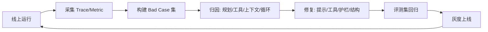

# 可观测性与 LLMOps

> 一句话定义：可观测性让 Agent 的"黑盒推理"变得可追踪、可量化、可回归；LLMOps 是把 Agent 当作持续运维的生产系统来管理的实践。

## 1. 为什么 Agent 特别需要可观测性

- **非确定性**：同一输入可能走出不同轨迹，传统日志不够。
- **长链路**：多步工具调用 + 循环，失败难定位（见 08 模块失败模式）。
- **成本高波动**：token 随轨迹长度剧烈变化。
- 原则（08 模块已点出）：**无日志无从调试**。本篇讲"具体怎么做"。

---

## 2. 三大支柱：Trace / Span / Metric

### Trace（全链路追踪）
一次用户请求 → 完整轨迹（每步 thought / action / observation / token）。
- 树状结构：一次对话 = 1 个 trace，每步 = 1 个 span。

### Span（跨度）
轨迹中的单个步骤，记录：
```
span = {
  type: "llm_call" | "tool_call" | "retrieval" | "node",
  input, output,
  latency_ms, token_in, token_out, cost,
  model, error?
}
```
- 嵌套：父 span（节点）→ 子 span（内部 LLM 调用、工具调用）。

### Metric（指标）
聚合后的时序数据（见 11 模块监控）：成功率、延迟 P50/P95、成本、工具错误率。

---

## 3. 必须记录的关键信息

| 类别 | 记录内容 | 用途 |
|------|---------|------|
| 推理 | 每步 prompt、completion、tool_calls | 复盘"为什么这么想" |
| 工具 | 调用名、参数、返回、耗时、错误 | 定位工具故障 |
| 检索 | query、召回 Top-K、分数 | 诊断记忆/知识质量问题 |
| 成本 | token_in/out、模型、费用 | 预算告警 |
| 异常 | 错误栈、重试次数、降级 | 故障归因 |

---

## 4. 主流工具

| 工具 | 定位 | 特点 |
|------|------|------|
| LangSmith | LangChain 生态 | trace、评测、数据集 |
| Langfuse | 开源、模型无关 | 自托管、成本追踪、prompt 版本 |
| Phoenix (Arize) | 开源 | RAG 检索质量、轨迹可视化 |
| OpenTelemetry | 通用标准 | 与现有 APM 打通 |
| Helicone / Literal | 轻量代理 | 一行接入、成本+延迟 |

> 选型：自研/多框架优先**模型无关 + 可自托管**（Langfuse）；LangChain 项目用 LangSmith。

---

## 5. LLMOps 闭环


- 与 11 模块"迭代闭环"一致，本篇强调**用 trace 驱动 bad case 采集**。
- 关键：把线上失败轨迹一键转成评测用例（LangSmith Dataset / Langfuse Sessions）。

---

## 6. 生产监控告警建议

- **质量**：任务成功率低于阈值告警；"看似完成"检测（输出与验收标准比对）。
- **成本**：单 trace token 超预算、日费用同比异常。
- **安全**：危险工具调用、注入尝试（见 09 模块）实时告警。
- **延迟**：P95 超 SLA。

---

## 7. 反模式
- ❌ 只记最终结果，不记中间步骤——无法归因。
- ❌ trace 含 PII/密钥——需脱敏（见 09、12 模块）。
- ❌ 上了工具却没人看 dashboard。
- ❌ 无评测集，回归靠"感觉"。

---

## 8. 学习要点
- 可观测性三支柱：Trace（链路）、Span（步骤）、Metric（指标）。
- Agent 必须"逐 span 记录"，否则长链路故障无法归因。
- LLMOps = 用 trace 驱动 bad case → 回归 → 灰度 的运维闭环。

## 9. 参考资料
- Langfuse / LangSmith / Phoenix 官方文档
- OpenTelemetry 文档
- `08-评估与调试`、`11-工程实践`
