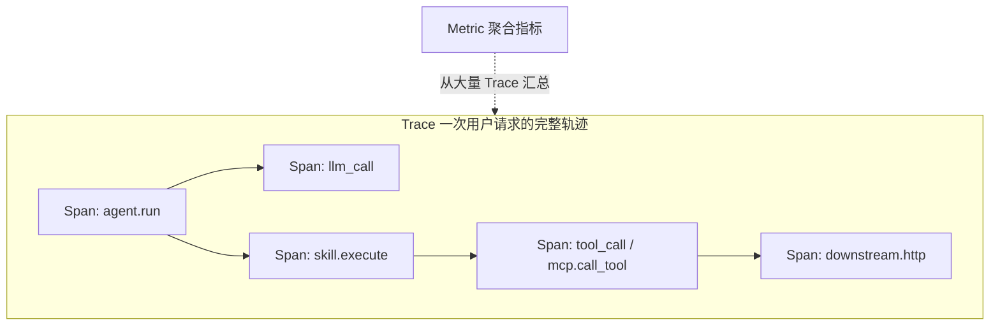
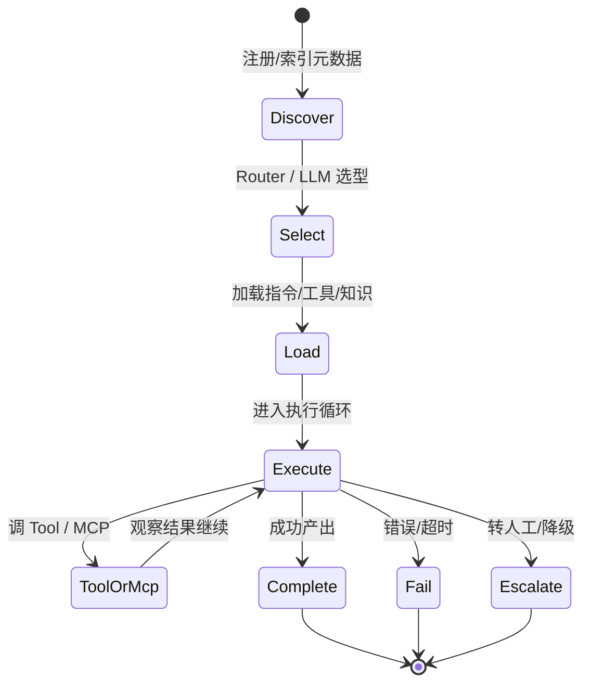
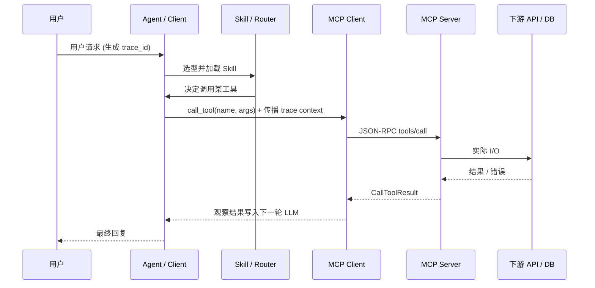

# 可观测性与 LLMOps

> 一句话定义： **可观测性** /əbˌzɜːvəˈbɪləti/ （ **Observability** ）让 Agent 的「黑盒推理」变得可追踪、可量化、可回归； **LLMOps** /ˌel el em ɒps/ （ **Large Language Model Operations** /lɑːdʒ ˈlæŋɡwɪdʒ ˈmɒdl ˌɒpəˈreɪʃnz/ ，大语言模型运维）把 Agent 当作持续运维的生产系统来管理。

---

## 1. 为什么 Agent 特别需要可观测性

- **非确定性**：同一输入可能走出不同轨迹，传统「只打最终日志」不够。
- **长链路**：多步工具调用 + 循环，失败难定位（见 [08 评估与调试](../08-评估与调试/01-评估与调试.md) 失败模式）。
- **分层调用**：用户请求 → Agent 循环 → **Skill** /skɪl/ （技能包）→ 本地 Tool / **MCP** /ˌem siː ˈpiː/ （ **Model Context Protocol** /ˈmɒdl ˈkɒntekst ˈprəʊtəkɒl/ ，模型上下文协议）→ 下游 API，任一环断都可能表现为「Agent 答错了」。
- **成本高波动**：token 随轨迹长度剧烈变化。
- 原则（08 模块已点出）： **无日志无从调试** 。本篇讲「具体怎么做」。

---

## 2. 可观测性三支柱：Trace / Span / Metric

业界把生产系统可观测性概括为三大支柱。Agent / LLM 场景同样适用，只是「一次请求」变成一棵 **推理-行动树** ，而不是单次 **RPC** /ˌɑːr piː ˈsiː/ （ **Remote Procedure Call** /rɪˈməʊt prəˈsiːdʒə kɔːl/ ，远程过程调用）。


```mermaid
flowchart TB
    subgraph Trace["Trace 一次用户请求的完整轨迹"]
        S1[Span: agent.run]
        S1 --> S2[Span: llm_call]
        S1 --> S3[Span: skill.execute]
        S3 --> S4[Span: tool_call / mcp.call_tool]
        S4 --> S5[Span: downstream.http]
    end
    M[Metric 聚合指标] -.从大量 Trace 汇总.-> Trace
```

### 2.1 Trace（全链路追踪）

**Trace** /treɪs/ ：一次用户请求（或一次会话回合）从进入到结束的 **完整调用树** 。

| 要点 | 说明 |
|------|------|
| 边界 | 通常：用户发消息 → Agent 终止（完成 / 超时 / 人审中断） |
| 标识 | 全局 `trace_id` ；跨进程时遵循 **W3C** /ˌdʌbljuː θriː ˈsiː/ （ **World Wide Web Consortium** /wɜːld waɪd web kənˈsɔːtiəm/ ） **Trace Context** /treɪs ˈkɒntekst/ （ `traceparent` 等） |
| 形态 | 树状：根 span = 本次 run；子 span = LLM / Skill / Tool / MCP / 检索 |
| 回答的问题 | 「这次任务整条链路发生了什么？卡在哪？烧了多少 token？」 |

Agent 场景的最小 Trace 契约：

```text
trace_id
├── agent.run                 # 根：输入、终止原因、总步数、总成本
│   ├── llm_call #1           # prompt / completion / tool_calls 候选
│   ├── skill.select          # Router 选了哪个 Skill、置信度/原因
│   ├── skill.execute         # Skill 生命周期（见 §3）
│   │   ├── llm_call #2
│   │   └── mcp.call_tool     # MCP 链路（见 §4）
│   │       └── http.request  # Server 内部下游
│   └── llm_call #N           # 最终作答
```

### 2.2 Span（步骤跨度）

**Span** /spæn/ ：Trace 上的一个有起止时间的节点，代表「做了一件事」。

推荐字段（可映射到 **OpenTelemetry** /ˌəʊpən ˌteləˈmetrɪ/ ，亦称 **OTel** /ˌəʊ ˈtel/ 的 GenAI semantic conventions）：

```text
span = {
  name,                          # e.g. "skill.execute:code-review"
  type: "agent" | "llm" | "skill" | "tool" | "mcp" | "retrieval" | "http",
  parent_span_id, trace_id,
  start_ms, end_ms, latency_ms,
  input_summary, output_summary, # 注意脱敏，见 §8
  attrs: {
    model, token_in, token_out, cost_usd,
    skill_name, skill_version,
    tool_name, mcp_server, mcp_transport,
    error_type, retry_count, status
  }
}
```

嵌套规则（务必遵守，否则链路「断成碎片」）：

1. **父包住子**：Skill span 必须包住其内部的 LLM / Tool / MCP span。
2. **同级并列**：同一步里并行的多个 tool 调用，是同一父 span 下的兄弟 span。
3. **跨进程续写**：Agent 调 MCP Server 时，把 `trace_id` / `parent_span_id` 经协议元数据或 HTTP 头传下去，Server 内新建子 span，而不是另起一个无关联 Trace。

### 2.3 Metric（指标）

**Metric** /ˈmetrɪk/ ：从大量 Trace / Span **聚合** 出的时序数据，用于看板与告警（单条 Trace 看细节，Metric 看趋势）。

| 层级 | 示例指标 | 用途 |
|------|---------|------|
| 任务级 | 任务成功率、完成率、人审率 | 质量 |
| 延迟 | 端到端 P50/P95；LLM / Tool / MCP 分位数 | **SLA** /ˌes el ˈeɪ/ （ **Service Level Agreement** /ˈsɜːvɪs ˈlevl əˈɡriːmənt/ ，服务级别协议） |
| 成本 | 单 trace token、日费用、按模型拆分 | 预算 |
| 工具 | 工具错误率、超时率、按 `tool_name` 分布 | 依赖健康 |
| Skill | Skill 选用率、成功率、平均步数、版本对比 | 能力治理 |
| MCP | Server 可用性、`call_tool` 延迟、按 Server 错误码 | 协议层健康 |
| 安全 | 危险工具触发次数、注入拦截次数 | 护栏 |

> 三支柱分工： **Trace 复盘个案，Span 定位步骤，Metric 驱动告警与容量** 。缺任一柱都会「看得见火、找不到着火点」或「修了个案、不知是否全局好转」。

### 2.4 与 Logs 的关系（常被误当成第四支柱）

结构化 **Log** /lɒɡ/ 仍然需要，但它是 **Span 的旁路细节** ，不是替代：

- Span：回答「做了什么、多久、成败」。
- Log：回答「某一步内部打印了什么」（异常栈、调试信息）。
- 生产建议：关键事件写 Span attributes；嘈杂细节写 Log，并用 `trace_id` 关联。

---

## 3. Skill 生命周期：调用链路如何监控与追踪

Skill 不是一次性函数调用，而是一段 **有状态的能力执行过程** 。可观测必须覆盖完整生命周期，否则只能看到「调了某个 tool」，看不到「为什么进了这个 Skill、卡在哪一阶段」。

### 3.1 生命周期阶段


```mermaid
stateDiagram-v2
    [*] --> Discover: 注册/索引元数据
    Discover --> Select: Router / LLM 选型
    Select --> Load: 加载指令/工具/知识
    Load --> Execute: 进入执行循环
    Execute --> ToolOrMcp: 调 Tool / MCP
    ToolOrMcp --> Execute: 观察结果继续
    Execute --> Complete: 成功产出
    Execute --> Fail: 错误/超时
    Execute --> Escalate: 转人工/降级
    Complete --> [*]
    Fail --> [*]
    Escalate --> [*]
```

| 阶段 | 监控点 | 建议 Span / 事件 |
|------|--------|------------------|
| **Discover** | Skill 是否被索引、描述是否可检索 | `skill.discover`（启动时批量一次即可） |
| **Select** | 谁选的、为何选、备选是谁、置信度 | `skill.select`（attrs: candidates, chosen, reason） |
| **Load** | 版本、注入的工具集、知识条目数、token 占用 | `skill.load`（attrs: version, tools[], prompt_tokens） |
| **Execute** | 内部步数、子 LLM 次数、终止原因 | `skill.execute`（父 span，包住全程） |
| **Tool / MCP** | 每次工具名、参数摘要、耗时、错误 | 子 span（见 §4） |
| **Complete / Fail / Escalate** | 输出契约是否满足、错误码、是否人审 | span status + 终态事件 |

### 3.2 推荐的关联 ID

一次 Skill 调用至少贯穿这些 ID（全部挂到同一 `trace_id` 下）：

| ID | 作用 |
|----|------|
| `trace_id` | 整次用户请求 |
| `span_id` / `parent_span_id` | 树形父子 |
| `skill_run_id` | 本次 Skill 执行实例（便于跨日志查询） |
| `skill_name` + `skill_version` | 能力与版本归因（行为漂移首选字段） |
| `router_decision_id` | 关联 Router 决策日志（见 [Skill Router](../12-补充概念/03-关于Agent%20Skill%20Router的几点思考.md)） |

### 3.3 链式 / 多 Skill 编排时怎么追

复杂任务常见：`debug` → `write-test` → `code-review`。

- 每个 Skill 一个 **独立的** `skill.execute` span，共享同一 `trace_id`。
- 编排层再包一层 `skill.pipeline` 父 span，attrs 记 `sequence: [...]` 与每步状态。
- 若 Skill A 内部又触发 Skill B（嵌套），必须父子嵌套，禁止「平铺且无 parent」——否则无法区分「编排串联」与「嵌套调用」。

### 3.4 最小埋点清单（可直接当验收标准）

- [ ] 能按 `skill_name` + `version` 过滤所有调用
- [ ] 能看到 Select 原因（或至少 candidates + chosen）
- [ ] Execute 内每一次 Tool/MCP 都是子 span，且可点开参数/返回摘要
- [ ] 失败时能区分：选错 Skill / Skill 内规划错 / 工具错 / MCP 下游错
- [ ] 有 Skill 级 Metric：成功率、P95、平均 token、版本对比

> 概念与设计见 [Skill 技能系统](../12-补充概念/01-Skill技能系统.md)；本篇只谈 **如何把生命周期变成可查询的链路** 。

---

## 4. MCP 工具调用链路：如何监控与追踪

MCP 把「工具」拆到独立进程/远端 Server。若只在 Agent 侧记一条 `tool_call`，会丢失 Server 内部耗时与下游错误——排查时只能猜「MCP 慢」还是「API 慢」。

### 4.1 端到端链路


```mermaid
sequenceDiagram
    participant U as 用户
    participant A as Agent / Client
    participant R as Skill / Router
    participant C as MCP Client
    participant S as MCP Server
    participant D as 下游 API / DB

    U->>A: 用户请求 (生成 trace_id)
    A->>R: 选型并加载 Skill
    R->>A: 决定调用某工具
    A->>C: call_tool(name, args) + 传播 trace context
    C->>S: JSON-RPC tools/call
    S->>D: 实际 I/O
    D-->>S: 结果 / 错误
    S-->>C: CallToolResult
    C-->>A: 观察结果写入下一轮 LLM
    A-->>U: 最终回复
```

对应 Span 树：

```text
agent.run
└── skill.execute
    └── mcp.client.call_tool          # Client 侧：序列化、传输、等待
        └── mcp.server.handle_call    # Server 侧：鉴权、执行 handler
            └── downstream.http       # 真正的外部依赖
```

### 4.2 每一跳记什么

| 跳 | 记录 | 常见故障信号 |
|----|------|-------------|
| Agent → 工具决策 | 模型选出的 tool 名、参数、是否并行 | 选错工具、参数幻觉 |
| MCP Client | `server_name`、transport（stdio/HTTP）、请求 ID、超时设置 | 连不上、握手失败、进程崩溃 |
| 传输层 | JSON-RPC method、往返耗时、取消/超时 | 管道阻塞、远程 502 |
| MCP Server handler | tool 名、参数校验结果、业务耗时 | schema 不符、权限拒绝 |
| 下游依赖 | URL/RPC 名（脱敏）、状态码、重试次数 | 限流、鉴权过期、慢查询 |
| 回传 Agent | 结果大小、截断策略、是否错误包装 | 上下文被超长结果炸满 |

### 4.3 上下文传播（断链是第一大坑）

目标： **Client 与 Server 落在同一条 Trace 上** 。

| 传输 | 推荐做法 |
|------|---------|
| **HTTP / Streamable HTTP** | 注入 `traceparent` / `tracestate`（W3C）；Server 中间件自动建子 span |
| **stdio** （本地子进程） | 在初始化 env 或自定义元数据中传入 `TRACE_ID` / `PARENT_SPAN_ID`；Server 启动时设为当前上下文 |
| 框架已集成 OTel | 优先用官方/社区 instrumentation，避免手写一半 |

无法改 Server 时的降级方案：

- Client 侧 span 记录完整 `call_tool` 耗时 + 错误码（至少知道「慢在 MCP 边界」）。
- Server 应用日志强制带 Client 传入的 `trace_id` 字符串，靠日志系统关联（弱关联，但强于没有）。

### 4.4 MCP 专属 Metric

- `mcp_call_total{server, tool, status}`
- `mcp_call_duration_ms` （P95 按 server/tool 拆）
- `mcp_server_up` / 握手失败率
- `mcp_result_bytes` （防返回体膨胀）
- `mcp_permission_denied_total` （安全信号，接 [09 安全](../09-安全与护栏/01-安全与护栏.md)）

### 4.5 排查口诀

1. Trace 里有没有 `mcp.server.handle_call`？ **没有 = 上下文没传播或 Server 未埋点** 。
2. Client 耗时长、Server 耗时短？ **传输或排队问题** 。
3. Server 耗时长、downstream 更长？ **下游依赖** ，别误伤 MCP 配置。
4. 工具名对但参数错？ **回到父级 llm_call span 看模型输出** ，不是 MCP 坏了。

> 协议与接入见 [MCP 协议](../03-工具调用/02-MCP协议.md)、[MCP 使用指南](../03-工具调用/04-MCP使用指南.md)；并行工具场景见 [批量工具调用](../03-工具调用/05-批量工具调用与并发处理.md)。

---

## 5. 必须记录的关键信息

| 类别 | 记录内容 | 用途 |
|------|---------|------|
| 推理 | 每步 prompt、completion、tool_calls | 复盘「为什么这么想」 |
| Skill | 选型原因、版本、加载内容摘要、终态 | 能力与版本归因 |
| 工具 | 调用名、参数、返回、耗时、错误 | 定位工具故障 |
| MCP | server、transport、RPC、下游状态 | 跨进程断点定位 |
| 检索 | query、召回 Top-K、分数 | 诊断记忆/知识质量问题 |
| 成本 | token_in/out、模型、费用 | 预算告警 |
| 异常 | 错误栈、重试次数、降级路径 | 故障归因 |

---

## 6. 主流工具

| 工具 | 定位 | 特点 |
|------|------|------|
| LangSmith | LangChain 生态 | trace、评测、数据集 |
| Langfuse | 开源、模型无关 | 自托管、成本追踪、prompt 版本 |
| Phoenix (Arize) | 开源 | RAG 检索质量、轨迹可视化 |
| OpenTelemetry | 通用标准 | 与现有 **APM** /ˌeɪ piː ˈem/ （ **Application Performance Monitoring** /ˌæplɪˈkeɪʃn pəˈfɔːməns ˈmɒnɪtərɪŋ/ ，应用性能监控）打通 |
| Helicone / Literal | 轻量代理 | 一行接入、成本+延迟 |
| Logfire | Pydantic 系 | 与 PydanticAI 深度集成（见 [PydanticAI 详解](../10-框架与工具/02-PydanticAI详解.md)） |

> 选型：自研/多框架优先 **模型无关 + 可自托管** （Langfuse / 纯 OTel）；LangChain 项目用 LangSmith；已上 PydanticAI 可优先 Logfire。

---

## 7. LLMOps 闭环


```mermaid
flowchart LR
    A[线上运行] --> B[采集 Trace/Metric]
    B --> C[构建 Bad Case 集]
    C --> D[归因: 规划/Skill/工具/MCP/上下文/循环]
    D --> E[修复: 提示/Skill/工具/护栏/结构]
    E --> F[评测集回归]
    F --> G[灰度上线]
    G --> A
```

- 与 11 模块「迭代闭环」一致，本篇强调 **用 trace 驱动 bad case 采集** 。
- 实践：把线上失败轨迹一键转成评测用例（LangSmith Dataset / Langfuse Sessions）。
- Skill / MCP 的版本号必须进数据集元数据，否则「修了 v1.2、回归却跑在 v1.1」。

---

## 8. 生产监控告警建议

- **质量**：任务成功率低于阈值；「看似完成」检测（输出与验收标准比对）。
- **Skill**：某 Skill 成功率骤降或版本发布后错误率上升 → 回滚该 Skill 版本。
- **MCP**：某 Server P95 飙升或握手失败 → 熔断该 Server（见 [可靠性与成本](./05-可靠性与成本工程.md)）。
- **成本**：单 trace token 超预算、日费用同比异常。
- **安全**：危险工具调用、注入尝试（见 09 模块）实时告警。
- **延迟**：端到端 P95 超 SLA；拆开看是 LLM、Skill 还是 MCP。

脱敏底线：trace 默认不下发密钥、完整身份证号、银行卡等 **PII** /ˌpiː aɪ ˈaɪ/ （ **Personally Identifiable Information** /ˌpɜːsənəli aɪˈdentɪfaɪəbl ˌɪnfəˈmeɪʃn/ ，个人身份信息）；工具参数做字段级红线（password/token/authorization）。

---

## 9. 反模式

- ❌ 只记最终结果，不记中间步骤——无法归因。
- ❌ Skill 只打一条日志「executed」，没有 Select/Load/子调用——版本与选型问题不可见。
- ❌ MCP 只在 Client 计时，Server 与下游无 span——跨进程断链。
- ❌ 并行 tool 共用一个 span 且无子节点——并发故障无法拆开。
- ❌ trace 含 PII/密钥——需脱敏（见 09、12 模块）。
- ❌ 上了工具却没人看 dashboard。
- ❌ 无评测集，回归靠「感觉」。

---

## 10. 学习要点

- 可观测性三支柱： **Trace** （链路）、 **Span** （步骤）、 **Metric** （指标）；Log 是补充不是替代。
- Agent 必须「逐 span 记录」，长链路故障才能归因到规划 / Skill / Tool / MCP / 下游。
- Skill 监控要覆盖 **Discover → Select → Load → Execute → 终态** ，并带 `name+version`。
- MCP 链路要 **跨 Client/Server 传播 trace context** ，否则只能看到边界耗时。
- LLMOps = 用 trace 驱动 bad case → 回归 → 灰度 的运维闭环。

---

## 11. 参考资料

- Langfuse / LangSmith / Phoenix / Logfire 官方文档
- OpenTelemetry 文档与 GenAI semantic conventions
- W3C Trace Context
- [08-评估与调试](../08-评估与调试/01-评估与调试.md)、[11-工程实践](../11-工程实践/01-工程实践.md)
- [Skill 技能系统](../12-补充概念/01-Skill技能系统.md)、[MCP 协议](../03-工具调用/02-MCP协议.md)

---

## 本文缩写

| 缩写 | 音标 | 全拼 | 中文 |
|---|---|---|---|
| **LLMOps** | /ˌel el em ɒps/ | Large Language Model Operations | 大语言模型运维 |
| **MCP** | /ˌem siː ˈpiː/ | Model Context Protocol | 模型上下文协议 |
| **OTel** | /ˌəʊ ˈtel/ | OpenTelemetry | 开放遥测 |
| **APM** | /ˌeɪ piː ˈem/ | Application Performance Monitoring | 应用性能监控 |
| **W3C** | /ˌdʌbljuː θriː ˈsiː/ | World Wide Web Consortium | 万维网联盟（本文指其 Trace Context 标准） |
| **SLA** | /ˌes el ˈeɪ/ | Service Level Agreement | 服务级别协议 |
| **PII** | /ˌpiː aɪ ˈaɪ/ | Personally Identifiable Information | 个人身份信息 |
| **RPC** | /ˌɑːr piː ˈsiː/ | Remote Procedure Call | 远程过程调用 |
