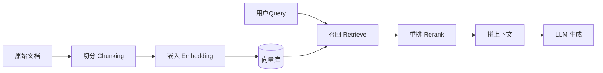

# RAG 工程化与 GraphRAG

> 一句话定义：07 模块讲了"RAG 作为 Agent 工具"，本篇讲"RAG 本身怎么做才靠谱"——切分、检索、重排、GraphRAG、评测，是知识密集型 Agent 的地基。

## 1. RAG 流水线全景

> 召回/重排细节 `04-记忆系统` 6.6–6.8 已极详尽（可直接复用），本篇补"切分"与"进阶形态"。

---

## 2. 切分策略（Chunking）

切分质量直接决定召回上限。

| 策略 | 做法 | 适用 |
|------|------|------|
| 固定长度 | 按 token/字符切块 | 通用兜底 |
| 语义切分 | 按段落/标题/句子边界 | 文档结构清晰 |
| 递归切分 | 逐级按 `\n\n`→`\n`→`.` 切 | LangChain 默认，较稳 |
| 结构感知 | 按 Markdown/代码 AST/表格切 | 代码、技术文档 |
| 父子块 | 小块检索、父块喂模型 | 兼顾精度与上下文 |

要点：
- 块太大→召回不精准；太小→丢失上下文。经验 256–512 token 起步，按任务调。
- 带**元数据**（来源、章节、时间）便于过滤（见 04 模块）。

---

## 3. 混合检索（Hybrid Search）

单路向量召回会漏（04 模块已论证）。生产用：
- **向量 + BM25** 双路召回，分数融合（RRF / 加权）。
- 可选：**向量 + 元数据/关键词** 多路（见 04 模块 6.7 多路召回）。
- 重排用 Cross-Encoder 精排 Top-K（04 模块 6.7）。

---

## 4. Self-RAG（反思式检索）

- 模型**自决**是否检索、检索什么、生成后是否需再检索/ critique。
- 比固定 pipeline 灵活，接近 07 模块的 Agentic RAG。
- 关键：引入"检索必要性"与"生成相关性"的反思 token，减少无效检索与幻觉。

---

## 5. GraphRAG（知识图谱 RAG）

微软提出：先用 LLM 从文档抽取**实体-关系**构建知识图谱，再检索子图。
- 解决传统向量 RAG 的**全局性/综述性问题**（"某公司所有产品趋势？"需要跨文档聚合）。
- 流程：文档 → 图提取 → 社区检测 → 社区摘要 → 检索时先定位社区再取摘要。
- 代价：构建成本高、更新复杂；适合**少更新、需全局洞察**的知识库。
- 关联：04 模块"结构化记忆/知识图谱"思路一致。

---

## 6. RAG 评测（RAG Evaluation）

不能只看"答案像不像"，要分层评：
| 层 | 指标 | 工具 |
|----|------|------|
| 检索 | Recall@K、MRR、NDCG | 人工标注 + 脚本 |
| 生成 |  faithfulness（不幻觉）、answer relevancy | Ragas / DeepEval |
| 端到端 | 任务成功率 | 见 13.08 评测框架 |

常见故障：召回错（改切分/重排）、上下文干扰（裁剪/重排）、幻觉（强约束 + 引用校验，07 模块已提）。

---

## 7. 与 Agent 的结合要点
- RAG 是 Agent 的"知识工具"之一（07 模块），但多条知识工具可并存（文档库 + 数据库 + 搜索）。
- Agentic RAG：让 Agent 决定**多跳检索路径**（07 模块多跳检索），比单跳更准。
- 检索质量决定知识类任务上限——投入切分/重排/评测的性价比极高。

---

## 8. 反模式
- ❌ 不做切分直接整篇嵌入 → 召回极粗。
- ❌ 只用向量、不用 BM25 → 专有名词/数字漏召。
- ❌ 不评测检索质量 → 幻觉归咎于 LLM，实则召回错。
- ❌ 频繁更新的库硬上 GraphRAG → 构建成本失控。

---

## 9. 学习要点
- 切分策略决定召回上限；混合检索（向量+BM25）+ 重排是生产标配。
- Self-RAG / Agentic RAG 让检索更自适应。
- GraphRAG 解决全局综述问题，但构建贵、更新难。
- RAG 必须分层评测（检索 / 生成 / 端到端）。

## 10. 参考资料
- "Self-RAG"、"GraphRAG"（Microsoft）
- LangChain / LlamaIndex RAG 文档
- Ragas / DeepEval 评测文档
- `04-记忆系统`、`07-RAG与知识集成`
