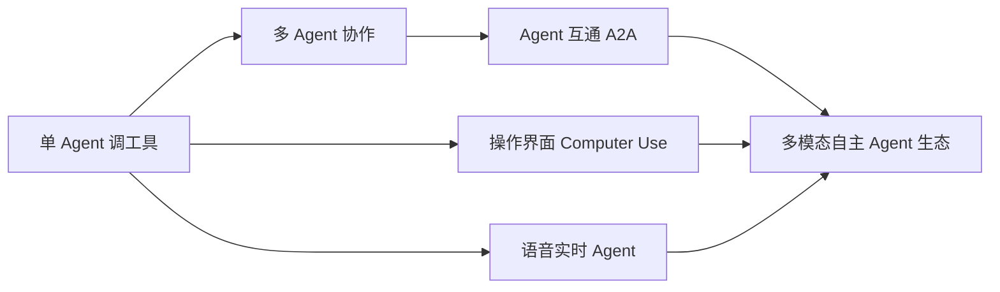

# Agent 协议与形态前沿

> 一句话定义：Agent 生态正在从"单 Agent 会调工具"走向"多 Agent 互通 + 会操作界面 + 能说话"——本篇梳理 A2A 协议、Computer Use、语音 Agent 与 Agent UX 等新兴方向。

## 1. Agent 间通信协议：A2A

- **背景**：MCP 解决了"Agent ↔ 工具"的标准化（03 模块）；但"Agent ↔ Agent"如何互通仍是各厂商孤岛。
- **A2A（Agent2Agent，Google 2025 提出）**：让不同厂商/框架的 Agent 互相发现能力、委派任务、交换结果。
  - 核心概念：Agent Card（能力描述）、Task（任务对象）、消息/产物交换。
  - 与 MCP 互补：**MCP 连工具，A2A 连 Agent**。
- **ANP（Agent Network Protocol）** 等也在探索去中心化 Agent 网络。
- 关联：12 模块 Skill Router 是"单系统内的调度"，A2A 是"跨系统的调度"。

---

## 2. Computer Use / GUI Agent（操作界面型）

- 让 Agent 像人一样操作图形界面：看截图 → 规划点击/输入 → 执行。
- 代表：Claude Computer Use、OSWorld 基准、浏览器 Agent（见 13.08 WebArena）。
- 形态：
  - **浏览器 Agent**：操作网页（填表、下单、查信息）。
  - **桌面/OS Agent**：操作本地应用（文件、软件）。
- 工程要点：
  - 视觉理解 + 动作空间（click/type/scroll）建模。
  - 高风险操作需人在环上（09 模块）。
  - 沙箱隔离，防误操作宿主（09 模块沙箱）。

---

## 3. 语音 / 实时 Agent（Voice / Realtime）

- **Realtime API**（如 OpenAI Realtime）：语音进、语音出，低延迟自然对话。
- 形态：
  - 语音客服、语音助手、实时翻译。
  - 与 Agent 结合：语音 → 转写 → Agent 推理 → 语音合成。
- 工程要点：
  - 流式 + 中断（barge-in：用户插话即停）。
  - 延迟敏感（端到端 < 1s 体验佳）。
  - TTS/STT 选型与成本控制。
- 关联：10 模块 OpenAI API（音频端点）、流式。

---

## 4. Agent UX / 产品设计

Agent 产品与传统 App 不同，交互设计要点：
- **透明度**：展示 Agent 在做什么（步骤、调用了什么工具），建立信任。
- **可控性**：可中断、可纠偏、可回退（人在环上）。
- **延迟感知**：流式输出、先给中间进展，避免"转圈太久"。
- **失败优雅**：Agent 说"我做不完 X，因为 Y，需要你确认 Z"，而非静默出错。
- 关联：13.04 可观测性（用户侧可见 trace）、09 模块人在环上。

---

## 5. 合规与治理（Governance）

- **数据合规**：PII（GDPR / 个保法）、数据驻留（跨境注意）。
- **审计**：所有 Agent 行为可追溯（13.04、09 模块）。
- **AI 监管**：欧盟 AI Act 按风险分级；高风险应用需透明度与人工监督。
- **责任归属**：自动化决策的责任边界，需明确"人在环上"节点。

---

## 6. 形态演进小结

---

## 7. 学习要点
- MCP 连工具，A2A 连 Agent——二者是 Agent 互操作的两层标准。
- Computer Use / 语音 Agent 把 Agent 从"文本对话"扩展到"操作世界"。
- Agent UX 核心是透明、可控、低延迟感知。
- 合规：PII、数据驻留、审计、人在环上是底线。

## 8. 参考资料
- Google A2A Protocol 规范
- Anthropic Computer Use 文档、OpenAI Realtime API 文档
- OWASP LLM Top 10、EU AI Act
- `03-工具调用(MCP)`、`09-安全与护栏`、`13-进阶与工程化/04-可观测性与LLMOps`
