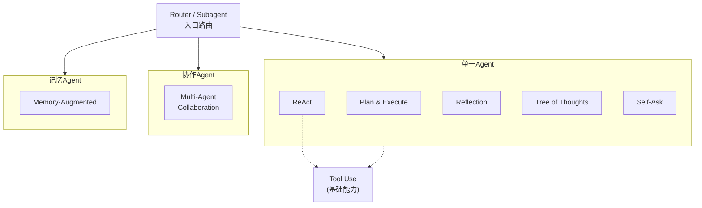
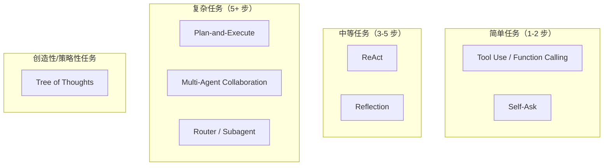

# Agent 设计模式总览

## 目录

| 序号 | 模式 | 核心思想 | 适用场景 |
|------|------|----------|----------|
| 01 | [ReAct](01-ReAct模式.html) | 思考→行动→观察，交替进行 | 需要工具和外部信息的多步任务 |
| 02 | [Plan-and-Execute](02-Plan-and-Execute模式.html) | 先制定完整计划，再逐步执行 | 复杂多步骤任务，可并行子任务 |
| 03 | [Reflection](03-Reflection模式.html) | 生成→反思→改进，迭代优化 | 需要高质量输出的生成任务 |
| 04 | [Multi-Agent Collaboration](04-Multi-Agent-Collaboration模式.html) | 多专业 Agent 协作完成任务 | 需要多领域协作的复杂项目 |
| 05 | [Tool Use / Function Calling](05-Tool-Use-Function-Calling模式.html) | Agent 调用外部工具获取能力 | 所有需要外部数据/操作的场景 |
| 06 | [Memory-Augmented](06-Memory-Augmented模式.html) | 持久化记忆，跨会话保持上下文 | 个性化助手、长期交互 |
| 07 | [Tree of Thoughts](07-Tree-of-Thoughts模式.html) | 探索多条推理路径，选择最优 | 需要创造性或策略性思考的难题 |
| 08 | [Self-Ask](08-Self-Ask模式.html) | 拆解为子问题，逐步自问自答 | 多跳问答、对比分析 |
| 09 | [Router / Subagent](09-Router-Subagent模式.html) | 意图路由到专业子代理处理 | 多功能平台、多领域服务 |

## 模式关系图



## 如何选择模式

### 按任务复杂度



### 按需求特征

| 需求 | 推荐模式 |
|------|----------|
| 需要调用外部 API | Tool Use |
| 需要动态调整策略 | ReAct |
| 需要高质量输出 | Reflection |
| 需要并行处理 | Plan-and-Execute |
| 需要团队分工 | Multi-Agent |
| 需要个性化/连续性 | Memory-Augmented |
| 需要多路径探索 | Tree of Thoughts |
| 需要拆解复杂问题 | Self-Ask |
| 需要领域路由 | Router/Subagent |

## 组合使用

实际项目中，这些模式经常组合使用：

### 示例 1：ReAct + Reflection + Memory

```python
class AdvancedAgent:
    """组合了 ReAct、Reflection 和 Memory 的 Agent"""
    
    def __init__(self):
        self.memory = VectorMemoryStore()        # Memory 模式
        self.tools = ToolRegistry()               # Tool Use 模式
        
    def solve(self, task):
        # ReAct 循环
        while not done:
            # 检索相关记忆
            context = self.memory.search(task)    # Memory
            
            # 生成思考 + 行动
            thought, action = self.react(task, context)
            
            # 反思当前路径
            if self.should_reflect():             # Reflection
                feedback = self.reflect(current_progress)
                action = self.adjust(action, feedback)
```

### 示例 2：Plan-and-Execute + Multi-Agent + Reflection

```python
# 软件项目开发流程
plan = Planner.create_plan(requirements)          # Plan-and-Execute

for step in plan:
    # 路由到专业团队处理
    if step.type == "architecture":
        team = [ArchitectAgent, ReviewerAgent]    # Multi-Agent
    elif step.type == "implementation":
        team = [CoderAgent, TesterAgent]
    
    output = team.execute(step)
    
    # 反思检查质量
    review = ReviewerAgent.reflect(output)        # Reflection
    if review.score < threshold:
        output = team.refine(output, review)
```

## 参考资源

- [ReAct: Synergizing Reasoning and Acting in Language Models](https://arxiv.org/abs/2210.03629)
- [Tree of Thoughts: Deliberate Problem Solving with Large Language Models](https://arxiv.org/abs/2305.10601)
- [Reflexion: Language Agents with Verbal Reinforcement Learning](https://arxiv.org/abs/2303.11366)
- [AutoGen: Enabling Next-Gen LLM Applications via Multi-Agent Conversation](https://arxiv.org/abs/2308.08155)
- [Plan-and-Solve Prompting](https://arxiv.org/abs/2305.04091)
- [Measuring and Narrowing the Compositionality Gap in Language Models](https://arxiv.org/abs/2210.03350) (Self-Ask)
