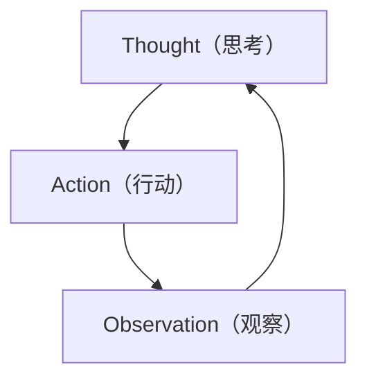

# ReAct（Reasoning + Acting）模式

## 概述

ReAct 是 **Reasoning + Acting** 的缩写，由 Google Research 于 2022 年提出。该模式让 Agent 交替进行**推理（Thought）** 和**行动（Action）**，并通过**观察（Observation）** 结果来动态调整下一步策略，形成一个**思考→行动→观察→思考**的循环。

## 原理



1. **Thought（思考）**：Agent 分析当前状态，推理下一步应该做什么
2. **Action（行动）**：Agent 执行具体操作（调用工具、搜索、计算等）
3. **Observation（观察）**：Agent 获取行动的结果反馈
4. 重复上述过程，直到任务完成

核心在于将推理与行动交织在一起，让模型能够根据实时反馈动态调整行为，而非一次性生成最终答案。

## 使用场景

- **知识密集型问答**：需要查阅外部知识库、搜索引擎的场景
- **多步推理任务**：回答需要分步检索和推理的问题（如 "2024年诺贝尔物理学奖得主的导师是谁？"）
- **交互式任务**：需要与环境交互的任务，如网页导航、API 调用
- **事实核查**：需要验证信息真实性的场景
- **数据分析**：需要查询数据库、计算、再查询的迭代过程

## 示例代码

```python
import re
from typing import List, Dict, Any

class ReActAgent:
    """ReAct 模式 Agent 实现"""

    def __init__(self, llm, tools: Dict[str, callable]):
        """
        Args:
            llm: 大语言模型接口
            tools: 可用工具字典 {工具名: 工具函数}
        """
        self.llm = llm
        self.tools = tools

    def run(self, question: str, max_steps: int = 10) -> str:
        """
        执行 ReAct 循环，解决用户问题
        """
        # 构建提示词，要求 LLM 按 ReAct 格式输出
        prompt = self._build_prompt(question, self.tools)

        # 历史记录
        history = []

        for step in range(max_steps):
            # 调用 LLM 生成下一步
            response = self.llm.generate(prompt, history)

            # 解析 Thought 和 Action
            thought, action, action_input = self._parse_response(response)

            history.append(f"Thought: {thought}")

            # 判断是否得出最终答案
            if action.lower() == "finish":
                return action_input

            # 执行工具调用
            if action in self.tools:
                observation = self.tools[action](action_input)
                history.append(f"Action: {action}[{action_input}]")
                history.append(f"Observation: {observation}")
            else:
                observation = f"Error: 未知工具 '{action}'"
                history.append(f"Observation: {observation}")

            if step == max_steps - 1:
                return "任务未在最大步数内完成"

    def _build_prompt(self, question: str, tools: Dict) -> str:
        """构建 ReAct 格式提示词"""
        tool_descriptions = "\n".join([
            f"- {name}: {func.__doc__ or '无描述'}"
            for name, func in tools.items()
        ])

        return f"""你需要使用以下工具回答问题。请严格按照以下格式回复：

可用工具：
{tool_descriptions}

回复格式（每次只能执行一个 Thought-Action 对）：
Thought: 你的推理过程
Action: 工具名称[参数]
Observation: （等待工具返回结果）

当你得到最终答案时，使用：
Thought: 我现在有足够的信息回答问题
Action: Finish[最终答案]

问题：{question}
"""

    def _parse_response(self, response: str) -> tuple:
        """解析 LLM 返回的 Thought 和 Action"""
        thought_match = re.search(r"Thought:\s*(.+?)(?=\nAction:|\Z)", response, re.DOTALL)
        action_match = re.search(r"Action:\s*(\w+)\[([^\]]*)\]", response)

        thought = thought_match.group(1).strip() if thought_match else ""
        action = action_match.group(1).strip() if action_match else "Finish"
        action_input = action_match.group(2).strip() if action_match else ""

        return thought, action, action_input


# ========== 使用示例 ==========
def search(query: str) -> str:
    """搜索引擎工具"""
    # 模拟搜索
    database = {
        "2024诺贝尔物理学奖": "John Hopfield 和 Geoffrey Hinton",
        "Geoffrey Hinton 导师": "Christopher Longuet-Higgins",
        "深度学习之父": "Geoffrey Hinton",
    }
    return database.get(query, "未找到相关信息")

def calculate(expression: str) -> str:
    """数学计算工具"""
    try:
        return str(eval(expression))
    except:
        return "计算错误"

# 创建 Agent
agent = ReActAgent(
    llm=YourLLM(),  # 替换为实际的 LLM 实例
    tools={
        "Search": search,
        "Calculate": calculate,
    }
)

# 执行任务
result = agent.run("2024年诺贝尔物理学奖得主的导师是谁？")
print(result)
```

## ReAct 对话示例

```
用户问题：2024年诺贝尔物理学奖得主的导师是谁？

Step 1:
  Thought: 我需要先查2024年诺贝尔物理学奖得主是谁
  Action: Search[2024诺贝尔物理学奖]
  Observation: John Hopfield 和 Geoffrey Hinton

Step 2:
  Thought: 得知得主是 Geoffrey Hinton，现在查他的导师
  Action: Search[Geoffrey Hinton 导师]
  Observation: Christopher Longuet-Higgins

Step 3:
  Thought: 已经找到答案，Hinton的导师是 Christopher Longuet-Higgins
  Action: Finish[2024年诺贝尔物理学奖得主Geoffrey Hinton的导师是Christopher Longuet-Higgins]
```

## 优点与局限

| 优点 | 局限 |
|------|------|
| 推理过程可解释、可审计 | 依赖 prompt 格式，解析不够鲁棒 |
| 能根据实时反馈动态调整 | 复杂任务可能需要大量步骤 |
| 减少幻觉，行动结果基于真实数据 | 对 LLM 的指令遵循能力要求高 |
| 与工具生态天然兼容 | 无长期记忆，历史对话依赖上下文窗口 |

## 变体与发展

- **ReAct + CoT**：在 Thought 阶段引入 Chain of Thought 推理
- **ReAct + Reflexion**：加入自我反思机制，从失败中学习
