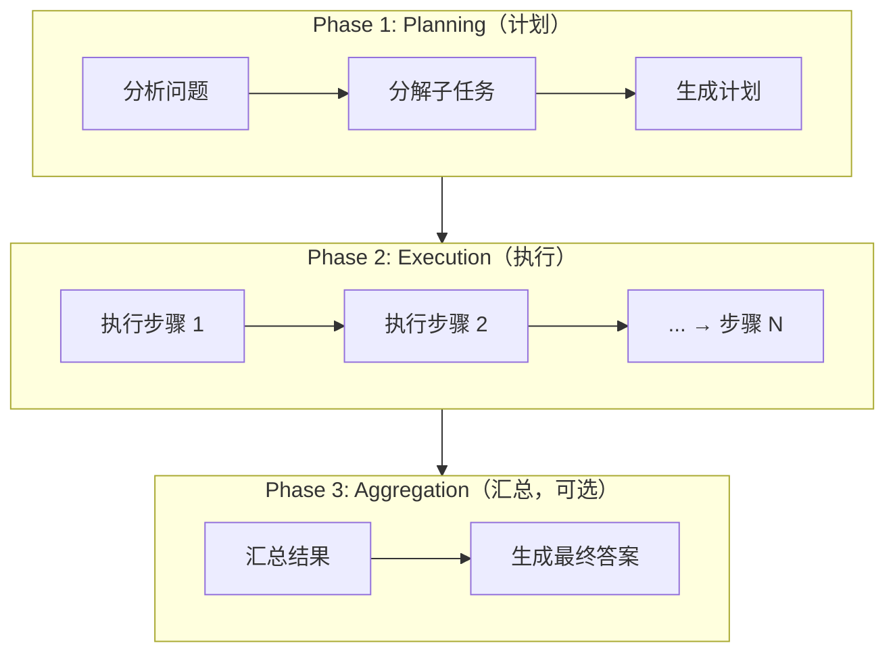

# Plan-and-Execute（计划与执行）模式

## 概述

Plan-and-Execute 模式将 Agent 的工作流程分为两个清晰阶段：**先制定完整计划，再逐步执行**。这种模式模仿人类解决复杂问题的方式——先想清楚整体方案，再动手实施。

## 原理



1. **Planning（计划阶段）**：Agent 将复杂任务分解为多个可独立执行的子任务，生成结构化的步骤列表
2. **Execution（执行阶段）**：Agent 按照计划顺序执行每个步骤，每个步骤可能是一个 ReAct 循环
3. **Aggregation（汇总阶段）**：将各步骤的结果整合为最终输出

关键设计在于**计划与执行的解耦**，计划器不需要知道执行细节，执行器专注于完成单个子任务。

## 使用场景

- **复杂多步任务**：需要 5 个以上步骤才能完成的复杂任务（如 "写一篇关于 AI Agent 的综述博客"）
- **代码生成项目**：从需求分析、架构设计到编码实现的多阶段开发任务
- **数据分析报告**：数据收集→清洗→分析→可视化→撰写报告
- **研究调研**：需要在多个维度收集信息并整合的场景
- **可并行的子任务**：步骤之间无依赖关系时，可并行执行加速

## 示例代码

```python
import json
from typing import List, Dict, Optional
from dataclasses import dataclass, field


@dataclass
class Plan:
    """计划数据结构"""
    goal: str
    steps: List[str] = field(default_factory=list)
    current_step: int = 0
    results: Dict[int, str] = field(default_factory=dict)


class PlanAndExecuteAgent:
    """Plan-and-Execute 模式 Agent"""

    def __init__(self, planner_llm, executor_llm, tools: Dict[str, callable]):
        """
        Args:
            planner_llm: 用于制定计划的 LLM
            executor_llm: 用于执行步骤的 LLM（可与 planner 相同）
            tools: 可用工具集
        """
        self.planner = planner_llm
        self.executor = executor_llm
        self.tools = tools

    def run(self, task: str, max_replan: int = 2) -> str:
        """
        执行 Plan-and-Execute 流程
        """
        # Phase 1: 制定计划
        plan = self._create_plan(task)
        print(f"[Plan] 目标: {plan.goal}")
        for i, step in enumerate(plan.steps):
            print(f"  Step {i+1}: {step}")

        # Phase 2: 逐步执行
        for replan_count in range(max_replan + 1):
            while plan.current_step < len(plan.steps):
                step_desc = plan.steps[plan.current_step]
                print(f"\n[Execute] Step {plan.current_step + 1}: {step_desc}")

                # 构建执行上下文（包含已完成的步骤结果）
                context = self._build_context(plan)

                # 执行当前步骤（使用 ReAct 或直接推理）
                step_result = self._execute_step(step_desc, context)

                plan.results[plan.current_step] = step_result
                plan.current_step += 1

            # Phase 3: 评估结果，决定是否需要重新规划
            if self._is_complete(plan):
                break

            if replan_count < max_replan:
                print(f"\n[Replan] 当前结果不满足要求，重新规划...")
                plan = self._replan(task, plan)

        # 汇总结果
        return self._aggregate(task, plan)

    def _create_plan(self, task: str) -> Plan:
        """Phase 1: 生成执行计划"""
        prompt = f"""你需要为以下任务制定详细的执行计划。

任务：{task}

请将任务分解为清晰的步骤序列，每个步骤应：
1. 单一职责，只完成一个明确目标
2. 可独立执行
3. 步骤间尽量解耦

以 JSON 格式返回计划：
{{
  "goal": "任务目标",
  "steps": [
    "步骤1：具体描述",
    "步骤2：具体描述",
    ...
  ]
}}
"""
        response = self.planner.generate(prompt)
        plan_data = json.loads(response)

        return Plan(
            goal=plan_data["goal"],
            steps=plan_data["steps"]
        )

    def _build_context(self, plan: Plan) -> str:
        """构建步骤执行的上下文"""
        if not plan.results:
            return "这是第一个步骤，无前置结果。"

        context_parts = ["已完成步骤的结果："]
        for step_idx, result in plan.results.items():
            context_parts.append(
                f"- Step {step_idx + 1}（{plan.steps[step_idx]}）: {result}"
            )
        return "\n".join(context_parts)

    def _execute_step(self, step_desc: str, context: str) -> str:
        """执行单个步骤"""
        prompt = f"""执行以下子任务。你可以使用提供的工具。

子任务：{step_desc}

前置上下文：
{context}

请完成该子任务并返回结果。只返回该步骤的结果，不要做额外的事情。
"""
        return self.executor.generate(prompt)

    def _is_complete(self, plan: Plan) -> bool:
        """检查任务是否完成"""
        # 简单判断：所有步骤执行完
        return plan.current_step >= len(plan.steps)

    def _replan(self, task: str, previous_plan: Plan) -> Plan:
        """根据执行情况重新规划"""
        prompt = f"""任务未完成，需要调整计划。

原始任务：{task}
原始计划：{previous_plan.steps}
已完成步骤及结果：{json.dumps(previous_plan.results, ensure_ascii=False)}

请制定新的执行计划（JSON 格式），重点关注未完成的部分。
"""
        response = self.planner.generate(prompt)
        plan_data = json.loads(response)

        new_plan = Plan(goal=plan_data["goal"], steps=plan_data["steps"])
        # 保留之前的结果作为上下文
        new_plan.results = previous_plan.results
        return new_plan

    def _aggregate(self, task: str, plan: Plan) -> str:
        """汇总所有步骤结果"""
        summary_prompt = f"""原始任务：{task}

各步骤执行结果：
{json.dumps(plan.results, ensure_ascii=False, indent=2)}

请整合以上所有结果，生成最终答案。
"""
        return self.planner.generate(summary_prompt)


# ========== 使用示例 ==========
agent = PlanAndExecuteAgent(
    planner_llm=YourLLM(),
    executor_llm=YourLLM(),
    tools={
        "search": search_function,
        "calculate": calc_function,
    }
)

# 执行复杂任务
result = agent.run(
    "写一篇 500 字的文章，比较 GPT-4、Claude 和 Gemini 三个模型在编程能力上的优劣"
)
print("\n" + "="*50)
print(result)
```

## 并行执行优化

```python
import concurrent.futures

class ParallelPlanAndExecuteAgent(PlanAndExecuteAgent):
    """支持并行步骤执行的 Plan-and-Execute Agent"""

    def _execute_parallel_steps(self, steps: List[str], context: str) -> Dict[int, str]:
        """并行执行多个独立的步骤"""
        results = {}

        with concurrent.futures.ThreadPoolExecutor(max_workers=5) as executor:
            future_to_step = {
                executor.submit(self._execute_step, step, context): idx
                for idx, step in enumerate(steps)
            }
            for future in concurrent.futures.as_completed(future_to_step):
                idx = future_to_step[future]
                results[idx] = future.result()

        return results
```

## 计划生成示例

```
任务：分析一个 Python 项目的代码质量并生成改进报告

生成计划：
Step 1: 扫描项目结构，统计文件数量和代码行数
Step 2: 运行 linter 工具，收集代码风格问题
Step 3: 分析函数复杂度（圈复杂度 > 10 的函数）
Step 4: 检查测试覆盖率
Step 5: 识别代码重复 (DRY 违反)
Step 6: 汇总以上发现，按优先级排序生成改进建议
Step 7: 生成 Markdown 格式的改进报告
```

## 优点与局限

| 优点 | 局限 |
|------|------|
| 计划清晰，执行过程可追踪 | 初始计划可能不准确，需要重规划 |
| 步骤间解耦，便于并行执行 | 对于需要动态决策的任务不够灵活 |
| 减少 LLM 调用时的上下文压力 | 增加了额外的 LLM 调用开销 |
| 适合长周期、跨领域的复杂任务 | 计划粒度过粗或过细都影响效果 |

## 变体

- **Hierarchical Planning**：计划中的步骤本身也可以是子计划
- **Adaptive Planning**：每个步骤执行后评估是否需要调整后续计划
- **Plan + ReAct**：规划阶段用 Plan-and-Execute，单个步骤用 ReAct 执行
