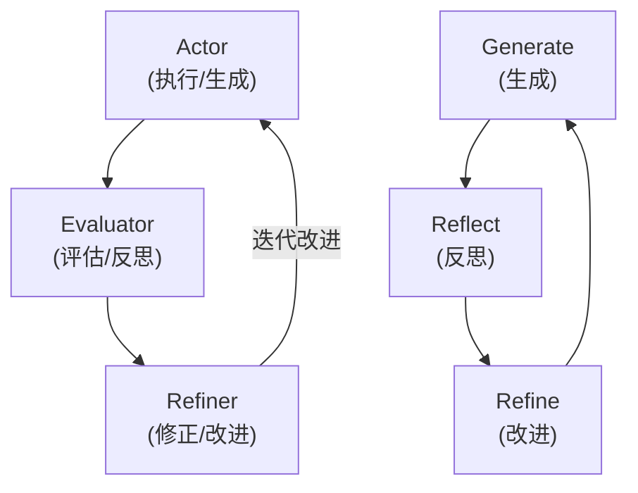

# Reflection（自我反思）模式

## 概述

Reflection 模式让 Agent 在生成初始输出后，**对自己的结果进行反思、评估和迭代改进**。类似于人类"写完后再检查一遍"的习惯，Agent 通过自我批评来发现错误、补充遗漏、优化表达，从而提升输出质量。

## 原理



核心包含三个角色（可以是同一个 LLM 的不同 prompt）：

1. **Actor（执行者）**：根据任务生成初始输出
2. **Evaluator（评估者）**：对输出进行批判性评估，发现问题
3. **Refiner（改进者）**：根据评估反馈修正输出

可以多轮迭代，每轮输出质量逐步提升。关键是评估标准要具体、可操作。

## 使用场景

- **代码生成与调试**：生成代码 → 反思代码问题 → 修复 bug → 再次检查
- **内容写作**：写初稿 → 自我审阅 → 润色改进 → 最终定稿
- **复杂推理**：得出答案 → 验证逻辑 → 发现漏洞 → 修正推理
- **翻译任务**：初步翻译 → 检查信达雅 → 优化表达
- **数学证明**：构造证明 → 检查每一步 → 修正错误
- **对话 Agent 安全**：生成回复 → 安全检查 → 过滤风险内容

## 示例代码

```python
from typing import Dict, List, Optional
from dataclasses import dataclass, field


@dataclass
class ReflectionCriteria:
    """反思评估标准"""
    name: str
    description: str
    weight: float = 1.0  # 权重


@dataclass
class ReflectionResult:
    """反思结果"""
    score: float
    issues: List[str]
    suggestions: List[str]
    passed: bool


class ReflectionAgent:
    """Reflection 模式 Agent 实现"""

    def __init__(self, llm, criteria: List[ReflectionCriteria]):
        """
        Args:
            llm: 大语言模型
            criteria: 评估标准列表
        """
        self.llm = llm
        self.criteria = criteria

    def run(
        self,
        task: str,
        max_iterations: int = 3,
        quality_threshold: float = 0.8
    ) -> Dict:
        """
        执行 Reflection 循环
        """
        history: List[Dict] = []
        best_output = None
        best_score = 0.0

        # Step 1: 初始生成
        output = self._generate(task, history)

        for iteration in range(max_iterations):
            print(f"\n{'='*40}")
            print(f"Iteration {iteration + 1}")

            # Step 2: 反思评估
            reflection = self._reflect(task, output)
            print(f"  Score: {reflection.score:.2%}")
            print(f"  Issues: {reflection.issues}")
            print(f"  Suggestions: {reflection.suggestions}")

            # 记录最佳输出
            if reflection.score > best_score:
                best_score = reflection.score
                best_output = output

            # 达到质量阈值，退出
            if reflection.passed and reflection.score >= quality_threshold:
                print(f"  质量达标，停止迭代")
                break

            # Step 3: 根据反思改进
            history.append({
                "output": output,
                "issues": reflection.issues,
                "suggestions": reflection.suggestions,
            })

            output = self._refine(task, output, reflection, history)
            print(f"  已生成改进版本")

        return {
            "final_output": best_output,
            "score": best_score,
            "iterations": iteration + 1,
            "history": history,
        }

    def _generate(self, task: str, history: List[Dict]) -> str:
        """Actor: 生成初始输出（或改进版本）"""
        if not history:
            prompt = f"""请完成以下任务，确保输出高质量：

任务：{task}

请直接给出你的回答。
"""
        else:
            # 基于历史的改进
            feedback = self._format_history(history)
            prompt = f"""根据以下反馈改进你的输出。

任务：{task}

之前的版本及问题：
{feedback}

请给出改进后的回答。
"""
        return self.llm.generate(prompt)

    def _reflect(self, task: str, output: str) -> ReflectionResult:
        """Evaluator: 对输出进行反思评估"""
        criteria_text = "\n".join([
            f"{i+1}. {c.name}：{c.description}（权重：{c.weight}）"
            for i, c in enumerate(self.criteria)
        ])

        prompt = f"""你需要严格评估以下输出的质量。

原始任务：{task}

当前输出：
{output}

评估标准：
{criteria_text}

请以 JSON 格式返回评估结果：
{{
  "overall_score": 0.85,
  "passed": true,
  "criteria_scores": {{
    "标准名": 0.9
  }},
  "issues": ["问题1", "问题2"],
  "suggestions": ["建议1", "建议2"]
}}

注意：
- score 范围为 0.0-1.0
- 必须严格、诚实评分，不要给面子分
- issues 列出具体问题，suggestions 给出可操作的改进建议
"""
        response = self.llm.generate(prompt)

        import json
        result = json.loads(response)

        return ReflectionResult(
            score=result.get("overall_score", 0.0),
            issues=result.get("issues", []),
            suggestions=result.get("suggestions", []),
            passed=result.get("passed", False),
        )

    def _refine(
        self,
        task: str,
        current_output: str,
        reflection: ReflectionResult,
        history: List[Dict]
    ) -> str:
        """Refiner: 根据反思结果改进输出"""
        prompt = f"""请根据评估反馈改进你的输出。

原始任务：{task}

当前输出：
{current_output}

发现的问题：
{chr(10).join(f'- {issue}' for issue in reflection.issues)}

改进建议：
{chr(10).join(f'- {sug}' for sug in reflection.suggestions)}

请直接给出改进后的完整输出，修复所有提到的问题。
"""
        return self.llm.generate(prompt)

    def _format_history(self, history: List[Dict]) -> str:
        """格式化历史反思记录"""
        parts = []
        for i, h in enumerate(history):
            parts.append(f"--- 第 {i+1} 轮 ---")
            parts.append(f"问题：{h['issues']}")
            parts.append(f"建议：{h['suggestions']}")
        return "\n".join(parts)


# ========== 使用示例：代码生成场景 ==========

code_criteria = [
    ReflectionCriteria(
        name="正确性",
        description="代码逻辑是否正确，能否通过测试用例",
        weight=1.5
    ),
    ReflectionCriteria(
        name="可读性",
        description="代码注释、命名、结构是否清晰易读",
        weight=1.0
    ),
    ReflectionCriteria(
        name="性能",
        description="时间复杂度和空间复杂度是否合理",
        weight=1.0
    ),
    ReflectionCriteria(
        name="边界处理",
        description="是否处理了空值、异常输入等边界情况",
        weight=1.2
    ),
]

agent = ReflectionAgent(llm=YourLLM(), criteria=code_criteria)

result = agent.run(
    task="用 Python 实现一个 LRU Cache，支持 get(key) 和 put(key, value) 操作",
    max_iterations=3,
    quality_threshold=0.85,
)

print("\n" + "=" * 50)
print("最终输出：")
print(result["final_output"])
print(f"\n最终质量分：{result['score']:.2%}")
```

## 反思迭代示例

```
任务：写一段 Python 代码，计算两个大数的最大公约数

=== Iteration 1 ===
输出：
def gcd(a, b):
    while b:
        a, b = b, a % b
    return a

Score: 65%
Issues:
  - 缺少函数文档字符串
  - 未处理负数输入
  - 未处理 a=0 或 b=0 的情况
Suggestions:
  - 添加 docstring 说明算法
  - 使用 abs() 处理负数
  - 添加边界条件检查

=== Iteration 2 ===
输出：
def gcd(a: int, b: int) -> int:
    """使用欧几里得算法计算两数的最大公约数"""
    a, b = abs(a), abs(b)
    if a == 0:
        return b
    if b == 0:
        return a
    while b:
        a, b = b, a % b
    return a

Score: 95%
Issues: []
Suggestions: []
质量达标，停止迭代
```

## 高级技巧

### 1. 角色分离
使用不同的 LLM 或不同的 system prompt 来扮演 Actor 和 Evaluator，避免"自己审自己"的盲区。

### 2. 结构化评估
```python
# 使用 JSON Schema 强制结构化输出
evaluation_schema = {
    "correctness": {"score": "0-10", "details": "string"},
    "completeness": {"score": "0-10", "details": "string"},
    "clarity": {"score": "0-10", "details": "string"},
}
```

### 3. 外部验证
反思不止于 LLM 自评，还可以结合：
- **代码执行结果**：实际运行测试
- **事实来源对比**：与知识库核对
- **规则引擎**：预设的业务规则校验

## 优点与局限

| 优点 | 局限 |
|------|------|
| 显著提升输出质量 | 增加 2-3 倍 LLM 调用成本 |
| 可发现人类容易忽略的问题 | 评估者的偏见可能固化错误 |
| 评估标准可定制 | 某些领域需要外部验证（如代码执行） |
| 降低幻觉率 | 迭代次数过多可能陷入过度优化 |
