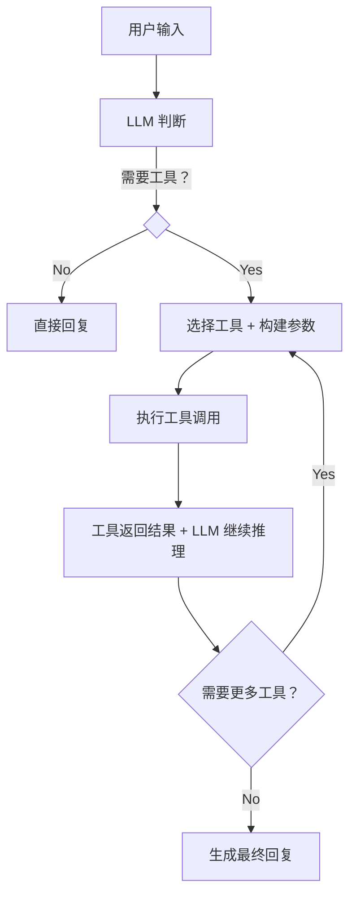

# Tool Use / Function Calling（工具调用）模式

## 概述

Tool Use（也称 Function Calling）是 Agent 的**基础能力模式**。Agent 不再仅仅生成文本，而是能够**识别何时需要调用外部工具，并正确构建调用参数**，将工具返回的结果融入后续推理中。这是 Agent 区别于普通 LLM 的核心能力。

## 原理



核心机制：
1. **工具定义（Schema）**：用结构化格式（JSON Schema）描述每个工具的名称、功能、参数
2. **工具选择（Selection）**：LLM 根据用户意图决定调用哪个工具
3. **参数提取（Argument Extraction）**：LLM 从用户输入中提取工具参数
4. **结果整合（Integration）**：将工具返回结果作为上下文，继续推理

## 使用场景

- **实时信息查询**：天气、股价、新闻等需要外部 API 的数据
- **数据库操作**：CRUD 操作、SQL 查询
- **数学计算**：精确计算（LLM 数学能力不稳定）
- **代码执行**：在沙箱中运行代码并获取结果
- **文件操作**：读写本地或远程文件
- **第三方服务集成**：发送邮件、创建日历事件、操作 IoT 设备
- **知识库 RAG**：从向量数据库检索相关文档

## 示例代码

```python
import json
from typing import List, Dict, Any, Callable, Optional
from dataclasses import dataclass, field
from enum import Enum


class ToolChoice(Enum):
    """工具选择策略"""
    AUTO = "auto"       # LLM 自动决定
    REQUIRED = "required"  # 必须使用工具
    NONE = "none"       # 不使用工具


@dataclass
class ToolParameter:
    """工具参数定义"""
    name: str
    type: str  # "string", "number", "boolean", "object", "array"
    description: str
    required: bool = True
    enum: Optional[List[str]] = None


@dataclass
class Tool:
    """工具定义"""
    name: str
    description: str
    parameters: List[ToolParameter]
    function: Callable
    category: str = "general"  # 工具分类

    def to_openai_schema(self) -> Dict:
        """转换为 OpenAI Function Calling 格式"""
        properties = {}
        required = []

        for param in self.parameters:
            prop = {
                "type": param.type,
                "description": param.description,
            }
            if param.enum:
                prop["enum"] = param.enum
            properties[param.name] = prop
            if param.required:
                required.append(param.name)

        return {
            "type": "function",
            "function": {
                "name": self.name,
                "description": self.description,
                "parameters": {
                    "type": "object",
                    "properties": properties,
                    "required": required,
                }
            }
        }


class ToolRegistry:
    """工具注册中心"""

    def __init__(self):
        self._tools: Dict[str, Tool] = {}

    def register(self, tool: Tool) -> None:
        """注册工具"""
        self._tools[tool.name] = tool
        print(f"[ToolRegistry] 注册工具: {tool.name}")

    def get_schemas(self) -> List[Dict]:
        """获取所有工具的 schema"""
        return [tool.to_openai_schema() for tool in self._tools.values()]

    def execute(self, name: str, arguments: Dict) -> str:
        """执行工具调用"""
        if name not in self._tools:
            return json.dumps({"error": f"未知工具: {name}"})

        tool = self._tools[name]
        try:
            result = tool.function(**arguments)
            # 确保返回值是字符串
            if not isinstance(result, str):
                result = json.dumps(result, ensure_ascii=False)
            return result
        except Exception as e:
            return json.dumps({"error": str(e)})


class ToolUseAgent:
    """支持工具调用的 Agent"""

    def __init__(self, llm, tool_registry: ToolRegistry):
        """
        Args:
            llm: 支持 Function Calling 的 LLM
            tool_registry: 工具注册中心
        """
        self.llm = llm
        self.tool_registry = tool_registry

    def run(
        self,
        user_message: str,
        system_prompt: str = "",
        max_tool_calls: int = 10,
    ) -> str:
        """
        执行 Agent 对话，支持多轮工具调用
        """
        messages = []

        if system_prompt:
            messages.append({"role": "system", "content": system_prompt})

        messages.append({"role": "user", "content": user_message})

        tool_call_count = 0

        while tool_call_count < max_tool_calls:
            # 调用 LLM（带工具定义）
            response = self.llm.chat(
                messages=messages,
                tools=self.tool_registry.get_schemas(),
                tool_choice=ToolChoice.AUTO.value,
            )

            # LLM 直接回复（不需要工具）
            if response.content and not response.tool_calls:
                return response.content

            # LLM 请求工具调用
            if response.tool_calls:
                # 将 LLM 的响应加入历史
                messages.append({
                    "role": "assistant",
                    "content": response.content,
                    "tool_calls": response.tool_calls,
                })

                for tool_call in response.tool_calls:
                    tool_name = tool_call["function"]["name"]
                    tool_args = json.loads(tool_call["function"]["arguments"])

                    print(f"[ToolCall] {tool_name}({tool_args})")

                    # 执行工具
                    result = self.tool_registry.execute(tool_name, tool_args)

                    # 将工具结果加入历史
                    messages.append({
                        "role": "tool",
                        "tool_call_id": tool_call["id"],
                        "content": result,
                    })

                    tool_call_count += 1

        return "达到最大工具调用次数限制"


# ========== 工具定义示例 ==========

def search_web(query: str, num_results: int = 5) -> str:
    """模拟网页搜索"""
    return json.dumps({
        "results": [
            {"title": f"搜索结果 {i}: {query}", "url": f"https://example.com/{i}"}
            for i in range(num_results)
        ]
    })


def get_weather(city: str, unit: str = "celsius") -> str:
    """获取天气信息"""
    # 模拟天气 API
    return json.dumps({
        "city": city,
        "temperature": 22,
        "unit": unit,
        "condition": "晴天",
        "humidity": "65%",
    })


def execute_python(code: str) -> str:
    """在沙箱中执行 Python 代码"""
    import subprocess
    try:
        result = subprocess.run(
            ["python", "-c", code],
            capture_output=True,
            text=True,
            timeout=5,
        )
        return json.dumps({
            "stdout": result.stdout,
            "stderr": result.stderr,
            "returncode": result.returncode,
        })
    except subprocess.TimeoutExpired:
        return json.dumps({"error": "代码执行超时"})


def query_database(sql: str) -> str:
    """查询数据库"""
    # 模拟数据库查询
    return json.dumps({
        "columns": ["id", "name", "age"],
        "rows": [
            [1, "张三", 28],
            [2, "李四", 35],
        ],
        "row_count": 2,
    })


# ========== 组装 Agent ==========

# 创建工具注册中心
registry = ToolRegistry()

registry.register(Tool(
    name="search_web",
    description="搜索互联网获取实时信息",
    parameters=[
        ToolParameter("query", "string", "搜索关键词"),
        ToolParameter("num_results", "number", "返回结果数量", required=False),
    ],
    function=search_web,
    category="search",
))

registry.register(Tool(
    name="get_weather",
    description="获取指定城市的天气信息",
    parameters=[
        ToolParameter("city", "string", "城市名称，如 Beijing"),
        ToolParameter("unit", "string", "温度单位：celsius 或 fahrenheit", required=False, enum=["celsius", "fahrenheit"]),
    ],
    function=get_weather,
    category="utility",
))

registry.register(Tool(
    name="execute_python",
    description="在安全沙箱中执行 Python 代码并返回结果",
    parameters=[
        ToolParameter("code", "string", "要执行的 Python 代码"),
    ],
    function=execute_python,
    category="code",
))

registry.register(Tool(
    name="query_database",
    description="执行 SQL 查询",
    parameters=[
        ToolParameter("sql", "string", "SQL 查询语句"),
    ],
    function=query_database,
    category="data",
))

# 创建 Agent
agent = ToolUseAgent(llm=YourLLM(), tool_registry=registry)

# 运行
result = agent.run("北京今天天气怎么样？适合出门吗？")
print(result)
```

## 工具设计最佳实践

### 1. 工具描述要精准

```python
# ❌ 差的描述
Tool(name="search", description="搜索东西", ...)

# ✅ 好的描述
Tool(
    name="search_web",
    description="使用 Google 搜索引擎搜索互联网上的实时信息，返回相关网页的标题、摘要和 URL",
    ...
)
```

### 2. 参数设计原则

```python
# 使用 enum 约束可选值
ToolParameter("sort_order", "string", "排序方式",
              enum=["asc", "desc"], required=False)

# 提供合理的默认值
ToolParameter("page_size", "integer", "每页条数", required=False)  # 默认 20

# 参数名用 snake_case，避免歧义
ToolParameter("start_date", "string", "开始日期，格式 YYYY-MM-DD")
```

### 3. 工具返回值规范

```python
def my_tool(param: str) -> str:
    """工具函数，始终返回 JSON 字符串"""
    return json.dumps({
        "success": True,      # 明确标识是否成功
        "data": {...},        # 实际数据
        "error": None,        # 错误信息（如有）
        "metadata": {         # 元数据（可选）
            "timestamp": "2024-01-01T00:00:00",
            "source": "API",
        }
    }, ensure_ascii=False)
```

### 4. 工具粒度控制

```python
# 避免过于细粒度
Tool(name="set_x", ...)
Tool(name="set_y", ...)

# 也不要过于粗粒度
Tool(name="do_everything", ...)

# 合理的粒度
Tool(name="create_user", ...)  # 创建一个用户
Tool(name="update_user_profile", ...)  # 更新用户资料
```

## 多工具编排模式

```python
class ToolChain:
    """工具链：按顺序执行多个工具"""
    def __init__(self, registry: ToolRegistry):
        self.registry = registry

    def execute(self, chain: List[Dict[str, Any]]) -> List[str]:
        results = []
        for step in chain:
            result = self.registry.execute(step["tool"], step["args"])
            results.append(result)
        return results


class ToolRouter:
    """工具路由：根据条件选择工具"""
    def route(self, intent: str, query: str) -> Optional[str]:
        routes = {
            "weather": "get_weather",
            "search": "search_web",
            "code": "execute_python",
            "data": "query_database",
        }
        return routes.get(intent)
```

## 优点与局限

| 优点 | 局限 |
|------|------|
| 突破 LLM 的知识截止时间限制 | 工具选择可能出错（幻觉） |
| 执行精确计算和确定性操作 | 参数提取可能不准确 |
| 与现有系统无缝集成 | 工具过多时选择困难 |
| 支持复杂的多步工作流 | 工具返回结果可能被 LLM 误解 |
| 安全可控（沙箱执行） | 需要额外的工具开发和维护成本 |
