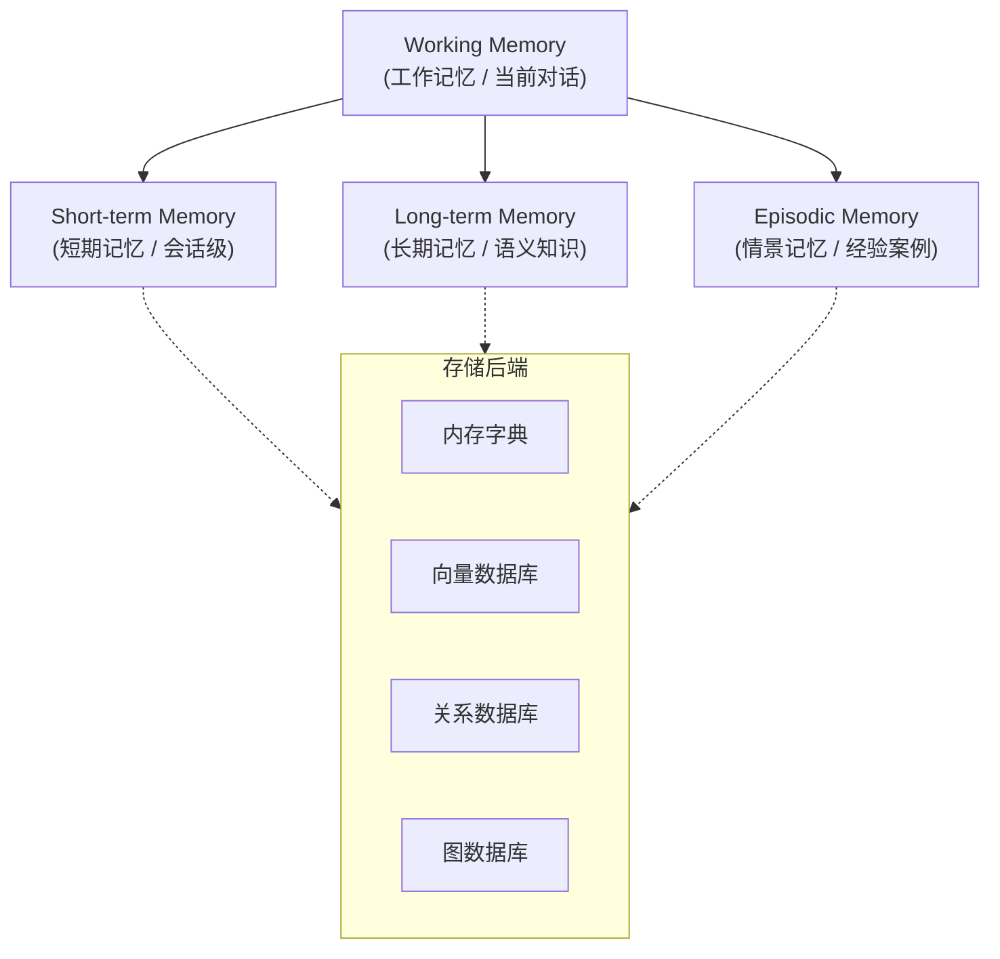

# Memory-Augmented（记忆增强）模式

## 概述

Memory-Augmented 模式为 Agent 增加**持久化记忆能力**，使其能够记住历史对话、用户偏好、任务上下文等关键信息，从而在跨会话、长时间的任务中保持连贯性和个性化。

## 原理



三种记忆类型：

| 类型 | 说明 | 类比 | 存储方式 |
|------|------|------|----------|
| **Working Memory** | 当前对话上下文 | 工作记忆 | 消息列表（内存） |
| **Short-term Memory** | 当前会话的历史 | 短期记忆 | 会话级存储 |
| **Long-term Memory** | 跨会话的知识 | 长期记忆 | 向量/关系数据库 |
| **Episodic Memory** | 过去的经验案例 | 情景记忆 | 案例库 |

关键操作：
1. **Store（存储）**：将重要信息编码并存入记忆
2. **Retrieve（检索）**：根据当前上下文检索相关记忆
3. **Update（更新）**：修改或删除过时记忆
4. **Forget（遗忘）**：自动清理不重要的信息

## 使用场景

- **个性化助手**：记住用户偏好、习惯、历史对话
- **知识积累 Agent**：从多轮交互中学习，逐渐建立领域知识
- **客户服务**：记住客户历史问题，提供连贯服务
- **代码 Agent**：记住项目结构、常用模式、之前的修改
- **研究 Agent**：积累研究过程中的发现和洞察
- **教育 Agent**：根据学生学习历史调整教学策略

## 示例代码

```python
import json
import hashlib
import time
from typing import List, Dict, Any, Optional
from datetime import datetime, timedelta
from abc import ABC, abstractmethod
from dataclasses import dataclass, field
from collections import OrderedDict


@dataclass
class MemoryItem:
    """记忆条目"""
    id: str
    content: str
    memory_type: str  # "fact", "preference", "experience", "summary"
    importance: float = 0.5  # 0.0-1.0
    timestamp: float = field(default_factory=time.time)
    access_count: int = 0
    metadata: Dict = field(default_factory=dict)

    def __hash__(self):
        return hash(self.id)


# ========== 记忆存储后端接口 ==========

class MemoryStore(ABC):
    """记忆存储抽象基类"""

    @abstractmethod
    def add(self, item: MemoryItem) -> None:
        """添加记忆"""
        pass

    @abstractmethod
    def search(self, query: str, top_k: int = 5) -> List[MemoryItem]:
        """检索相关记忆"""
        pass

    @abstractmethod
    def delete(self, item_id: str) -> bool:
        """删除记忆"""
        pass

    @abstractmethod
    def get_all(self) -> List[MemoryItem]:
        """获取所有记忆"""
        pass


# ========== 简单实现：基于关键词匹配 ==========

class SimpleMemoryStore(MemoryStore):
    """基于内存的简单记忆存储（适合原型开发）"""

    def __init__(self, max_size: int = 1000):
        self._items: OrderedDict[str, MemoryItem] = OrderedDict()
        self.max_size = max_size

    def add(self, item: MemoryItem) -> None:
        if len(self._items) >= self.max_size:
            # LRU 淘汰
            self._items.popitem(last=False)
        self._items[item.id] = item

    def search(self, query: str, top_k: int = 5) -> List[MemoryItem]:
        """简单的关键词匹配搜索"""
        query_words = set(query.lower().split())

        scored_items = []
        for item in self._items.values():
            content_lower = item.content.lower()

            # 计算关键词匹配度
            match_count = sum(
                1 for word in query_words if word in content_lower
            )
            if match_count == 0:
                continue

            # 综合得分 = 匹配度 × 重要性 × 时间衰减
            time_decay = 2.718 ** (-0.01 * (time.time() - item.timestamp) / 3600)
            score = match_count * item.importance * time_decay
            scored_items.append((score, item))

        # 按得分排序
        scored_items.sort(key=lambda x: x[0], reverse=True)
        return [item for _, item in scored_items[:top_k]]

    def delete(self, item_id: str) -> bool:
        if item_id in self._items:
            del self._items[item_id]
            return True
        return False

    def get_all(self) -> List[MemoryItem]:
        return list(self._items.values())


# ========== 向量数据库实现 ==========

class VectorMemoryStore(MemoryStore):
    """基于向量数据库的语义记忆存储"""

    def __init__(self, embedding_model, vector_db):
        """
        Args:
            embedding_model: 文本向量化模型
            vector_db: 向量数据库（如 Chroma, Pinecone, Milvus）
        """
        self.embedding_model = embedding_model
        self.vector_db = vector_db

    def add(self, item: MemoryItem) -> None:
        embedding = self.embedding_model.encode(item.content)
        self.vector_db.insert(
            id=item.id,
            vector=embedding,
            metadata={
                "content": item.content,
                "memory_type": item.memory_type,
                "importance": item.importance,
                "timestamp": item.timestamp,
            }
        )

    def search(self, query: str, top_k: int = 5) -> List[MemoryItem]:
        query_embedding = self.embedding_model.encode(query)
        results = self.vector_db.search(query_embedding, top_k=top_k)

        items = []
        for r in results:
            items.append(MemoryItem(
                id=r["id"],
                content=r["metadata"]["content"],
                memory_type=r["metadata"]["memory_type"],
                importance=r["metadata"].get("importance", 0.5),
                timestamp=r["metadata"].get("timestamp", time.time()),
            ))
        return items

    def delete(self, item_id: str) -> bool:
        self.vector_db.delete(item_id)
        return True

    def get_all(self) -> List[MemoryItem]:
        return []  # 向量数据库通常不支持全量获取


# ========== Memory-Augmented Agent ==========

class MemoryAugmentedAgent:
    """带记忆能力的 Agent"""

    def __init__(self, llm, memory_store: MemoryStore):
        self.llm = llm
        self.memory_store = memory_store
        self.working_memory: List[Dict] = []  # 当前对话上下文

    def chat(self, user_input: str, user_id: str = "default") -> str:
        """
        带记忆的对话处理
        """
        # Step 1: 检索相关记忆
        relevant_memories = self._retrieve_relevant(user_input, user_id)
        memory_context = self._format_memories(relevant_memories)

        # Step 2: 构建增强 prompt
        if memory_context:
            system_prompt = f"""你是用户的个人助手。以下是相关的历史记忆，请参考这些信息来更好地帮助用户。

## 相关记忆：
{memory_context}

如果这些记忆与当前问题相关，请自然地引用它们；如果不相关，请忽略。
"""
        else:
            system_prompt = "你是用户的个人助手。"

        messages = [
            {"role": "system", "content": system_prompt},
            *self.working_memory[-10:],  # 最近 10 条对话
            {"role": "user", "content": user_input},
        ]

        # Step 3: 生成回复
        response = self.llm.chat(messages)

        # Step 4: 提取并存储新的记忆
        self._extract_and_store(user_input, response, user_id)

        # Step 5: 更新工作记忆
        self.working_memory.append({"role": "user", "content": user_input})
        self.working_memory.append({"role": "assistant", "content": response})

        # 限制工作记忆大小
        if len(self.working_memory) > 50:
            self.working_memory = self.working_memory[-30:]

        return response

    def _retrieve_relevant(self, query: str, user_id: str) -> List[MemoryItem]:
        """检索相关记忆"""
        # 可以加入 user_id 过滤
        return self.memory_store.search(query, top_k=5)

    def _format_memories(self, memories: List[MemoryItem]) -> str:
        """格式化记忆上下文"""
        if not memories:
            return ""

        parts = []
        for i, mem in enumerate(memories):
            age = self._format_age(time.time() - mem.timestamp)
            parts.append(f"{i+1}. [{age}前] [{mem.memory_type}] {mem.content}")

        return "\n".join(parts)

    def _extract_and_store(self, user_input: str, response: str, user_id: str):
        """从对话中提取关键信息并存储为记忆"""
        prompt = f"""从以下对话中提取值得记住的信息。判断每一条信息的重要性（0.0-1.0）。

## 对话
用户：{user_input}
助手：{response}

## 输出格式
以 JSON 数组返回，每个元素包含：
- type: "fact"（事实）, "preference"（偏好）, "experience"（经验）
- content: 具体内容
- importance: 重要性评分 0.0-1.0（0.7以上才值得存储）

只提取真正有价值的信息。如果没有什么值得记忆的，返回空数组 []。
"""
        result = self.llm.generate(prompt)

        try:
            extracted = json.loads(result)
            for item in extracted:
                if item.get("importance", 0) >= 0.7:
                    mem_id = hashlib.md5(
                        f"{user_id}:{item['content']}".encode()
                    ).hexdigest()
                    memory = MemoryItem(
                        id=mem_id,
                        content=item["content"],
                        memory_type=item["type"],
                        importance=item["importance"],
                        metadata={"user_id": user_id},
                    )
                    self.memory_store.add(memory)
        except json.JSONDecodeError:
            pass  # 解析失败则跳过

    @staticmethod
    def _format_age(seconds: float) -> str:
        """格式化时间差"""
        if seconds < 60:
            return "刚刚"
        elif seconds < 3600:
            return f"{int(seconds / 60)}分钟"
        elif seconds < 86400:
            return f"{int(seconds / 3600)}小时"
        else:
            return f"{int(seconds / 86400)}天"


# ========== 使用示例 ==========

store = SimpleMemoryStore(max_size=1000)
agent = MemoryAugmentedAgent(llm=YourLLM(), memory_store=store)

# 第一轮对话：建立记忆
print("=== 第一轮 ===")
response = agent.chat("我是一名 Python 开发者，主要做后端开发，喜欢用 FastAPI")
print(f"助手：{response}")

print("\n=== 第二轮 ===")
response = agent.chat("帮我推荐一个适合我的 Web 框架")
print(f"助手：{response}")

print("\n=== 第三轮 ===")
response = agent.chat("我之前说过我做什么开发？")
print(f"助手：{response}")

# 查看记忆
print("\n=== 存储的记忆 ===")
for mem in store.get_all():
    print(f"  [{mem.memory_type}] (重要性:{mem.importance}) {mem.content}")
```

## 记忆管理策略

### 1. 重要性评分

```python
class ImportanceEvaluator:
    """评估信息是否值得存储"""

    KEYWORDS_HIGH = {"偏好", "重要", "关键", "必须", "密码", "地址"}
    KEYWORDS_LOW = {"天气", "问候", "闲聊"}

    def evaluate(self, content: str, context: str) -> float:
        score = 0.5  # 基础分

        # 包含高重要性关键词
        if any(kw in content for kw in self.KEYWORDS_HIGH):
            score += 0.3

        # 包含低重要性关键词
        if any(kw in content for kw in self.KEYWORDS_LOW):
            score -= 0.2

        # 时间衰减：最近的信息更重要
        # 由 LLM 最终判断

        return min(max(score, 0.0), 1.0)
```

### 2. 记忆整合与去重

```python
class MemoryConsolidator:
    """记忆整合器：合并相似记忆，减少冗余"""

    def consolidate(self, memories: List[MemoryItem]) -> List[MemoryItem]:
        """将相似的短记忆合并为更概括的长记忆"""
        # 按类型分组
        groups: Dict[str, List[MemoryItem]] = {}
        for mem in memories:
            groups.setdefault(mem.memory_type, []).append(mem)

        consolidated = []
        for mem_type, group in groups.items():
            if len(group) > 3:
                # 调用 LLM 合并同类记忆
                summary = self._summarize_group(group)
                consolidated.append(summary)
            else:
                consolidated.extend(group)

        return consolidated

    def _summarize_group(self, group: List[MemoryItem]) -> MemoryItem:
        """用 LLM 将多条同类记忆合并为一条概括"""
        # ... LLM 合并逻辑
        pass
```

### 3. 遗忘机制

```python
class ForgettingPolicy:
    """遗忘策略"""

    @staticmethod
    def age_based(memories: List[MemoryItem],
                  max_age_days: int = 90) -> List[MemoryItem]:
        """基于时间的遗忘：删除超过N天的记忆"""
        threshold = time.time() - max_age_days * 86400
        return [m for m in memories if m.timestamp > threshold]

    @staticmethod
    def importance_based(memories: List[MemoryItem],
                         max_items: int = 100) -> List[MemoryItem]:
        """基于重要性的遗忘：保留最重要的N条"""
        sorted_mems = sorted(memories, key=lambda m: m.importance, reverse=True)
        return sorted_mems[:max_items]
```

## 优点与局限

| 优点 | 局限 |
|------|------|
| 提供个性化、连贯的交互体验 | 记忆准确性依赖 LLM 提取质量 |
| 跨会话保持上下文 | 大量记忆时检索精度下降 |
| 支持知识积累和持续学习 | 敏感信息需要隐私保护机制 |
| 减少重复信息询问 | 记忆管理策略需要精心设计 |
| 增强 Agent 的长期有用性 | 向量存储增加基础设施成本 |

## 变体

- **Reflection Memory**：不只存储事实，还存储 Agent 对自己的反思
- **Hierarchical Memory**：分层记忆（核心记忆/扩展记忆/归档记忆）
- **Shared Memory**：多个 Agent 共享的记忆空间
