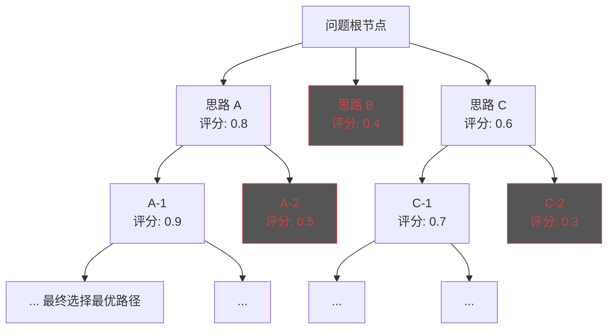
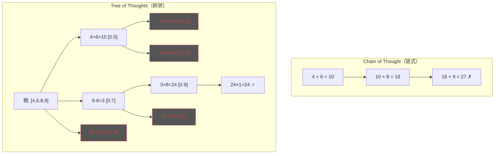

# Tree of Thoughts（思维树）模式

## 概述

Tree of Thoughts（ToT）模式让 Agent 像下棋一样**探索多条推理路径**，在每个推理步骤生成多个候选思路，评估每个思路的可行性，选择最有希望的方向继续深入，必要时回溯到之前的节点重新选择。

## 原理



核心四个步骤：

1. **Thought Generation（思路生成）**：为当前状态生成 K 个候选下一步
2. **Thought Evaluation（思路评估）**：对每个候选思路进行独立或综合评分
3. **Search Strategy（搜索策略）**：BFS（广度优先）或 DFS（深度优先）选择推进方向
4. **Backtracking（回溯）**：当某个分支评分过低时，回到之前的节点探索其他分支

## 使用场景

- **数学证明**：探索不同的证明路径
- **编程竞赛**：尝试多种算法思路，选择最优解
- **创意写作**：生成多个故事发展方向，选择最精彩的
- **策略规划**：探索不同的商业策略并评估可行性
- **谜题求解**：如 "24点游戏"、逻辑推理谜题
- **复杂决策**：多因素权衡的决策问题

## 示例代码

```python
from typing import List, Dict, Any, Optional, Tuple
from dataclasses import dataclass, field
from enum import Enum
import math
import json


class SearchStrategy(Enum):
    BFS = "bfs"  # 广度优先搜索
    DFS = "dfs"  # 深度优先搜索
    BEAM = "beam"  # 束搜索


@dataclass
class ThoughtNode:
    """思维树节点"""
    id: str
    content: str
    depth: int = 0
    score: float = 0.0
    parent: Optional["ThoughtNode"] = None
    children: List["ThoughtNode"] = field(default_factory=list)
    is_terminal: bool = False

    @property
    def cumulative_score(self) -> float:
        """累计得分（从根到当前节点的平均分）"""
        if self.parent is None:
            return self.score

        path_scores = []
        node = self
        while node is not None:
            if node.score > 0:
                path_scores.append(node.score)
            node = node.parent
        return sum(path_scores) / len(path_scores) if path_scores else 0.0

    def get_path(self) -> List[str]:
        """获取从根节点到当前节点的路径"""
        path = []
        node = self
        while node is not None:
            path.append(node.content)
            node = node.parent
        return list(reversed(path))


class TreeOfThoughtsAgent:
    """Tree of Thoughts 模式 Agent"""

    def __init__(
        self,
        llm,
        max_depth: int = 5,
        num_thoughts_per_step: int = 3,
        beam_width: int = 2,
    ):
        """
        Args:
            llm: 大语言模型
            max_depth: 最大搜索深度
            num_thoughts_per_step: 每步生成的候选思路数
            beam_width: 束搜索宽度（保留几个最优分支）
        """
        self.llm = llm
        self.max_depth = max_depth
        self.num_thoughts = num_thoughts_per_step
        self.beam_width = beam_width

    def solve(self, problem: str) -> Dict[str, Any]:
        """
        用思维树求解问题
        """
        # 创建根节点
        root = ThoughtNode(
            id="root",
            content=f"Problem: {problem}",
            depth=0,
        )

        # BFS + 束搜索
        beam = [root]  # 当前层的候选节点
        node_counter = 0

        while beam:
            next_beam = []

            for node in beam:
                # 到达最大深度，标记为终结点
                if node.depth >= self.max_depth:
                    node.is_terminal = True
                    next_beam.append(node)
                    continue

                # 1. 为当前节点生成 K 个候选思路
                candidates = self._generate_thoughts(problem, node)

                # 2. 评估每个候选思路
                evaluated = self._evaluate_thoughts(problem, candidates)

                # 3. 添加到搜索树
                for idx, (thought_text, score) in enumerate(
                    zip(candidates, evaluated)
                ):
                    node_counter += 1
                    child = ThoughtNode(
                        id=f"node_{node_counter}",
                        content=thought_text,
                        depth=node.depth + 1,
                        score=score,
                        parent=node,
                    )
                    node.children.append(child)
                    next_beam.append(child)

            # 4. 束搜索：只保留得分最高的 beam_width 个节点
            next_beam.sort(key=lambda n: n.cumulative_score, reverse=True)
            beam = next_beam[:self.beam_width]

            # 检查是否有终结点
            if all(n.is_terminal for n in beam):
                break

        # 找出最佳路径
        all_nodes = self._collect_nodes(root)
        best_node = max(all_nodes, key=lambda n: n.cumulative_score)

        return {
            "solution": best_node.get_path(),
            "score": best_node.cumulative_score,
            "total_nodes": node_counter,
            "root": root,
        }

    def _generate_thoughts(self, problem: str, node: ThoughtNode) -> List[str]:
        """为当前状态生成候选思路"""
        path = node.get_path()

        prompt = f"""你正在解决以下问题：

问题：{problem}

目前的推理路径：
{chr(10).join(f'Step {i}: {step}' for i, step in enumerate(path))}

请生成 {self.num_thoughts} 个可能的下一步思考方向。每个方向应该是不同的、有创意的角度。

以 JSON 数组格式返回：
["思路 1", "思路 2", "思路 3"]
"""
        response = self.llm.generate(prompt)
        try:
            thoughts = json.loads(response)
            return thoughts[:self.num_thoughts]
        except json.JSONDecodeError:
            # 降级：按行解析
            lines = [l.strip() for l in response.split("\n") if l.strip()]
            return lines[:self.num_thoughts]

    def _evaluate_thoughts(
        self, problem: str, thoughts: List[str]
    ) -> List[float]:
        """评估候选思路的可行性"""
        thoughts_text = "\n".join(
            f"{i+1}. {t}" for i, t in enumerate(thoughts)
        )

        prompt = f"""评估以下推理思路对解决问题的帮助程度。

问题：{problem}

候选思路：
{thoughts_text}

请对每条思路评分（0.0-1.0），考虑：
- 逻辑正确性
- 与问题的相关性
- 推进解题的潜力
- 是否可进一步展开

以 JSON 格式返回分数数组：
[0.8, 0.4, 0.6]
"""
        response = self.llm.generate(prompt)
        try:
            scores = json.loads(response)
            return scores
        except json.JSONDecodeError:
            return [0.5] * len(thoughts)

    def _collect_nodes(self, root: ThoughtNode) -> List[ThoughtNode]:
        """DFS 收集所有节点"""
        nodes = [root]
        for child in root.children:
            nodes.extend(self._collect_nodes(child))
        return nodes

    def visualize(self, root: ThoughtNode, max_display_depth: int = 3) -> str:
        """可视化思维树"""
        lines = []

        def _render(node: ThoughtNode, prefix: str = "", is_last: bool = True):
            if node.depth > max_display_depth:
                return

            connector = "└── " if is_last else "├── "
            score_str = f" [score:{node.score:.2f}]" if node.score > 0 else ""
            lines.append(
                f"{prefix}{connector}{node.content[:50]}...{score_str}"
            )

            new_prefix = prefix + ("    " if is_last else "│   ")
            for i, child in enumerate(node.children):
                _render(child, new_prefix, i == len(node.children) - 1)

        _render(root)
        return "\n".join(lines)


# ========== 深度优先搜索变体 ==========

class DFSTreeOfThoughts(TreeOfThoughtsAgent):
    """使用 DFS 的思维树搜索"""

    def solve(self, problem: str) -> Dict[str, Any]:
        best_solution = None
        best_score = -float("inf")
        node_counter = 0

        root = ThoughtNode(
            id="root",
            content=f"Problem: {problem}",
        )

        def dfs(node: ThoughtNode) -> None:
            nonlocal best_solution, best_score, node_counter

            # 达到最大深度或找到优秀解
            if node.depth >= self.max_depth:
                node.is_terminal = True
                score = node.cumulative_score
                if score > best_score:
                    best_score = score
                    best_solution = node
                return

            # 生成候选
            candidates = self._generate_thoughts(problem, node)
            scores = self._evaluate_thoughts(problem, candidates)

            # 创建子节点并按得分排序（优先探索高分组）
            children = []
            for text, score in zip(candidates, scores):
                node_counter += 1
                child = ThoughtNode(
                    id=f"node_{node_counter}",
                    content=text,
                    depth=node.depth + 1,
                    score=score,
                    parent=node,
                )
                children.append(child)
                node.children.append(child)

            # 按得分降序排列，优先探索高分分支
            children.sort(key=lambda c: c.score, reverse=True)

            for child in children:
                # 剪枝：如果当前分支最好情况也不可能超过 best_score
                optimistic_bound = child.cumulative_score + 0.3 * (
                    self.max_depth - child.depth
                )
                if optimistic_bound < best_score:
                    continue
                dfs(child)

        dfs(root)

        if best_solution is None:
            best_solution = root

        return {
            "solution": best_solution.get_path(),
            "score": best_score,
            "total_nodes": node_counter,
            "root": root,
        }


# ========== 使用示例：24点游戏 ==========

agent = TreeOfThoughtsAgent(
    llm=YourLLM(),
    max_depth=5,
    num_thoughts_per_step=3,
    beam_width=2,
)

problem = "24点游戏：用数字 4, 6, 8, 9 通过加减乘除运算得到 24"

result = agent.solve(problem)

print(f"最佳解法：")
for i, step in enumerate(result["solution"]):
    print(f"  Step {i}: {step}")
print(f"\n得分：{result['score']:.2f}")
print(f"探索节点数：{result['total_nodes']}")

# 可视化
print("\n思维树：")
print(agent.visualize(result["root"]))
```

## ToT 与其他模式的对比



## 搜索策略选择

| 策略 | 适用场景 | 优点 | 缺点 |
|------|----------|------|------|
| BFS | 解在浅层，需要广泛探索 | 找到全局最优 | 内存消耗大 |
| DFS | 有明确启发式，深度优先 | 内存小，快速到达终点 | 可能陷入局部最优 |
| Beam Search | 状态空间大，需控制开销 | 平衡质量和效率 | 可能剪掉最优解 |

## 优点与局限

| 优点 | 局限 |
|------|------|
| 系统性地探索多种可能 | LLM 调用次数极多（N×K×D） |
| 避免陷入局部最优 | 评估器本身可能不准确 |
| 思路回溯，不从零开始 | 延迟高，不适合实时场景 |
| 可解释性强，思维过程透明 | 节点爆炸问题需要剪枝策略 |
| 适合需要"灵光一现"的难题 | 对简单问题过度设计 |
