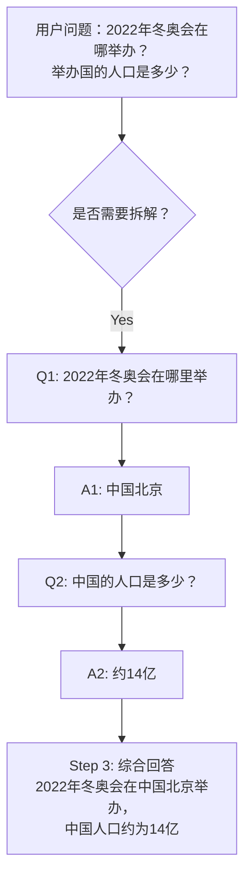
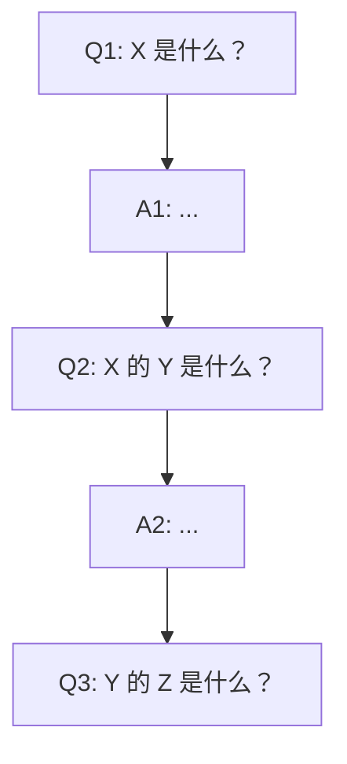
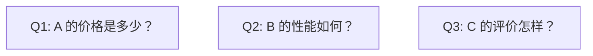
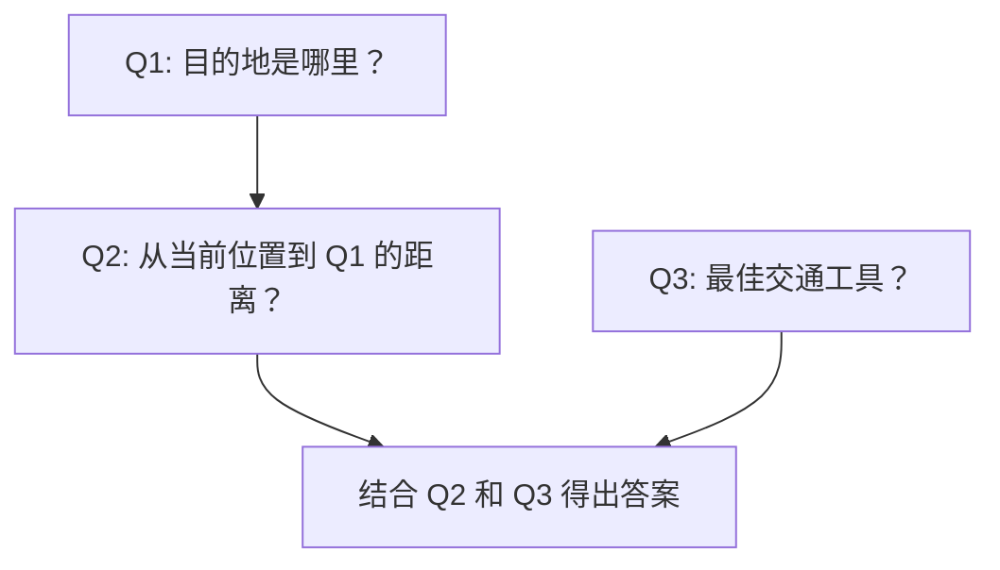

# Self-Ask（自问自答）模式

## 概述

Self-Ask 模式让 Agent 在面对复杂问题时，**先不直接回答，而是将问题拆解为一系列子问题，逐步自问自答**，最终综合所有子答案形成最终回复。与 Chain of Thought 的单向推理不同，Self-Ask 明确地将问题分解为结构化的问答对。

## 原理



核心机制：
1. **判断是否拆解**：Agent 判断问题是否需要分解
2. **生成子问题**：将原问题拆分为独立的、可逐个回答的子问题
3. **逐一回答**：对每个子问题进行回答（可能需要中间结果）
4. **综合回答**：将子答案合并为最终答案

## 使用场景

- **多跳问答**：需要串联多个事实的问题
- **对比分析**："比较 A 和 B 在 X 方面的差异"
- **条件推理**：需要分情况讨论的问题
- **数据聚合**：需要多源数据综合的问题
- **逐步计算**：多步数学或逻辑计算

## 示例代码

```python
import json
import re
from typing import List, Dict, Tuple, Optional
from dataclasses import dataclass, field


@dataclass
class SubQuestion:
    """子问题"""
    id: int
    question: str
    answer: Optional[str] = None
    depends_on: List[int] = field(default_factory=list)  # 依赖的子问题 ID


class SelfAskAgent:
    """Self-Ask 模式 Agent 实现"""

    def __init__(self, llm, tools: Dict[str, callable] = None):
        self.llm = llm
        self.tools = tools or {}

    def answer(self, question: str) -> str:
        """
        使用 Self-Ask 策略回答问题
        """
        # Step 1: 分析问题是否需要拆解
        decomposition = self._should_decompose(question)

        if not decomposition["should_decompose"]:
            # 简单问题直接回答
            return self._direct_answer(question)

        # Step 2: 拆解为子问题
        sub_questions = self._decompose(question, decomposition["complexity"])

        print(f"拆解为 {len(sub_questions)} 个子问题：")
        for sq in sub_questions:
            deps = f" (依赖: {sq.depends_on})" if sq.depends_on else ""
            print(f"  Q{sq.id}: {sq.question}{deps}")

        # Step 3: 逐步回答子问题（处理依赖关系）
        answered = self._answer_sub_questions(sub_questions)

        # Step 4: 综合最终答案
        return self._synthesize(question, answered)

    def _should_decompose(self, question: str) -> Dict:
        """判断是否需要拆解问题"""
        prompt = f"""分析以下问题是否需要拆解为子问题来回答。

问题：{question}

判断标准：
- 需要查询多个独立事实：拆解
- 涉及比较/对比：拆解
- 需要多步计算：拆解
- 包含嵌套问题（"A的B的C是什么"）：拆解
- 简单的单一事实查询：不拆解

以 JSON 格式返回：
{{
  "should_decompose": true/false,
  "complexity": "simple|medium|complex",
  "reason": "判断理由"
}}
"""
        response = self.llm.generate(prompt)
        return json.loads(response)

    def _decompose(self, question: str, complexity: str) -> List[SubQuestion]:
        """将复杂问题拆解为子问题序列"""
        prompt = f"""将以下问题拆解为可独立回答的子问题。

原始问题：{question}
复杂程度：{complexity}

要求：
1. 每个子问题应该是自包含的、可独立回答的
2. 标注子问题之间的依赖关系（哪些子问题需要先于其他回答）
3. 子问题按逻辑顺序排列

以 JSON 格式返回：
[
  {{"id": 1, "question": "子问题?", "depends_on": []}},
  {{"id": 2, "question": "子问题?", "depends_on": [1]}},
  ...
]
"""
        response = self.llm.generate(prompt)
        items = json.loads(response)

        return [
            SubQuestion(
                id=item["id"],
                question=item["question"],
                depends_on=item.get("depends_on", []),
            )
            for item in items
        ]

    def _answer_sub_questions(
        self, sub_questions: List[SubQuestion]
    ) -> Dict[int, str]:
        """按依赖顺序回答子问题"""
        answers: Dict[int, str] = {}
        remaining = list(sub_questions)

        while remaining:
            # 找到所有依赖已满足的子问题
            ready = [
                sq for sq in remaining
                if all(dep in answers for dep in sq.depends_on)
            ]

            if not ready:
                # 存在循环依赖，强制回答所有剩余问题
                ready = remaining

            for sq in ready:
                # 构建上下文（包含依赖问题的答案）
                context = ""
                if sq.depends_on:
                    context_parts = []
                    for dep_id in sq.depends_on:
                        context_parts.append(
                            f"已知：{sub_questions[dep_id-1].question}\n"
                            f"答案：{answers[dep_id]}"
                        )
                    context = "\n\n".join(context_parts)

                # 回答子问题
                answer = self._answer_single(sq.question, context)
                sq.answer = answer
                answers[sq.id] = answer

                print(f"  A{sq.id}: {answer[:80]}...")
                remaining.remove(sq)

        return answers

    def _answer_single(self, question: str, context: str = "") -> str:
        """回答单个问题（可使用工具）"""
        prompt = f"""请回答以下子问题。

{f'背景知识：{context}' if context else ''}

子问题：{question}

请直接给出准确、简洁的答案。如果问题可以使用工具查询，请使用工具。
"""
        return self.llm.generate(prompt)

    def _direct_answer(self, question: str) -> str:
        """直接回答问题（不拆解）"""
        return self.llm.generate(
            f"请回答以下问题：{question}\n\n直接给出答案。"
        )

    def _synthesize(
        self, original_question: str, answers: Dict[int, str]
    ) -> str:
        """综合子答案生成最终回答"""
        qa_pairs = "\n".join([
            f"Q: {sq.question}\nA: {answers.get(sq.id, 'N/A')}"
            for sq in self._cached_sub_questions
            if sq.id in answers
        ]) if hasattr(self, '_cached_sub_questions') else "\n".join(
            f"{k}: {v}" for k, v in sorted(answers.items())
        )

        prompt = f"""基于以下子问题和答案，综合回答原始问题。

原始问题：{original_question}

子问题与答案：
{qa_pairs}

请生成一个连贯、准确的综合回答。
"""
        return self.llm.generate(prompt)


# ========== 带 Follow-up 的 Self-Ask ==========

class FollowUpSelfAskAgent(SelfAskAgent):
    """支持追问澄清的 Self-Ask"""

    def _decompose(self, question: str, complexity: str) -> List[SubQuestion]:
        sub_questions = super()._decompose(question, complexity)

        # 检查是否有需要澄清的子问题
        clarified = []
        for sq in sub_questions:
            if self._needs_clarification(sq.question):
                clarified_q = self._clarify(sq.question)
                sq.question = clarified_q
            clarified.append(sq)

        self._cached_sub_questions = clarified
        return clarified

    def _needs_clarification(self, question: str) -> bool:
        """判断子问题是否需要澄清"""
        prompt = f"""判断以下问题是否包含模糊术语需要澄清。

问题：{question}

以 JSON 返回：{{"needs_clarification": true/false}}
"""
        response = self.llm.generate(prompt)
        return json.loads(response).get("needs_clarification", False)

    def _clarify(self, question: str) -> str:
        """澄清模糊问题"""
        prompt = f"""以下问题包含模糊术语，请改写为精确的问题。

原问题：{question}

改写后的精确问题（只返回改写后的问题）：
"""
        return self.llm.generate(prompt)


# ========== 使用示例 ==========

agent = SelfAskAgent(llm=YourLLM())

# 多跳问题
result = agent.answer(
    "特斯拉 CEO 的出生城市和国家的人口排名是多少？"
)
print(f"\n最终答案：{result}")

# 对比问题
result = agent.answer(
    "Python 和 Rust 在内存管理、性能和生态方面有什么区别？"
)
print(f"\n最终答案：{result}")
```

## 拆解策略

### 1. 顺序拆解（Sequential）
每个子问题依赖前一个的答案：



### 2. 并行拆解（Parallel）
子问题互不依赖，可并行回答：



### 3. 混合拆解（Hybrid）
部分依赖，部分独立：



## 优点与局限

| 优点 | 局限 |
|------|------|
| 问题结构化，回答更系统 | 拆解不当时可能引入错误 |
| 子问题可并行处理 | 依赖关系复杂时调度困难 |
| 中间结果可追溯、可验证 | 增加了 LLM 调用次数 |
| 适合处理多跳、对比类问题 | 简单问题使用会增加延迟 |
| 可结合工具调用强化子问题回答 | 子问题间信息传递可能失真 |
