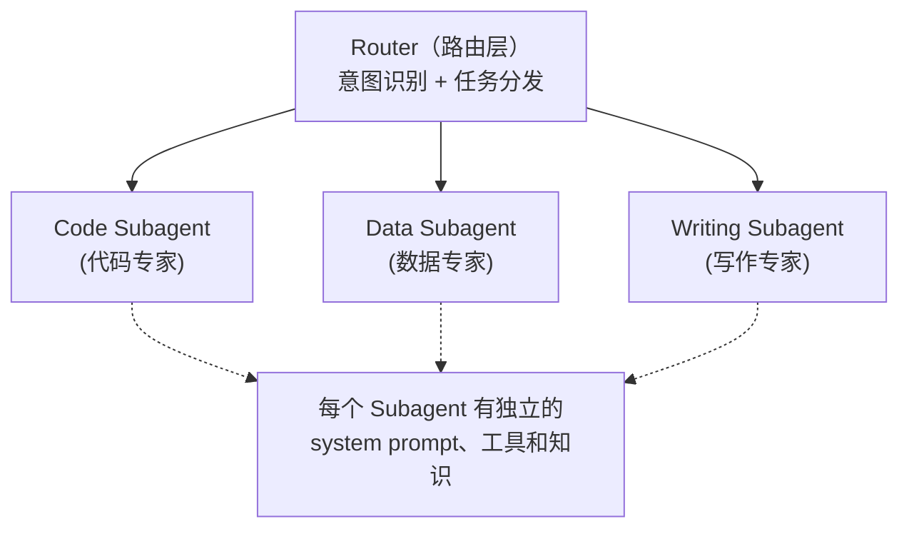

# Router / Subagent（路由/子代理）模式

## 概述

Router/Subagent 模式将 Agent 系统设计为一个**路由器 + 多个专家子代理**的架构。当用户请求到来时，Router 分析请求意图，将其路由到最合适的专家子代理处理。每个子代理是独立的、专注的 Agent，只处理自己擅长的领域。

## 原理



Router 的工作流程：
1. **意图分类**：分析用户请求属于哪个领域
2. **复杂度评估**：判断是否需要进一步分解
3. **路由分发**：将任务转发给对应子代理
4. **结果聚合**（可选）：收集子代理结果并返回

## 使用场景

- **多功能平台**：一个界面支持多种服务（代码、写作、分析、翻译）
- **企业内部系统**：路由到 HR、IT、财务等不同部门的子代理
- **客服系统**：售前咨询、售后支持、技术问题各自路由到专业代理
- **API Gateway**：智能 API 网关，根据请求内容路由到不同微服务
- **知识库系统**：不同领域的知识路由到不同的 RAG 子系统

## 示例代码

```python
import json
from typing import List, Dict, Any, Optional, Callable
from dataclasses import dataclass, field
from enum import Enum
from abc import ABC, abstractmethod


class Intent(str, Enum):
    """意图分类"""
    CODE = "code"           # 代码相关
    WRITING = "writing"     # 写作相关
    DATA = "data"           # 数据分析
    QA = "qa"               # 知识问答
    TRANSLATION = "translation"  # 翻译
    GENERAL = "general"     # 通用对话
    UNKNOWN = "unknown"     # 未知意图


@dataclass
class IntentResult:
    """意图识别结果"""
    intent: Intent
    confidence: float
    sub_intent: Optional[str] = None  # 子意图，如 code/python
    details: Dict[str, Any] = field(default_factory=dict)


# ========== 子代理基类 ==========

class Subagent(ABC):
    """子代理抽象基类"""

    def __init__(self, name: str, description: str, llm, tools: Dict = None):
        self.name = name
        self.description = description
        self.llm = llm
        self.tools = tools or {}
        self.system_prompt = self._build_system_prompt()

    @abstractmethod
    def _build_system_prompt(self) -> str:
        """构建子代理专属的 system prompt"""
        pass

    @abstractmethod
    def can_handle(self, intent: IntentResult) -> bool:
        """判断是否能处理该意图"""
        pass

    def execute(self, user_input: str, context: Dict = None) -> str:
        """执行子代理任务"""
        messages = [
            {"role": "system", "content": self.system_prompt},
            {"role": "user", "content": user_input},
        ]

        if context:
            messages.insert(1, {
                "role": "system",
                "content": f"额外上下文：{json.dumps(context, ensure_ascii=False)}"
            })

        return self.llm.chat(messages)


# ========== 专家子代理实现 ==========

class CodeSubagent(Subagent):
    """代码专家子代理"""

    def _build_system_prompt(self) -> str:
        return """你是一个世界级的软件工程师。遵循以下原则：

1. 代码风格：遵循 PEP 8（Python）或对应语言的最佳实践
2. 完整性：包含导入、类型注解、文档字符串和错误处理
3. 可读性：变量命名清晰，添加必要注释
4. 性能：考虑时间复杂度和空间复杂度
5. 测试：提供关键函数的测试用例

当用户要求写代码时，优先输出可运行的完整代码。
"""

    def can_handle(self, intent: IntentResult) -> bool:
        return intent.intent == Intent.CODE


class WritingSubagent(Subagent):
    """写作专家子代理"""

    def _build_system_prompt(self) -> str:
        return """你是一个专业的写作者和编辑。擅长：

1. 各类文体：技术博客、商业报告、创意写作、学术论文
2. 语言风格：可根据需求调整正式/非正式、专业/通俗
3. 结构优化：组织逻辑清晰，段落过渡自然
4. 语言润色：语法正确，表达精炼，避免冗余

请根据用户的写作目的和目标读者调整风格。
"""

    def can_handle(self, intent: IntentResult) -> bool:
        return intent.intent == Intent.WRITING


class DataSubagent(Subagent):
    """数据分析子代理"""

    def _build_system_prompt(self) -> str:
        return """你是一个数据分析专家。能力包括：

1. 数据处理：清洗、转换、聚合数据
2. 统计分析：描述性统计、假设检验、回归分析
3. 可视化：推荐合适的图表类型和维度
4. SQL/Pandas：生成高效的数据查询和处理代码
5. 业务洞察：从数据中提炼可操作的业务建议

所有分析基于数据，不作无根据的推断。
"""

    def can_handle(self, intent: IntentResult) -> bool:
        return intent.intent == Intent.DATA


class QASubagent(Subagent):
    """知识问答子代理"""

    def _build_system_prompt(self) -> str:
        return """你是一个知识渊博的问答专家。回答原则：

1. 准确性优先：不确定时明确说明
2. 简洁全面：在保证完整的前提下追求简洁
3. 结构化：对复杂问题使用列表、表格等结构
4. 引用来源：尽可能提供信息来源
5. 批判性思维：区分事实和观点，指出争议点
"""

    def can_handle(self, intent: IntentResult) -> bool:
        return intent.intent == Intent.QA


class GeneralSubagent(Subagent):
    """通用对话子代理（兜底）"""

    def _build_system_prompt(self) -> str:
        return """你是一个友好、有帮助的 AI 助手。尽量理解用户需求并提供有价值的回应。"""

    def can_handle(self, intent: IntentResult) -> bool:
        return True  # 兜底，处理所有未匹配的意图


# ========== 路由器 ==========

class Router:
    """意图识别和任务路由"""

    def __init__(self, llm):
        self.llm = llm
        self._subagents: Dict[str, Subagent] = {}

    def register(self, subagent: Subagent):
        """注册子代理"""
        self._subagents[subagent.name] = subagent
        print(f"[Router] 注册子代理: {subagent.name} - {subagent.description}")

    def route(self, user_input: str, history: List[Dict] = None) -> str:
        """
        分析意图并路由到合适的子代理
        """
        # Step 1: 意图识别
        intent = self._classify_intent(user_input, history)
        print(f"[Router] 意图: {intent.intent} (置信度: {intent.confidence:.2%})")

        # Step 2: 选择子代理
        subagent = self._select_subagent(intent)

        if subagent is None:
            return "抱歉，我无法处理该请求，请重新描述您的问题。"

        print(f"[Router] 路由到: {subagent.name}")

        # Step 3: 执行
        context = {"intent": intent.intent.value, "confidence": intent.confidence}
        return subagent.execute(user_input, context)

    def _classify_intent(
        self, user_input: str, history: List[Dict] = None
    ) -> IntentResult:
        """意图分类"""
        # 构建可用意图描述
        intents_desc = "\n".join([
            f"- {intent.value}: {self._get_intent_description(intent)}"
            for intent in Intent
            if intent != Intent.UNKNOWN
        ])

        prompt = f"""分析以下用户消息的意图。可用意图类别：

{intents_desc}

用户消息：{user_input}

以 JSON 格式返回：
{{
  "intent": "意图类别",
  "confidence": 0.0-1.0,
  "sub_intent": "子类别（可选）",
  "reason": "判断理由"
}}

注意：
- 如果用户要求写代码 → code
- 如果用户要求写文章、润色文字 → writing
- 如果用户要求分析数据、画图表 → data
- 如果用户问知识性问题 → qa
- 如果要求翻译 → translation
- 其他 → general
"""
        response = self.llm.generate(prompt)
        data = json.loads(response)

        return IntentResult(
            intent=Intent(data["intent"]),
            confidence=data["confidence"],
            sub_intent=data.get("sub_intent"),
            details={"reason": data.get("reason", "")},
        )

    def _get_intent_description(self, intent: Intent) -> str:
        """获取意图描述"""
        descriptions = {
            Intent.CODE: "代码编写、调试、代码审查、架构设计",
            Intent.WRITING: "文章撰写、内容润色、文案创作、翻译",
            Intent.DATA: "数据分析、SQL 查询、数据可视化、统计",
            Intent.QA: "知识问答、概念解释、事实查询",
            Intent.TRANSLATION: "语言翻译、本地化",
            Intent.GENERAL: "通用对话、闲聊",
        }
        return descriptions.get(intent, "其他")

    def _select_subagent(self, intent: IntentResult) -> Optional[Subagent]:
        """选择合适的子代理"""
        candidates = []

        for agent in self._subagents.values():
            if agent.can_handle(intent):
                candidates.append(agent)

        if not candidates:
            return None

        # 多个候选时，选择最匹配的（这里简化为第一个，实际可以有更复杂的策略）
        return candidates[0]


# ========== 组装系统 ==========

class RouterAgentSystem:
    """完整的路由代理系统"""

    def __init__(self, llm):
        self.router = Router(llm)

        # 注册所有子代理
        self.router.register(CodeSubagent(
            "code-expert", "代码编写和审查专家", llm
        ))
        self.router.register(WritingSubagent(
            "writing-expert", "写作和编辑专家", llm
        ))
        self.router.register(DataSubagent(
            "data-expert", "数据分析专家", llm
        ))
        self.router.register(QASubagent(
            "qa-expert", "知识问答专家", llm
        ))
        self.router.register(GeneralSubagent(
            "general-assistant", "通用助手（兜底）", llm
        ))

    def chat(self, user_input: str) -> str:
        return self.router.route(user_input)


# ========== 使用示例 ==========

system = RouterAgentSystem(llm=YourLLM())

# 代码请求
print("=== 代码请求 ===")
response = system.chat("用 Python 写一个快速排序算法")
print(response[:200])

# 写作请求
print("\n=== 写作请求 ===")
response = system.chat("帮我写一段产品发布公告的文案")
print(response[:200])

# 数据分析请求
print("\n=== 数据分析请求 ===")
response = system.chat("分析这份销售数据中的趋势")
print(response[:200])

# 知识问答
print("\n=== 知识问答 ===")
response = system.chat("解释一下什么是 CAP 定理")
print(response[:200])
```

## 高级路由策略

### 1. 多级路由

```python
class HierarchicalRouter(Router):
    """多级路由器：先粗分类，再细分类"""

    def _classify_intent(self, user_input: str, history=None) -> IntentResult:
        # 第一级：粗分类
        coarse = super()._classify_intent(user_input, history)

        # 第二级：细分类（仅对代码意图）
        if coarse.intent == Intent.CODE:
            coarse.sub_intent = self._classify_code_intent(user_input)

        return coarse

    def _classify_code_intent(self, user_input: str) -> str:
        """代码意图的二级分类"""
        prompt = f"""判断此代码请求的具体类别：

用户：{user_input}

类别：debug（调试）、implement（实现新功能）、refactor（重构）、
      review（代码审查）、architecture（架构设计）、explain（解释代码）

只返回类别名称。
"""
        return self.llm.generate(prompt).strip()
```

### 2. 基于规则的快速路由

```python
class FastRuleRouter:
    """基于规则的快速路由，避免 LLM 调用"""

    RULES = {
        Intent.CODE: [
            r"(写|生成|帮我).*代码",
            r"(debug|调试|修复).*bug",
            r"(python|java|go|rust|js|ts)\s*(代码|实现|开发)",
        ],
        Intent.WRITING: [
            r"(写|润色|修改).*(文章|文案|博客|报告)",
            r"(帮我|请).*(翻译|translate)",
        ],
        Intent.DATA: [
            r"(分析|查询|统计).*(数据|sql|数据库)",
            r"(可视化|画图|图表)",
        ],
    }

    def classify(self, user_input: str) -> Optional[Intent]:
        import re
        for intent, patterns in self.RULES.items():
            for pattern in patterns:
                if re.search(pattern, user_input, re.IGNORECASE):
                    return intent
        return None  # 规则未命中，回退到 LLM 路由
```

## 优点与局限

| 优点 | 局限 |
|------|------|
| 子代理各司其职，专业化程度高 | 意图分类可能出错导致路由到错误代理 |
| 易于扩展，新增领域只需添加子代理 | 跨领域的混合问题处理困难 |
| System Prompt 可按领域深度定制 | 代理切换导致上下文丢失 |
| 降低单个 prompt 的复杂度 | Router 成为单点瓶颈 |
| 便于权限和成本隔离 | 简单问题可能过度路由 |
