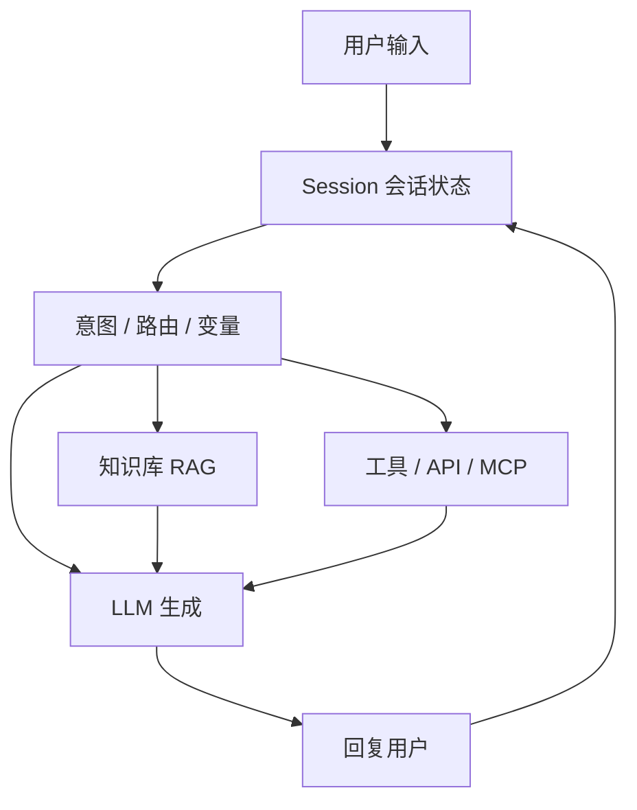

# 什么是 ChatFlow（AI 对话流）

> 一句话定义：ChatFlow 是以多轮会话为中心，用编排节点组织 LLM、工具与知识库，构建可交互对话应用的范式。

## 1. 定义

在 AI 应用语境下， **ChatFlow（对话流）** 指：

- 以 **会话（Session/Conversation）** 为基本单位，维护多轮上下文；
- 用可视化或声明式节点编排「理解意图 → 检索/调工具 → 生成回复」；
- 面向终端用户提供聊天体验（Web、IM、嵌入式 Widget 等）。

它回答的问题是： **「用户怎么和 AI 持续聊下去，并在对话中完成任务？」**

常见产品形态：

| 形态 | 说明 | 代表 |
|------|------|------|
| AI 应用平台 · 对话编排 | 画布编排 + 知识库 + 发布渠道 | Dify Chatflow、FastGPT |
| Bot 搭建平台 | 对话机器人 / Agent 商店生态 | Coze（扣子）、Botpress |
| 知识库问答产品 | 偏 RAG 对话 | MaxKB、部分企业知识助手 |
| 语音/多渠道对话设计 | 设计对话体验并发布多端 | Voiceflow |
| 开源对话框架 | 代码/配置驱动对话管理 | Rasa（偏传统 NLU，可接 LLM） |

## 2. 核心组件

1. **Conversation / Memory** ：多轮历史、变量槽位、用户画像。
2. **Orchestration** ：条件分支、问题分类、子流程、回退策略。
3. **Knowledge** ：文档知识库、FAQ、检索与重排。
4. **Tools** ：查订单、建工单、日历、浏览器等；可接 MCP / OpenAPI。
5. **Channels** ：Web Chat、飞书/企微/钉钉、WhatsApp、API。
6. **Guardrails** ：敏感词、权限、人工接管、输出审核。

## 3. 典型工作流程

1. **接入** ：用户从渠道发起对话。
2. **理解** ：分类意图 / 抽取槽位 / 读取会话变量。
3. **增强** ：按需检索知识库或调用工具。
4. **生成** ：LLM 结合上下文产出回复（可流式）。
5. **收尾** ：更新会话状态；必要时转人工或触发后台 WorkFlow。

## 4. 与相关概念的边界

| 概念 | 关系 | 差异 |
|------|------|------|
| **WorkFlow** | 常配合使用 | WorkFlow 偏触发式后台流水线；ChatFlow 偏实时多轮交互 |
| **单轮 Chatbot** | ChatFlow 的退化形态 | 单轮无复杂编排与状态机；ChatFlow 可含分支、工具、子流程 |
| **Agent** | ChatFlow 可内嵌 Agent 节点 | Agent 强调自主规划循环；ChatFlow 强调对话体验与可控路径 |
| **Prompt 链式调用** | 实现手段之一 | ChatFlow 还包含渠道、会话、发布与运营能力 |

**Dify 中的约定（便于记忆）** ：

- **Chatflow** ：对话型应用编排（有会话）。
- **Workflow** ：非对话/批处理编排（无会话或弱会话）。

## 5. 适用场景

- 智能客服 / 售前咨询
- 企业内部知识助手
- 带工具调用的个人助理（查数、下单、预约）
- 教学答疑、导览讲解
- 多渠道统一机器人入口

## 6. 优点与局限

### 优点

- **体验友好** ：天然契合聊天交互习惯。
- **状态可管** ：变量、记忆、分支让复杂对话可控。
- **业务可达** ：工具调用把「能聊」变成「能办」。
- **上线快** ：低代码平台可快速发布到多渠道。

### 局限

- **长对话噪声** ：上下文膨胀导致跑偏或成本上升。
- **编排与自由发挥的张力** ：管太死像菜单树，放太开像不可控 Agent。
- **渠道差异** ：各 IM 能力不一，交互要适配。
- **评测难** ：多轮对话质量评估比单次生成更复杂。

## 7. 设计要点

1. **先定义成功对话** ：用户要完成什么任务，而不是先堆节点。
2. **关键动作可确认** ：支付、删改、对外发送等必须二次确认或人工审批。
3. **检索与工具失败要有话术** ：不要把原始报错甩给用户。
4. **会话记忆分级** ：短期历史 / 长期记忆 / 业务变量分开管理。
5. **重活丢给 WorkFlow** ：对话里触发任务，真正批处理放后台。

## 8. 学习要点

- ChatFlow = Session + Orchestration + Knowledge + Tools + Channels。
- 与 WorkFlow 是「前台对话 / 后台流水线」的分工。
- 选型时先问：要多轮吗？要接哪些渠道？知识库比重多大？工具风险多高？

## 9. 参考资料

- Dify 文档：Chatflow 应用说明
- Coze / Botpress 官方文档
- 本仓库：[WorkFlow 知识库](../WorkFlow/README.md)、[Agent 基础](../AI知识库/12-Agent与工具/01-Agent基础.md)
