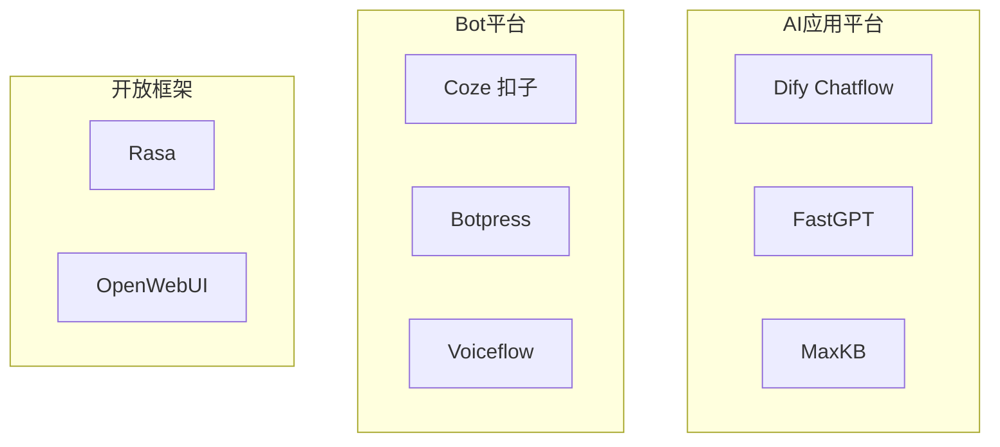

# ChatFlow 主流工具全景

> 一句话定义：盘点当前主流对话流 / 机器人搭建工具的定位、特点与选型建议。

## 1. 工具地图

| 工具 | 类型 | 开源/形态 | 一句话定位 | 更适合 |
|------|------|-----------|-----------|--------|
| **Dify Chatflow** | AI 应用平台 | 开源可自托管 + 云 | 对话编排 + 知识库 + 工具一体 | 企业自建 LLM 应用 |
| **Coze（扣子）** | Bot 平台 | 平台型（字节系） | 低代码 Agent/Bot + 插件生态 | 快速上线多渠道 Bot |
| **FastGPT** | 知识库对话 | 开源可自托管 | 强 RAG 的对话工作流 | 文档问答、知识库客服 |
| **MaxKB** | 知识库问答 | 开源 | 开箱即用的知识库助手 | 内部知识库快速落地 |
| **Botpress** | 对话平台 | 开源核心 + 云 | 开发者向对话机器人平台 | 可定制多轮 Bot |
| **Voiceflow** | 对话设计 | SaaS | 产品/设计驱动的对话原型与发布 | 体验设计、多渠道原型 |
| **Rasa** | 对话框架 | 开源 | 传统 NLU + 对话管理（可接 LLM） | 需强可控对话策略的团队 |
| **Open WebUI** | Chat 前端 | 开源 | 本地/私有模型聊天界面 | Ollama 等本地模型入口 |

## 2. 重点工具说明

### 2.1 Dify Chatflow

- **定位** ：Dify 中面向 **对话型应用** 的编排模式（与 Workflow 并列）。
- **特点** ：
  - 画布编排：问题分类、条件分支、知识库检索、LLM、工具、代码节点等。
  - 原生会话：维护多轮上下文与变量。
  - 模型/工具/知识库统一管理，可发布为 WebApp 或 API。
  - 适合「要可控对话路径，又要 LLM 生成能力」的企业场景。
- **典型场景** ：带知识库的客服、内部助手、工具增强型对话应用。
- **注意** ：纯后台批处理、定时任务应改用 [Dify Workflow](../WorkFlow/01-主流工具全景.html)。

### 2.2 Coze（扣子）

- **定位** ：低代码 Bot / Agent 搭建平台，强调插件、工作流与多渠道发布。
- **特点** ：
  - 上手快，模板与插件生态丰富。
  - 支持工作流编排、知识库、多 Agent 等能力（产品能力持续演进）。
  - 适合运营/产品快速做出可发布机器人。
- **局限** ：深度自托管与定制通常弱于开源一体平台；合规与数据驻留需按业务评估。

### 2.3 FastGPT

- **定位** ：开源 LLM 知识库平台，对话 + 工作流能力突出。
- **特点** ：
  - RAG 体验成熟（导入、分段、检索调试）。
  - 可视化工作流可编排复杂问答路径。
  - 自托管友好，适合做企业知识问答底座。
- **典型场景** ：文档客服、制度问答、售后知识助手。

### 2.4 MaxKB

- **定位** ：开源知识库问答系统，强调快速部署与易用。
- **特点** ：开箱偏向「知识库 + 对话」，路径相对聚焦。
- **适合** ：要尽快上线内部知识助手、团队规模不大的场景。

### 2.5 Botpress

- **定位** ：面向开发者的对话机器人平台。
- **特点** ：对话流可视化 + 代码扩展；可接 LLM 做 NLU/生成。
- **适合** ：需要工程化定制、多轮策略清晰的 Bot。

### 2.6 Voiceflow

- **定位** ：对话/语音体验设计与协作平台。
- **特点** ：产品经理友好，适合原型、评审与多渠道发布。
- **局限** ：偏设计与编排，重后端集成时常需配合工程能力。

### 2.7 Rasa / Open WebUI

- **Rasa** ：经典开源对话框架，规则与策略可控；现可与 LLM 混合。适合「对话状态机要强掌控」的团队。
- **Open WebUI** ：更偏 Chat 前端与模型网关体验，不是完整 ChatFlow 编排器，但常作为本地对话入口。

## 3. 横向对比维度

| 维度 | 关注点 |
|------|--------|
| 会话能力 | 多轮记忆、变量、子对话、打断与恢复 |
| 知识库 | 导入格式、切片策略、检索效果、引用展示 |
| 工具调用 | OpenAPI / 插件 / MCP / 自定义函数 |
| 编排自由度 | 画布节点丰富度 vs 纯 Prompt Agent |
| 渠道发布 | Web、企微/飞书/钉钉、国际 IM、SDK |
| 部署与合规 | 云 / 私有化、审计、数据驻留 |
| 运营能力 | 对话日志、标注、A/B、人工接管 |
| 成本 | 平台费 + 模型 token + 自托管人力 |

## 4. 选型建议

| 你的情况 | 更推荐 |
|----------|--------|
| 要私有化、对话编排 + 知识库一体 | **Dify Chatflow** |
| 要最快做出可发布 Bot、接受平台生态 | **Coze** |
| 核心是文档/知识库问答 | **FastGPT / MaxKB** |
| 开发团队要深度定制对话策略 | **Botpress / Rasa** |
| 产品主导对话体验原型 | **Voiceflow** |
| 本地模型聊天入口 | **Open WebUI** （+ Ollama 等） |
| 对话触发后要跑重后台任务 | ChatFlow 触发 → **[WorkFlow 工具](../WorkFlow/01-主流工具全景.html)** |

## 5. 与 WorkFlow 工具如何配合

常见落地组合：

1. **Dify Chatflow + Dify Workflow** ：对话收口在 Chatflow，批处理/长任务走 Workflow。
2. **Coze / FastGPT + n8n** ：对话平台负责交互，n8n 负责跨系统集成与自动化。
3. **任意 ChatFlow + LangGraph** ：前台低代码，核心复杂 Agent 下沉代码级编排。

原则： **前台对话短链路、可解释；后台任务可重试、可观测。**

## 6. 实践建议

1. **先做 10 个高频意图** ，再扩展长尾，避免一上来巨型画布。
2. **知识库与工具分开治理** ：谁维护文档、谁维护 API 契约要明确。
3. **所有对外动作可审计** ：记录「谁在哪轮触发了什么工具」。
4. **建立对话评测集** ：多轮脚本回归，比只看单次回复更有用。
5. **成本护栏** ：限制最大轮次、检索条数、工具调用次数。

## 7. 后续文档计划

- Dify Chatflow：节点设计、问题分类、与 Workflow 协作
- Coze：插件与发布渠道实战
- FastGPT：知识库调参与工作流编排
- 对话评测与人工接管模式

## 8. 参考资料

- [Dify](https://dify.ai/)
- [Coze](https://www.coze.com/) / [扣子](https://www.coze.cn/)
- [FastGPT](https://fastgpt.in/)
- [MaxKB](https://maxkb.cn/)
- [Botpress](https://botpress.com/)
- [Voiceflow](https://www.voiceflow.com/)
- [Rasa](https://rasa.com/)
- 本仓库：[什么是 ChatFlow](00-什么是ChatFlow.html)、[WorkFlow 主流工具](../WorkFlow/01-主流工具全景.html)
