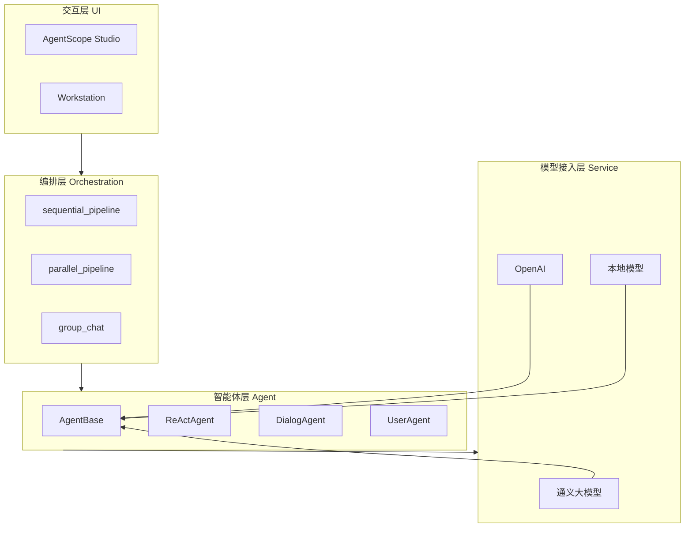
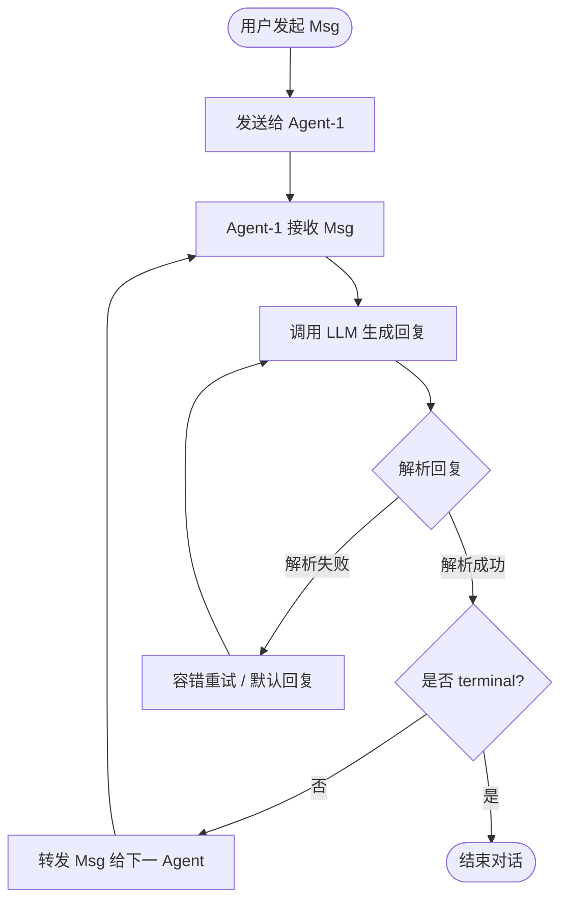
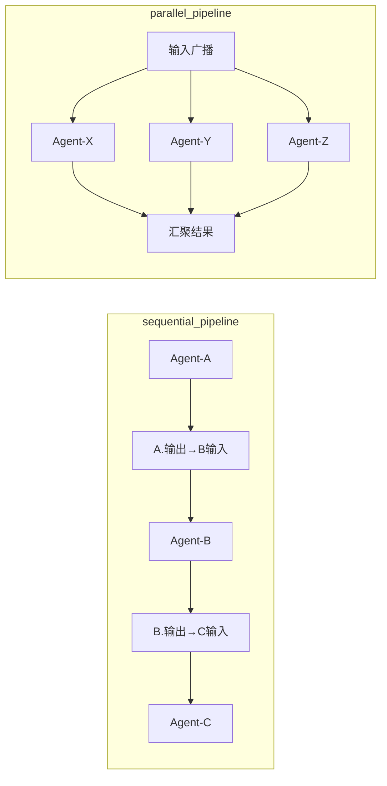
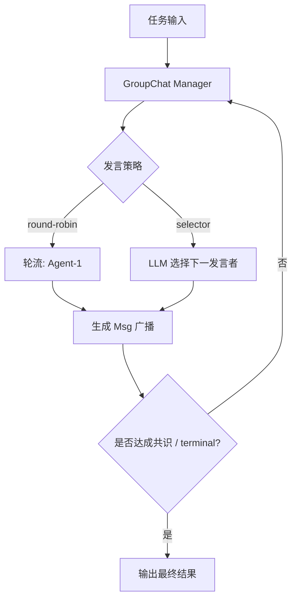
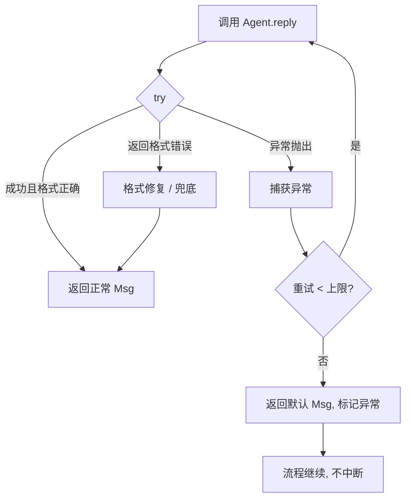

# AgentScope 详细介绍

> 整理日期：2026-08-21
> 定位：阿里巴巴 ModelScope（通义）团队开源的多智能体应用开发框架
> 风格：中文为主，术语保留英文原文；本文深入架构、消息传递、编排与容错，配合流程图

AgentScope 是 ModelScope 团队开源的**多智能体（Multi-Agent）应用开发框架**，设计目标可以概括为一句话：**让开发者用最少的代码，构建稳健、可分布、可观测的多智能体应用**。它特别适合多角色协作对话、智能体仿真（Agent-Based Simulation）与生产级分布式系统。

本文从四个维度展开，并配合 **flowchart 流程图**说明其运行机制。

---

## 一、总体定位与特性

| 维度 | 说明 |
|------|------|
| **易用性** | 高层 API + 内置 Agent，几行代码即可跑通多智能体对话 |
| **鲁棒性（Robustness）** | 防御式编程（Defensive Programming）与解析容错，单点异常不拖垮整体 |
| **分布式** | 基于 Actor 模型，支持跨进程 / 跨机器的 Agent 部署 |
| **可观测** | 内置 tracing，配合 AgentScope Studio 实时查看消息流 |

---

## 二、总体架构

AgentScope 自底向上分为四层：**模型接入层（Service）→ 智能体层（Agent）→ 编排层（Pipeline / GroupChat）→ 交互层（Studio）**。



---

## 三、核心抽象

### 1. Agent 与 Msg

- **AgentBase**：所有智能体的基类，核心方法是 `reply(x)`，接收一条 `Msg`、返回一条 `Msg`。
- **Msg（消息）**：通信单元，结构为 `{ name, role, content }`。`role` 通常为 `user` / `assistant` / `system`。
- **内置 Agent**：`ReActAgent`（推理-行动）、`DialogAgent`（对话）、`UserAgent`（人工输入 / 脚本输入）。

### 2. Service（服务层）

统一管理模型客户端，屏蔽厂商差异。典型用法：

```python
import agentscope
from agentscope.service import ServiceToolkit

agentscope.init(
    model_configs={
        "qwen": {
            "model_type": "dashscope_chat",
            "model_name": "qwen-max",
        }
    }
)
```

### 3. Pipeline / GroupChat

- `sequential_pipeline(agents)`：顺序串联多个 Agent，前者的输出作为后者的输入。
- `parallel_pipeline(agents)`：并行执行多个 Agent，汇聚结果。
- `group_chat(agents, ...)`：群聊式多轮协作，由发言策略驱动。

---

## 四、消息传递流程（Actor 模型）

AgentScope 借鉴 **Actor 模型**：每个 Agent 是独立 Actor，通过消息邮箱异步收发 `Msg`，天然支持并发。下面是一条消息从发起、处理到终止的完整流程。



**关键点**：
- `terminal` 标志决定对话是否结束，避免无限循环。
- 解析失败时不抛异常中断，而是走容错分支，保证流程可继续。

---

## 五、Pipeline 编排流程

AgentScope 的编排原语把"多 Agent 协作"声明式地组织起来。



- **顺序管道**：适合"流水线"式任务（如 研究 → 写作 → 润色）。
- **并行管道**：适合"多视角独立生成再汇总"（如 多个评审员同时打分）。

---

## 六、群聊（GroupChat）协作流程

多 Agent 群聊由发言调度器决定"下一个谁说"，支持轮转、LLM 选择等策略。



---

## 七、鲁棒性与容错机制

生产级多智能体最怕"一个 Agent 崩，全盘崩"。AgentScope 用**防御式编程 + 解析容错**解决。



**要点**：
- 通过 `agentscope.exception` 统一捕获。
- 重试有上限，超限返回兜底消息，保证整体不中断。
- 配合 tracing 可定位是哪个 Agent、哪次调用出了问题。

---

## 八、可观测与 Studio 调试流程

AgentScope Studio 提供 Web UI，可可视化搭建、运行、观察消息流。

```mermaid
flowchart LR
    CODE[编写 Agent / Pipeline] --> ST[as_studio(agents) 启动]
    ST --> UI[浏览器打开 Studio]
    UI --> RUN[运行对话 / 工作流]
    RUN --> TRACE[实时消息流 + tracing]
    TRACE --> DBG[定位异常 / 调参]
    DBG --> CODE
```

---

## 九、最小可运行示例（概念示意）

```python
import agentscope
from agentscope.agents import DialogAgent
from agentscope.pipeline import sequential_pipeline

agentscope.init(
    model_configs={
        "qwen": {"model_type": "dashscope_chat", "model_name": "qwen-max"}
    }
)

researcher = DialogAgent(name="研究员", model_config_name="qwen",
                        sys_prompt="你负责调研并列出要点。")
writer = DialogAgent(name="作家", model_config_name="qwen",
                     sys_prompt="你根据要点写成文章。")

# 顺序管道：研究员 -> 作家
x = sequential_pipeline(researcher, writer,
                        "请介绍一下多智能体框架。")
print(x.content)
```

---

## 十、选型与定位

| 对比项 | AgentScope | AutoGen | CrewAI | LangGraph |
|--------|-----------|---------|--------|-----------|
| 核心范式 | Actor 消息模型 | 对话式群聊 | 角色 + 流程 | 状态图 |
| 鲁棒性重点 | 防御式编程 | 代码执行闭环 | 角色分工 | 持久化 / 人审 |
| 分布式 | 原生支持 | Core 支持 | 一般 | 一般 |
| 低代码 UI | Studio / Workstation | Studio | 企业平台 | Studio（LangGraph） |
| 典型场景 | 仿真、生产多智能体 | 代码执行、科研 | 业务流水线 | 复杂有状态编排 |

## 相关资源

- 概念速览：[README.md](README.md)
- 同类框架：见 [harness 框架总览](../../README.md)
- 官网与文档：https://modelscope.cn/agentscope · https://agentscope.readthedocs.io/
