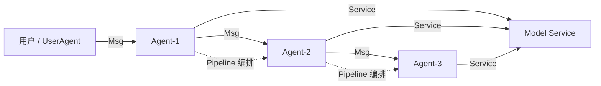

# AgentScope

> 整理日期：2026-08-21
> 定位：阿里巴巴 ModelScope（通义）团队开源的多智能体应用开发框架
> 风格：中文为主，术语保留英文原文；本页为概念速览，详见 [AgentScope详细介绍.md](AgentScope详细介绍.md)

AgentScope 是 ModelScope 团队推出的**多智能体（Multi-Agent）应用开发框架**，目标是用最少的代码快速构建"稳健、可分布、可观测"的多智能体应用。它强调三大特性——**易用性、鲁棒性、分布式能力**，并配套提供 AgentScope Studio 低代码 Web 界面与 Workstation 可视化工作流编排。

## 核心概念

| 概念 | 说明 |
|------|------|
| **Agent（智能体）** | 继承自 `AgentBase`，通过消息（Msg）与外界交互；内置 `ReActAgent`、`DialogAgent`、`UserAgent` 等 |
| **Msg（消息）** | Agent 间通信的基本单元，包含 `name` / `role` / `content` |
| **Service（服务）** | 对模型与 API 调用的统一封装层，屏蔽不同厂商模型接入差异 |
| **Pipeline（管道）** | 提供 `sequential_pipeline`、`parallel_pipeline`、`group_chat` 等编排原语 |
| **Studio / Workstation** | `as_studio` 启动 Web UI 可视化调试；Workstation 提供无代码工作流编排 |

## 架构与通信模型

AgentScope 借鉴 **Actor 模型**：每个 Agent 是一个独立 Actor，通过消息邮箱异步通信，天然支持并发与分布式部署。

## 关键能力

- **多模型 / 多厂商接入**：统一 Service 层对接通义、OpenAI、本地模型等。
- **鲁棒性（防御式编程）**：通过 `agentscope.exception` 与解析容错，单个 Agent 异常不拖垮整体。
- **分布式**：支持跨进程 / 跨机器的 Agent 部署。
- **可观测**：内置 tracing，配合 Studio 实时查看消息流。

## 典型工作流

1. 定义模型 Service（配置 API Key、模型名）。
2. 继承 `AgentBase` 或使用内置 Agent，实现 `reply` 逻辑。
3. 用 `Msg` 在 Agent 间传递信息。
4. 通过 `Pipeline` 或 `group_chat` 编排多 Agent 协作。
5. `as_studio(agents)` 启动 Web UI 调试与演示。

## 适用场景

多角色协作对话、智能体模拟（Agent-Based Simulation）、需要容错与分布式的生产级多智能体系统。

## 相关资源

- 详细架构与流程图：[AgentScope详细介绍.md](AgentScope详细介绍.md)
- 上游索引：[Harness 总览](../../README.md)
- 官网：https://modelscope.cn/agentscope
