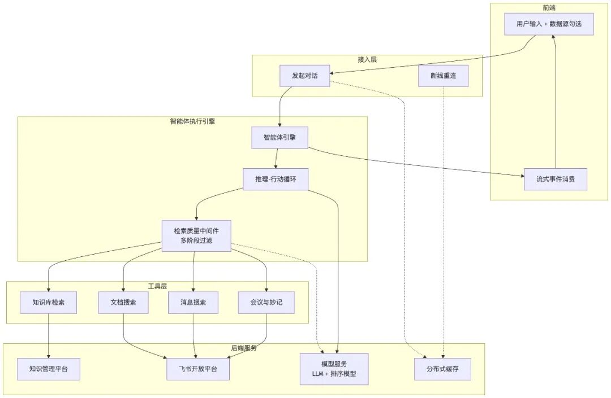
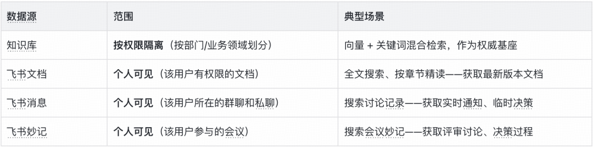
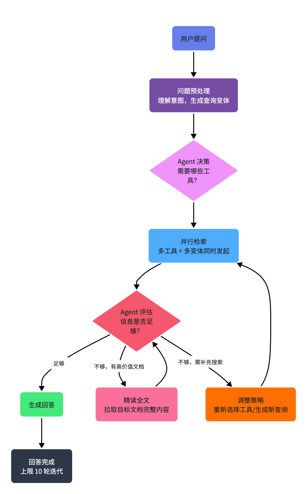

# 得物知识问答：复合检索 AGENT 的系统设计实践

> Original 莲舟 莲舟 得物技术
> 文 / 莲舟


## 目录

一、AgentScope 2.0：Harness Agent 架构
    1. 我们重点使用的三个能力
    2. 基于框架能力构建的复合检索流程
    3. 当前定位：知识库 + 个人飞书数据

二、Agent 自主决策的复合检索架构
    1. 多源并行检索能力
    2. 自主决策能力
    3. 信息整合能力

三、检索质量：三阶段 Pipeline——不只靠搜，更要靠"筛"
    1. 查询扩展：为什么是自然语言句子而非关键词
    2. 问题：向量相似 ≠ 语义相关
    3. 方案：三阶段质量 Pipeline
    4. 实现方式：AgentScope Middleware
    5. 核心过滤逻辑代码示例

四、多模态：让图片成为提问的一部分
    1. 自动模型切换
    2. 图片全生命周期管理

五、生产级可靠性：多实例 SSE 断点续传
    1. 三种路径
    2. 关键设计决策
    3. 模型容灾

六、创新点总结与展望

---

## 一、AgentScope 2.0：Harness Agent 架构

知识问答的核心挑战是准确率和质量。一个回答要准确，需要：查得全（召回率），查得准（精准度），理解得对（多模态），看得对（权限隔离）。这些能力不是堆功能就能实现的，需要一个强大的 Agent 运行时来支撑。

我们选择 AgentScope 2.0，核心原因是它的 HarnessAgent 架构——这是面向生产环境的 Agent 实现，内置了长期运行 Agent 必备的工程能力。

### 我们重点使用的三个能力

HarnessAgent 提供了丰富的能力（ReAct 循环、Middleware、长期记忆、子 Agent 编排、沙箱隔离等），我们重点使用了三个与复合检索直接相关的能力：

- **ReAct 循环**：Agent 不是一次性检索然后回答，而是在「推理→行动→观察→再推理→再行动……」的循环中反复迭代，实现"搜索→评估→精读→再搜索"的复杂流程。
- **中间件（Middleware）**：在 Agent 执行流程的关键位置插入自定义逻辑，不侵入核心代码。我们在 onActing 钩子中实现三阶段质量过滤，对 Agent 完全透明。
- **并行工具调用**：当 Agent 决定调用多个工具时，框架自动并行执行，而非串行等待。这让"多工具 + 多变体"并行检索成为可能。

### 基于框架能力构建的复合检索流程

流程概览：Agent 通过 ReAct 循环实现多轮自主决策，每一轮都是"搜索 → 评估 → 决策"的闭环。

- **多源并行检索**：Agent 同时调用知识库、飞书文档、飞书消息、飞书妙记等多个工具，每个工具用不同的查询变体并行调用。
- **自主评估与挖掘**：Agent 评估检索结果的相关性、完整性和时效性，不够充分时触发补充检索或精读全文。
- **质量过滤**：检索结果经过三阶段质量 Pipeline（FastPass → Reranker → LLM Grading）过滤。
- **信息整合**：Agent 根据来源权威性优先级排序，多源信息交叉验证，生成有判断力的回答。

核心：Agent 的自主决策权——Agent 决定用哪些工具、搜几次、是否需要精读、什么时候停止。用户不需要告诉 Agent"你去查飞书文档"，Agent 自己知道什么时候该查。

### 当前定位：知识库 + 个人飞书数据

当前产品的定位是两条线并行：

- **知识库线**：企业知识库——产品文档、流程规范、FAQ 等，按业务领域或部门划分，由管理员统一维护。
- **个人线**：飞书生态数据——用户勾选飞书消息、飞书文档、飞书妙记时，Agent 检索的是该用户个人可见的数据，由飞书自身的权限体系控制。

两条线在同一轮对话中可以同时激活——用户问"SSO 接入流程"，Agent 可能从知识库拿官方文档、从用户所在技术群拿最新讨论、从团队周会妙记拿相关决策。知识库提供权威性和结构化的知识基座，个人数据提供实时性和上下文关联的补全——这是产品最核心的价值差异。

---

## 二、Agent 自主决策的复合检索架构

### 多源并行检索能力

Agent 可用的工具覆盖知识库数据源 + 三类个人飞书数据源，全部根据用户的前端勾选和权限动态激活。Agent 自主判断何时调用哪个工具，整个过程对用户透明：

权限隔离的两个层面：知识库层按业务领域或部门划分，不同用户拥有不同的可访问知识库列表；飞书生态层通过 UserCallContext 注入用户的飞书 openId，API 按当前用户的身份返回数据。同一个问题，不同用户看到的结果是不同的。

并行调用的技术实现：当 Agent 在一次推理中决定调用多个工具时，框架自动并行执行，由 AgentScope 的 Toolkit.parallel(true) + Java 21 Virtual Thread 支撑。工具调用是 I/O 密集型的（HTTP 请求到知识管理平台和飞书 API），虚拟线程在 I/O 阻塞时自动释放底层平台线程。

### 自主决策能力

传统 RAG 的流程是单向的：用户提问 → 向量检索 → 拼接上下文 → 生成回答。Agent 在这个流程里是被动的——检索到什么就用什么，无法判断信息是否充分，也不会主动补充检索。

我们的流程完全不同，核心在于两个关键决策点：判断 Agent 如何评估检索结果是否充分？

Agent 拿到第一轮检索结果后，会基于结构化提示词中的策略进行多维度评估：

- **相关性判断**：检索结果是否直接回答了用户问题？还是只是"词像但意思不对"？
- **完整性判断**：关键信息是否齐全？比如用户问"SSO 接入流程"，是否包含了配置步骤、权限申请、测试方法等必要环节？
- **时效性判断**：文档是否是最新版本？是否有更新的版本在其他数据源中？

如果评估结果是"信息不足"，Agent 不会盲目重试，而是根据判断结果选择下一步策略。

**挖掘：Agent 如何决定深挖方向？**

基于判断结果，Agent 有三种挖掘策略：

- **精读全文**：如果搜索结果中有高价值文档的片段，但信息不完整，Agent 会调用 get_document_content 工具拉取完整文档。比如从知识库检索到"SSO 接入指南"的摘要，但缺少具体的配置参数，Agent 会精读全文获取完整信息。
- **补充检索**：如果当前数据源的信息不够，Agent 会调整查询策略，尝试其他数据源。比如知识库没有最新讨论，Agent 会转向飞书消息或妙记搜索。
- **交叉验证**：如果多个数据源返回了冲突信息，Agent 会根据来源权威性进行优先级排序——官方文档 > 飞书文档 > 消息/妙记，并在回答中明确指出冲突和建议采信的来源。

这个流程的核心是 Agent 的决策权——每一轮都是"搜索 → 评估 → 决策"，而不是预设的固定路径。Agent 决定用哪些工具、搜几次、是否需要精读、什么时候停止。

**决策依据：结构化提示词 + Middleware 兜底**

Agent 做决策的依据来自我们精心设计的结构化提示词中的策略引导——"知识库权威性更高，优先使用"、"飞书文档检索范围更广，权威性一般"——这些是优先级提示，帮助 Agent 判断不同来源的特性。但最终选哪些工具、怎么组合、哪一轮做什么，由 LLM 在提示词的策略框架内自主决定。用户不需要告诉 Agent"你去查飞书文档"，Agent 自己知道什么时候该查。

我们在 AGENTS.md 中设计了一套结构化的 Agent 提示词，它不是简单的指令列表，而是一个完整的决策流程图：

这套提示词的设计精髓在于：它不是告诉 Agent 怎么做，而是告诉 Agent 做什么和为什么。Agent 在 ReAct 循环中自主决定具体的执行细节——用哪些工具、搜几次、是否需要精读、什么时候停止。

同时，HarnessAgent 的中间件机制允许在 ReAct 循环的关键时机插入自定义逻辑。我们在 onActing 钩子中实现三阶段质量过滤（FastPass → Reranker → LLM Grading），当知识库检索工具执行完成、结果即将返回给大模型时，中间件拦截结果进行过滤。这个过程对 Agent 完全透明——Agent 看到的始终是过滤后的高质量结果。

这种设计的优势在于：关注点分离。结构化提示词负责"做什么"（策略框架），Middleware 负责"做得好"（质量保障），ReAct 循环负责"怎么做"（执行流程）。三者各司其职，互不侵入。

我们没有修改 AgentScope 的 ReAct 循环代码，而是通过结构化提示词和中间件，在循环的关键节点注入了我们的业务逻辑。

### 信息整合能力

当 Agent 自主选择多个数据源并行检索后，它拿到的不是零散的片段，而是一张信息拼图。这张拼图的价值体现在三个递进的层面：

**第一层：多角度并行搜索，最大化召回。** Agent 发现知识库结果中有一份标记为"废弃"的旧版文档，同时飞书文档搜索找到了同文档的最新版本——它自动优先采用新版，标注旧版已废弃。

**第二层：从搜索到精读，深挖关键文档。** Agent 不是"搜到什么就用什么"。它从搜索结果中识别出最关键的文档，进一步调用精读工具拉取全文——因为向量检索只返回最相似的那几个片段，完整的上下文藏在同一篇文档的其他段落里。

**第三层：多源交叉验证，有判断力的信息整合。** Agent 拿到多源信息后，会根据来源权威性进行优先级排序——官方文档最高优先级，会议纪要作为背景补充。这不是"多搜几个地方然后拼起来"，而是有判断力的信息整合。

实现要点：结构化提示词中明确规定了来源优先级（企业知识库 > 飞书文档 > 消息/妙记），并要求冲突时明确指出并建议用户以哪个为准。SourceCollector 组件按 sourceId 跨工具去重，每条关键信息在最终回答中标注 `[src:sourceId]`，可追溯到来源。

---

## 三、检索质量：三阶段 Pipeline——不只靠搜，更要靠"筛"

RAG 系统的质量由两个指标决定：召回率——有没有把相关文档找出来；精准度——找出来的文档是不是真的相关。召回靠查询扩展，精准靠三阶段质量 Pipeline。

向量检索本身我们没有重复造轮子——知识库的文档解析、Chunk 切分、向量化、混合检索，全部由公司已有的知识管理平台提供。我们做的是"在知识管理平台之上构建智能检索层"。

### 查询扩展：为什么是自然语言句子而非关键词

在发起检索之前，第一件事是查询扩展——将用户的原始问题转化为更适合检索的查询语句。这不是简单的关键词提取，而是生成语义等价的完整自然语言句子。

为什么是自然语言而非关键词？Embedding 模型是在海量自然语言文本上训练的——完整的句子、段落、文档。模型对"一句话"的语义编码远比"一串词"精准。例如用户问"怎么申请加薪"，关键词方式「加薪 申请 流程 条件」缺乏语法结构，而自然语言变体「得物内部员工申请薪资调整的流程是什么」有完整的主谓宾结构，能生成更精准的语义向量。

更关键的是，Agent 会生成多个不同角度的变体，并行发起检索。这些变体彼此互补——有的侧重流程描述，有的侧重政策条款，有的侧重申请入口——共同覆盖用户意图的各个侧面。

### 问题：向量相似 ≠ 语义相关

查询扩展提升了召回率，但并不保证召回来的都是真正有用的。向量检索用余弦相似度比较 query 和 document 的 Embedding 向量，这个机制适合"找看起来像的"，但容易被高频词汇干扰。

例如用户问「得物 App 的退货流程是什么」，向量检索返回 5 条结果中只有 2 条真正相关，噪声比例 60%。直接把这些喂给大模型，回答质量必然受影响。

### 方案：三阶段质量 Pipeline

我们不是在向量检索结果上只做一次过滤，而是构建了一个三阶段 Pipeline，每个阶段解决不同层面的问题：



### 实现方式：AgentScope Middleware

三阶段 Pipeline 通过 AgentScope 的 Middleware 机制接入，在 onActing 钩子中拦截 knowledge_search 工具结果。核心逻辑：

- 识别 knowledge_search 工具调用。
- 调用原始工具获取结果。
- 按 toolCallId 分组独立处理：FastPass → Reranker → LLM Grading。
- 重建事件流，用过滤后的结果替换原始工具输出。

关注点分离：Agent 的推理逻辑和检索质量策略完全解耦。调整阈值、切换 Reranker 模型、开关 LLM Grading，都只需修改配置或 Middleware，不影响 Agent 核心代码。

### 核心过滤逻辑代码示例

**Middleware 入口 — onActing 拦截 knowledge_search 结果：**

```java
// 实现 MiddlewareBase 接口，在工具执行前后注入过滤逻辑
Flux<AgentEvent> onActing(Agent agent, ActingInput input, next){
    if (!config.isEnabled()) return next.apply(input);            // 未启用，直接透传
    // 1. 识别本轮是否包含 knowledge_search 工具调用
    targetToolCalls = input.toolCalls()
        .filter(tc -> tc.name == "knowledge_search");
    if (targetToolCalls.isEmpty()) return next.apply(input);      // 无目标工具，透传
    // 2. 先让工具执行，收集所有事件后再统一处理
    events = next.apply(input).collectList();
    return processEvents(events, targetToolCalls);                // 进入三阶段过滤
}
```

**三阶段过滤主流程：**

```java
List<RetrievedItem> filter(String query, List<RetrievedItem> items){
    // ── Stage 0: FastPass ──
    // 条件：结果数 ≤ 2 且全部原始 score ≥ 0.7
    if (items.size() <= 2 && items.allMatch(i -> i.originalScore >= 0.7)) {
        return items;  // 高置信度，跳过过滤，零额外延迟
    }
    // ── Stage 1: Reranker 粗筛 ──
    // 调用交叉编码器模型重新打分，过滤"词像但意思不对"的结果
    if (config.rerankerEnabled) {
        scores = rerankerService.rerank(query, items.snippets);   // 调用 gte-rerank-v2 模型
        items = items
            .filter(i -> scores[i.index] >= 0.3)                  // 阈值 0.3，过滤低相关
            .sortByDescending(i -> i.rerankerScore)
            .limit(8);                                            // 取 Top-8
    }
    // ── Stage 2: LLM Grading 精评 ──
    // 用大模型逐条打分（0.1~1.0 四级），过滤"主题对但不够直接"的结果
    if (config.llmGradeEnabled && !items.isEmpty()) {
        graded = llmScoringService.gradeInBatch(query, items);    // 最多 10 条，30s 超时
        items = graded
            .filter(g -> g.score >= 0.5)                          // 阈值 0.5，过滤不够直接的结果
            .sortByDescending(i -> i.relevanceScore);
    }
    return items;  // 过滤后的结果重建为文本，替换原始工具输出，对 Agent 透明
}
```

**设计要点：**

- 整个 Pipeline 通过 AgentScope 的 MiddlewareBase 接口接入 onActing 钩子，与 Agent 核心推理逻辑完全解耦。
- `fastPass()` 确保高置信度场景（≤ 2 条高分结果）零额外延迟，不增加不需要的过滤开销。
- 每阶段独立可开关（rerankerEnabled / llmGradeEnabled），可按场景灵活组合——例如对时效性要求高的场景可关闭 LLM Grading 以降低延迟。
- 过滤后结果重建为与原始工具输出格式完全一致的文本，Agent 无需感知 Middleware 的存在，做到"关注点分离"。

---

## 四、多模态：让图片成为提问的一部分

在实际使用中，用户遇到问题时往往第一反应是截图——报错信息、界面异常、配置页面，一张图比千言万语更直观。支持图片输入，让"截图即提问"成为可能，大幅降低了用户的表达成本。

### 自动模型切换

用户上传图片后，系统检测到上下文包含图片，自动判断模型策略：

- 未指定模型 → 自动切换到视觉语言模型。
- 指定了视觉模型 → 正常执行。
- 指定了纯文本模型 → 拒绝并提示，防止调用失败。

这个校验不仅检查本轮上传的图片，还检查历史对话中是否有图片。因为大模型无状态，历史图片也需要每轮重新发送——即使本轮没传新图，只要历史中有，同样强制使用视觉模型。

### 图片全生命周期管理

从上传到在回答中展示，图片经历了完整的生命周期：

- **上传阶段**：拖拽/粘贴/点击，最多 6 张，校验类型和大小。
- **发送阶段**：从对象存储内网读取图片字节，Base64 编码，与文本一起构造多模态消息。
- **历史回放**：多轮对话中，历史图片按消息聚合回放，按用户归属过滤，总大小受预算控制。
- **回答嵌入**：Agent 可以在回答中插入检索到的图片辅助说明，图片和文字引用统一编号。

---

## 五、生产级可靠性：多实例 SSE 断点续传

SSE 断点续传的需求，不止来自"服务器宕机"这种极端情况。实际上，高频触发断点续传的是用户的正常操作：

- 页面切到后台太久，浏览器断开了 SSE 连接。
- 刷新页面（F5），前端重新挂载，需要重建 SSE 流。
- 关闭标签页后重新打开，用户期望回到刚才的对话。
- 移动端切换网络（Wi-Fi → 5G），IP 变了，连接中断。

我们的方案是多实例 SSE 断点续传：无论因为什么断开——服务器宕机、页面刷新、网络切换——浏览器自动重连，从断开的地方继续接收，完全看不到中断痕迹。

### 三种路径

系统同时支持三种恢复路径，按优先级自动选择：

**路径一：同实例恢复（最常见——页面刷新、切后台、网络闪断）** 用户断开后重连，请求打到同一个实例。本地内存中仍有 Agent 的运行状态，直接发送一个完整快照恢复历史，然后续传后续内容。零延迟、零 Redis 开销。

**路径二：跨实例转发（负载均衡调度、网络切换导致 IP 变化）** 用户重连时被负载均衡分到了另一个实例。新实例通过 Redis 路由表查到原实例的地址，内部转发请求。原实例像对待本地客户端一样直接推送 SSE 流，新实例透传。

**路径三：快照重建兜底（原实例宕机或不可达）** 如果原实例确实不可达，系统从 Redis 中重建完整会话，已产生的所有内容可以完整恢复，用户不会丢失任何信息。

以下为三种恢复路径的对比图：



### 关键设计决策

**为什么用快照一帧恢复而不是逐条重放？** 早期的方案是"把所有历史事件按顺序重新发送一遍"。在一个典型的多轮 Agent 对话中可能意味着几百个事件——如果逐条重放，前端 React 组件接收到密集的批量更新，浏览器渲染引擎会把这些更新合并成"一段一段"的跳变。快照方案把所有这些事件折叠成一个完整的"当前状态"——就像游戏存档，一帧恢复。

**为什么用路由表 + 内部转发，而不是 Redis Pub/Sub？** 一个更"直觉"的多实例方案是：每个实例的事件写入 Redis Pub/Sub，其他实例订阅。但 Pub/Sub 有一个致命问题——订阅生效有延迟。新订阅者连上 Pub/Sub 时，可能已经错过了前面几条消息。我们的方案核心思路是：Redis 只存路由信息，不参与事件推送。

- **心跳保活**：工具调用期间可能长时间无新事件，系统通过定期发送 SSE 注释行（心跳，每 10 秒）保持连接活跃，对业务逻辑完全透明。
- **分布式锁**：用户快速双击发送按钮，可能导致同一会话产生两个并发请求。系统通过 Redis 的原子 SETNX 操作实现分布式锁，锁带 TTL 自动过期，防止死锁。

### 模型容灾

大模型服务偶尔波动。当主模型出现可重试错误时（5xx 服务端错误、限流、超时、网络异常），自动切换到备用版本继续服务，用户无感知。4xx 客户端错误不触发切换，直接返回错误让用户修正。

---

## 六、创新点总结与展望

回到最初的问题。我们的答案不在某一个算法或某一项技术上，而在系统设计的整体思路。以下是与"标准 RAG 套壳"的六个关键差异：

### 核心创新点

- **复合检索不是"多搜几个地方"**——大多数多源 RAG 的做法是"各搜各的然后拼起来"。我们的做法是 Agent 根据问题自主选择最合适的来源组合，搜索和精读交替推进，交叉验证、分层整合。
- **质量 Pipeline 不只是 Reranker**——很多系统在向量检索后只加一个 Reranker。我们做了三级：FastPass 快速通道、Reranker 粗筛、LLM Grading 精评，每一级解决不同层面的问题。
- **SSE 断点续传不靠 Pub/Sub**——我们用了路由表 + 内部转发的方案，Redis 只存路由信息不参与推送，跨实例重连时直接 HTTP 转发到原实例。

### 展望：从知识问答到个人知识助手

当前产品已经实现了复合检索 Agent 的核心能力：四源融合检索、三阶段质量过滤、多模态支持、以及生产级的 SSE 断点续传。基于这些能力，未来的演进可以分为两个层次。

**短期优化：精细化检索与总结策略**

当前系统对飞书文档、会议、消息等数据源采用统一的总结逻辑，但实际上不同数据源的信息特征差异很大。例如：

- 飞书文档：通常是结构化的流程说明或技术规范，需要提取关键步骤和配置参数
- 飞书消息：包含大量日常讨论噪声，需要识别关键决策点和时间线
- 飞书妙记：会议记录包含结论、待办、责任人等多维度信息，需要根据会议类型（技术评审、项目周会、需求讨论）采用不同的总结侧重点

未来可以针对这些数据源特性，设计差异化的总结策略，进一步提升回答的精准度和实用性。同时，评测体系也会持续完善，覆盖更多业务场景和边界情况。

**长期愿景：个人知识助手**

当前产品打通了"公共知识 + 个人数据"的双通道，但每次对话仍然是独立的。未来的方向是让 Agent 具备长期记忆能力——记住用户的身份、职责、偏好，主动关联相关信息和过往对话，实现"公共知识 + 个人数据 + 长期记忆"三重叠加的检索优势。

AgentScope 框架已内置长期记忆、对话压缩、技能系统、子代理编排等能力，当前处于"已禁用但可激活"状态，后续功能可直接迭代优化，不需要推倒重来。

---

## 七、附录：问答评测结果与框架选型对比

基于不同业务维度的三组评测集（覆盖知识库、飞书文档、飞书消息、飞书妙记四类数据源），全量人工标注，评测结果如下：



另外在技术选型阶段，我们将 AgentScope 2.0 与 Java 生态的主流 AI 框架进行了详细对比：


### 往期回顾

1. 实战从零开始构建一个 Coding Agent：Violin ｜得物技术
2. AI Native 交易核心系统的研发范式｜得物技术
3. 推荐系统体验的数字化突破：得物自动化评测平台的技术实践｜AICon 文章整理
4. RAG 核心概念与原理：Chunking、Embedding、相似度、HNSW 与多路召回｜得物技术
5. 从"机械应答"到"服务伙伴"：得物高可控智能客服的 Agent 工程实践｜AICon 演讲整理

---

> 文 / 莲舟
> 关注得物技术，每周三更新技术干货
> 未经得物技术许可严禁转载，否则依法追究法律责任。
