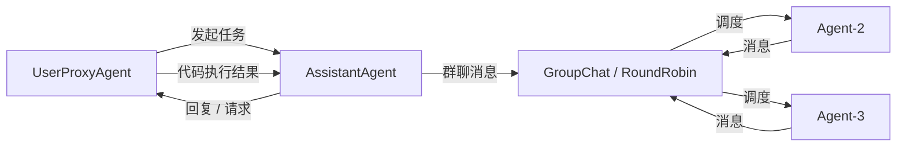

# AutoGen

> 整理日期：2026-08-21
> 定位：微软（Microsoft）开源的多智能体对话与编排框架
> 风格：中文为主，术语保留英文原文；介绍框架定位、核心概念与基本用法

AutoGen 是微软推出的**多智能体对话框架**，核心思想是让多个可对话的 Agent 通过对话自动协作完成任务。v0.4 起重构为 **AutoGen Core（事件驱动内核）+ AgentChat（高层 API）** 两层架构，并配套 AutoGen Studio 低代码界面与 Magentic-One 通用多智能体系统。

## 核心概念

| 概念 | 说明 |
|------|------|
| **ConversableAgent** | 可对话智能体，能收发消息并调用 LLM / 工具（v0.2 经典 API） |
| **UserProxyAgent** | 代表人类或执行代码，可在 Human-in-the-loop 下运行 |
| **GroupChat** | 多 Agent 群聊，由 `GroupChatManager` 按策略轮转发言 |
| **AssistantAgent** | AgentChat 中面向任务对话的助手（v0.4 新 API） |
| **RoundRobinGroupChat / SelectorGroupChat** | 轮流发言 / 由 LLM 选择下一发言者的群聊编排 |
| **Swarm / Magentic-One** | 蜂群式 / 通用多智能体编排模式 |

## 架构与通信模型

AutoGen 以"对话即编排"为核心：Agent 之间通过消息轮流对话，由群聊管理器或事件循环驱动下一步。

## 关键能力

- **代码自动执行**：`UserProxyAgent` 可运行 LLM 生成的代码并回传结果，形成"生成-执行-纠错"闭环。
- **多 Agent 群聊**：内置轮流、选择、群聊管理等多种编排策略。
- **事件驱动（Core）**：v0.4 的 `autogen_core` 提供 `Agent` / `AgentRuntime` / `MessageContext` 事件机制，适合构建复杂分布式系统。
- **低代码 Studio**：可视化搭建与调试多 Agent 工作流。

## 典型工作流

1. 配置模型客户端（`OpenAIChatCompletionClient` 等）。
2. 创建 `AssistantAgent` 与需要的工具函数。
3. 多 Agent 用 `RoundRobinGroupChat` / `SelectorGroupChat` 组织。
4. `await team.run_stream(task)` 启动对话式协作。
5. 可选接 AutoGen Studio 做可视化调试。

## 适用场景

需要代码执行与自动纠错的科研 / 数据分析任务、多专家协作问答、通用任务自动化（Magentic-One）。

## 相关资源

- 上游索引：[Harness 总览](../../README.md)
- 对比参考：[Agent开发知识 / 主流框架对比](../Agent开发知识/10-框架与工具/01-主流框架对比.md)
- 官网：https://microsoft.github.io/autogen/
