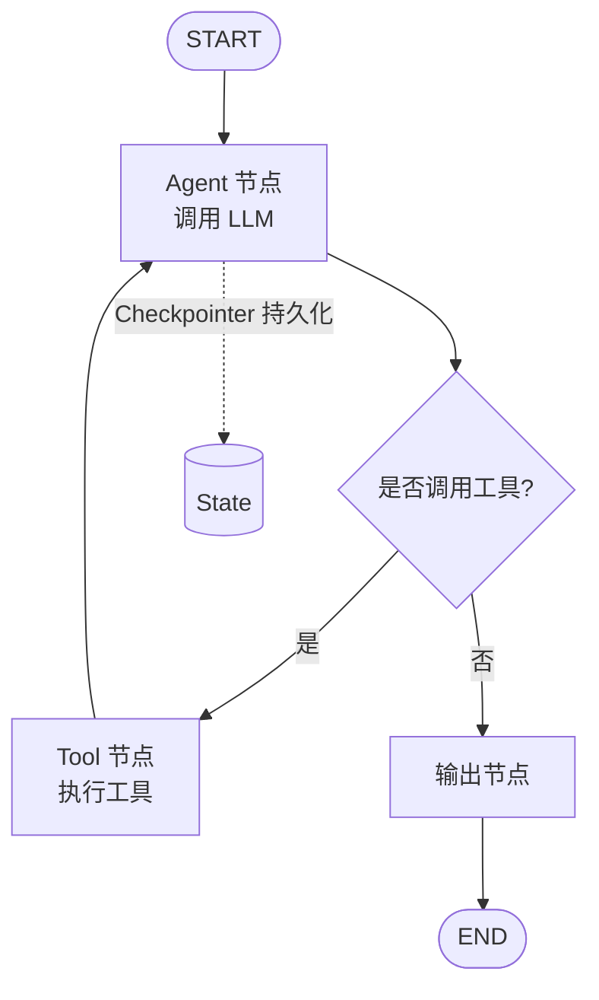

# LangChain / LangGraph

> 整理日期：2026-08-21
> 定位：最流行的 LLM 应用框架（LangChain）及其有状态多智能体编排层（LangGraph）
> 风格：中文为主，术语保留英文原文；介绍框架定位、核心概念与基本用法

LangChain 是应用最广泛的 **LLM 应用开发框架**，提供链（Chain）、工具（Tool）、记忆（Memory）、检索（RAG）等抽象，快速搭建单 Agent 应用。而 **LangGraph** 是其之上的**有状态、可循环、可持久化**的多智能体编排框架，用"图（Graph）"建模 Agent 工作流，支持分支、循环、人审（Human-in-the-loop）与断点续跑。

## 核心概念

| 概念 | 说明 |
|------|------|
| **Chain（链）** | 将 Prompt、模型、解析器串联的可复用流程（LangChain 经典） |
| **Tool / ToolCall** | 外部能力封装，配合 Function Calling 使用 |
| **Memory** | 对话历史与上下文的存储与召回 |
| **Retriever / RAG** | 文档检索增强生成 |
| **Graph / Node / Edge（LangGraph）** | 用节点与边建模 Agent 工作流，支持条件边与循环 |
| **State / Checkpointer** | 全局状态与持久化检查点，支持断点续跑、时间旅行 |
| **Human-in-the-loop** | 在图上插入人工审批节点 |

## 架构与编排模型

LangChain 偏向线性 Chain；LangGraph 以"状态图"表达可循环的 Agent 流程。

## 关键能力

- **生态庞大**：海量官方 / 社区集成（模型、向量库、工具）。
- **有状态编排（LangGraph）**：突破线性 Chain，支持循环、分支、并行与持久化。
- **可观测与可控**：LangSmith 追踪，Human-in-the-loop 保证安全。
- **多智能体**：Supervisor、Swarm、Multi-agent 等官方模式。

## 典型工作流

1. 选定模型与组件，用 LangChain 快速搭 Chain 或 LCEL 表达式。
2. 需要循环 / 多步决策时，改用 LangGraph 定义 `StateGraph`。
3. 添加节点（Agent、Tool）、条件边与 `checkpointer`。
4. 编译后用 `graph.invoke / ainvoke` 运行；必要时插入人工审批。
5. 用 LangSmith 观察与调试。

## 适用场景

从简单 RAG / 问答到复杂可循环多智能体系统；需要成熟生态与可控生产落地的团队。

## 相关资源

- 上游索引：[Harness 总览](../../README.md)
- 多智能体实战：[Agent开发知识 / 多智能体实战-LangGraph-Supervisor](../Agent开发知识/06-多智能体/03-多智能体实战示例-LangGraph-Supervisor.md)
- 对比参考：[Agent开发知识 / 主流框架对比](../Agent开发知识/10-框架与工具/01-主流框架对比.md)
- 官网：https://www.langchain.com/ / https://langchain-ai.github.io/langgraph/
