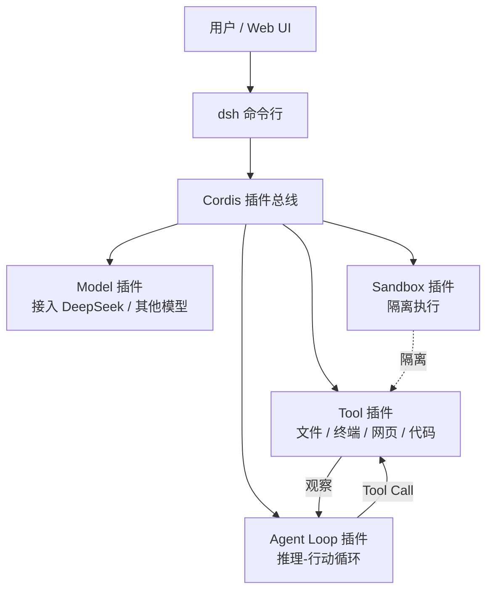

# DeepSeek Harness（dsh）

> 整理日期：2026-08-25
> 定位：DeepSeek AI 官方开源的 Agent harness（"Everything is a Plugin"）
> 风格：中文为主，术语保留英文原文；介绍框架定位、核心概念与基本用法

**DeepSeek Harness**（命令行别名 **dsh** /ˌdiː es ˈeɪtʃ/ ）是 DeepSeek AI 官方开源的 **Agent harness（智能体运行框架）** ，官方 slogan 为 "Everything is a Plugin（一切皆插件）"。它于 2026-08 发布开发者预览版（v0.1，MIT 协议），GitHub 星标快速破十万。注意：它不是新模型，也不是单纯的 API 客户端，而是把"模型接入文件系统、终端、网页、代码工具与其他 Agent，并组织上下文、工具调用与任务执行"的一整套 Agent 运行框架。

## 核心概念

| 概念 | 说明 |
|------|------|
| **Plugin（插件）** | 核心理念：模型、**工具（Tool）** 、**沙箱（Sandbox）** 、甚至 **Agent Loop（智能体循环）** 本身都是插件，可替换、可扩展 |
| **Cordis** | 支撑"一切皆插件"的底层框架，设计源于 *A Programming Paradigm for Spatiotemporal Composability*（时空可组合编程范式） |
| **dsh** | 命令行入口，子命令 `web` 启动本地 / SSH Web UI |
| **Web UI** | 默认 `http://127.0.0.1:3080`，本地自动开浏览器，SSH 启动则打印访问地址 |
| **多语言** | 仓库含 `packages/`（TS/JS）与 `python/`，支持 TS 与原生 Python 工具链 |

## 架构与执行模型

DeepSeek Harness 以 **Cordis** 插件总线为中心，把模型、工具、沙箱、Agent 循环等全部注册为插件，运行时按需组合。

## 关键能力

- **一切皆插件**：模型、工具、沙箱、Agent Loop 均可插拔与自定义，强调"Agent 大平台"而非单款产品。
- **官方模型原生亲和**：与 DeepSeek 系列模型深度协同，同时不锁定单一厂商。
- **Web 优先体验**：一条命令起本地 Web UI，便于演示与远程（SSH）使用。
- **多语言支持**：TS/JS 与 Python 双栈，生态工具覆盖面广。
- **可发现生态**：社区仓库加 `dsh-plugin` 话题即可被检索与复用。

## 典型工作流

1. 安装 Node.js 后，直接 `npx @deepseek-ai/dsh web` 启动 Web UI（默认 `http://127.0.0.1:3080`）。
2. 远程时加 SSH 启动参数，复制打印出的 Host URL 访问；用 `--no-open` 可跳过自动开浏览器。
3. 从源码构建：`git clone` → `pnpm install` → `pnpm run build` → `pnpm dsh web`。
4. 按需安装 / 编写插件（模型、工具、沙箱、Loop），通过 Cordis 注册进 harness。
5. 配置模型与权限边界后投入编码 / 自动化任务。

## 适用场景

希望以"插件化平台"思路自研或集成 Agent 的团队；偏好 DeepSeek 生态、又需要可替换模型与工具链的开发者；以及把 dsh 作为可扩展 Agent 底座嵌入自有产品的场景。

## 相关资源

- 上游索引：[Harness 总览](../../README.md)
- 官方仓库：https://github.com/deepseek-ai/deepseek-harness （官网 https://deepseek.com/harness ）
- 中文文档：https://deepseekharness.io/
- 同类对比：见 [PI](../PI/README.md)、[Cline](../../成品harness/Cline/README.md)、[Claude Code](../../成品harness/Claude Code/README.md)
