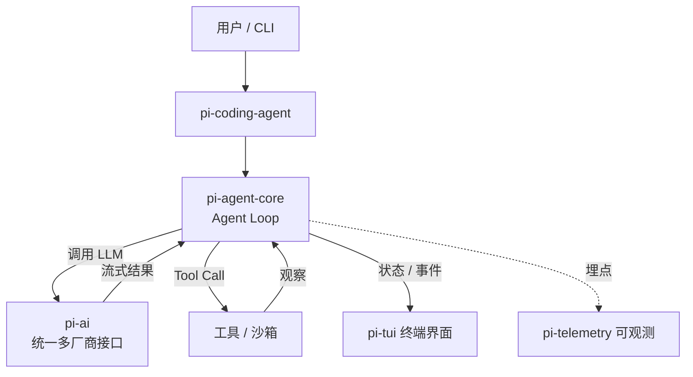

# PI（Pi Agent）

> 整理日期：2026-08-25
> 定位：开源的 AI Agent 工具集与"可自解释的编码 Agent"harness（earendil-works/pi）
> 风格：中文为主，术语保留英文原文；介绍框架定位、核心概念与基本用法
> 学习文档：社区中文教学版 [how-pi-agent-works](https://github.com/cellinlab/how-pi-agent-works)

**PI**（项目名，官网 `pi.dev`，常以 "Pi agent harness" 自述）是一个开源的 **AI Agent 工具集（AI Agent Toolkit）**，官方 slogan 为 "unified LLM API, agent loop, TUI, coding agent CLI"。它本身是一个 **monorepo（单体仓库）** ，把"统一大模型接口、Agent 运行循环、终端界面、编码 Agent 命令行"打包成一组可复用的底层包，方便开发者从零搭建自己的 AI 编码 Agent 与聊天 / 工作流自动化。它的编码 Agent 还主打"能解释自己、可被扩展（self-extensible）"。

## 核心概念

| 概念 | 包 / 模块 | 说明 |
|------|-----------|------|
| **pi-ai** | `@earendil-works/pi-ai` | 统一的多厂商 **LLM** /ˌel el ˈem/ （ **Large Language Model** /lɑːdʒ ˈlæŋɡwɪdʒ ˈmɒdl/ ，大语言模型）接口层，屏蔽 OpenAI、Anthropic、Google 等差异 |
| **pi-agent-core** | `@earendil-works/pi-agent-core` | Agent 运行内核：负责 **Agent Loop（智能体循环）** 、消息、**Tool Call（工具调用）** 与状态管理 |
| **pi-coding-agent** | `@earendil-works/pi-coding-agent` | 基于 core 构建的交互式编码 **Agent** /ˈeɪdʒənt/ （智能体），以 **CLI** /ˌsiː el ˈaɪ/ （ **Command-Line Interface** /kəˈmɑːnd laɪn ˈɪntəfeɪs/ ，命令行界面）形式提供 |
| **pi-tui** | `@earendil-works/pi-tui` | **TUI** /ˌtiː juː ˈaɪ/ （ **Terminal User Interface** /ˈtɜːmɪnl ˈjuːzər ˈɪntəfeɪs/ ，终端用户界面）库，带差量渲染（differential rendering） |
| **pi-telemetry** | `@earendil-works/pi-telemetry` | 厂商中立的可观测性契约、适配器与一致性测试 |

> 说明：PI 未内建权限系统，强隔离需自行容器化 / 沙箱（Gondolin 微虚机、Plain Docker、OpenShell 三种模式在官方文档中有说明）。

## 架构与执行模型

PI 采用分层 monorepo：模型接入、Agent 逻辑、领域能力三层解耦。Agent 执行以"循环"为核心——模型推理、工具调用、观察结果，再回到下一轮，直到任务完成。

社区教学版（cellinlab/how-pi-agent-works，TypeScript 实现）进一步把核心拆解为：**Agent Loop → Messages（消息）→ Streaming Events（流式事件）→ Tool Calls（工具调用）→ Session Tree（会话树）→ Context Compression（上下文压缩）**，并配套 `demo:01`~`demo:04` 由最小循环逐步加上工具、会话与压缩。

## 关键能力

- **统一 LLM 接口**：一份 API 接多家模型，切换厂商成本低。
- **可自解释的编码 Agent**：编码 Agent 能"解释自己"并支持扩展，适合做二次开发底座。
- **终端体验**：自带差量渲染 TUI，长会话输出流畅。
- **供应链硬化**：依赖精确锁版本、`.npmrc` 最小发布龄、lockfile 为准，偏工程严谨。
- **可观测**：厂商中立 telemetry 契约，便于接自有监控。

## 典型工作流

1. `npm install --ignore-scripts` 安装依赖，`npm run build` 构建全部包。
2. 基于 `pi-ai` 配置多厂商模型客户端（OpenAI / Anthropic / Google 等）。
3. 用 `pi-agent-core` 组装 Agent Loop，注册工具（Tool）与状态管理。
4. 必要时用 `pi-coding-agent` CLI 或 `pi-tui` 提供交互界面。
5. 接 `pi-telemetry` 做运行观测；生产环境用 Docker / 微虚机做隔离沙箱。

## 适用场景

想从底层自研 AI 编码 Agent / 自动化 Agent 的开发者；需要统一多模型接口、可控 Agent 循环与终端交互的团队；以及把 PI 当作"harness 内核"嵌入自有产品的场景。

## 相关资源

- 上游索引：[Harness 总览](../../README.md)
- 官方仓库：https://github.com/earendil-works/pi （官网 https://pi.dev ）
- 中文学习文档（原理 + 从零实现）：https://github.com/cellinlab/how-pi-agent-works
- 同类对比：见 [AgentScope](../AgentScope/README.md)、[AutoGen](../AutoGen/README.md)、[CrewAI](../CrewAI/README.md)
