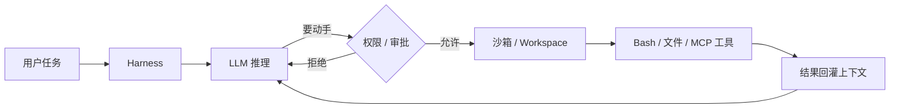
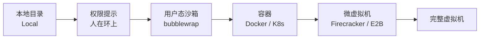
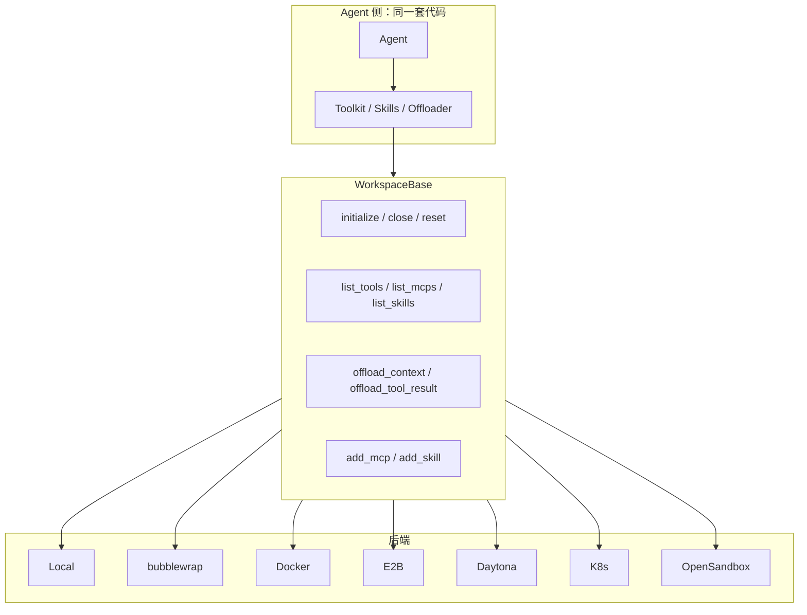
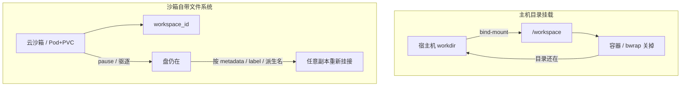

# 沙箱（Sandbox）：Harness 的执行隔离层

> 整理日期：2026-08-21
> 定位：Harness 的执行环境层——给 Agent 一块可动手、可落盘、可回收的隔离地盘
> 风格：中文为主，术语保留英文原文；从概念、隔离维度、类型谱系落到 AgentScope Workspace 的七种后端

**Sandbox** /ˈsændbɒks/ （沙箱）是一块 **隔离执行环境** ：里面的进程能跑命令、读写文件、调工具，但默认碰不到宿主机上不该碰的东西。对 **Harness** /ˈhɑːnɪs/ （外壳，包裹大模型的那层运行时软件）来说，沙箱不是可选插件，而是 **执行环境** 本身——模型负责想，沙箱负责动手。

在 **Agent** /ˈeɪdʒənt/ （智能体）系统里，这块地盘常被抽象成 **Workspace** /ˈwɜːkspeɪs/ （工作区）：同一套 Agent 代码，可以换本地目录、Linux 用户态沙箱、容器、云沙箱或集群 **Pod** /pɒd/ ，而不改业务逻辑。

一句话： **沙箱限制破坏面，Workspace 把沙箱变成 Agent 可依赖的执行与持久化接口。**

---

## 一、为什么 Agent 必须有沙箱

传统聊天机器人只「说」。Agent 会 **执行** ：跑 shell、改文件、装依赖、调外部服务。风险从话语升级到行为。

| 没有沙箱时 | 有沙箱时 |
|---|---|
| `rm -rf` 打到宿主机 | 最多毁掉一块可丢弃的工作区 |
| 读到 `.env` / 密钥再外传 | 密钥默认不挂进沙箱，出站可白名单 |
| 提示注入让 Agent「帮你清理磁盘」 | 文件系统范围被钉死，越权写不出去 |
| 一次跑飞占满处理器 / 磁盘 | 配额、超时、关闭即回收 |

这和浏览器之于 JavaScript 引擎是同一结构：引擎能算，能不能碰摄像头、能不能跨域，由外面那层决定。详见 [Harness Engineering](../AI编程范式/AI辅助编程范式/09-harness-engineering.md) 里「浏览器是网页的 harness」的类比；安全侧的护栏分层见 [安全与护栏](../Agent开发知识/09-安全与护栏/01-安全与护栏.md) 。



**LLM** /ˌel el ˈem/ （ **Large Language Model** /lɑːdʒ ˈlæŋɡwɪdʒ ˈmɒdl/ ，大语言模型）决定「下一步调用什么」；沙箱决定「这次调用实际能碰到什么」。两者缺一，要么 Agent 只能空谈，要么一动手就不可控。

---

## 二、隔离到底隔什么

谈「有没有沙箱」之前，先拆维度。 **Isolation** /ˌaɪsəˈleɪʃn/ （隔离）不是开关，是一组边界：

| 维度 | 要挡住的事 | 常见手段 |
|---|---|---|
| **进程** | 看到 / 杀掉宿主机进程 | **PID** /ˌpiː aɪ ˈdiː/ （ **Process Identifier** /ˈprəʊses aɪˈdentɪfaɪə/ ，进程标识）命名空间、独立容器 |
| **文件系统** | 读密钥、改系统文件、写穿到别的租户 | chroot、 **bind-mount** /baɪnd maʊnt/ （绑定挂载）限定目录、只读根 |
| **用户身份** | 以 root 碰宿主机 | 映射成非特权用户、user namespace |
| **网络** | 扫内网、外传数据、打生产接口 | 独立网络命名空间、出站白名单、默认禁网 |
| **系统调用** | 逃逸、加载内核模块 | **seccomp** /ˈsekɒmp/ （secure computing mode，安全计算模式）、能力集（capabilities）裁剪 |
| **资源** | 占满处理器 / 内存 / 磁盘，拖垮邻居 | **cgroup** /ˈsiː ɡruːp/ （control group，控制组）、超时、过期回收 |
| **密钥与配置** | 环境变量泄漏进工具上下文 | 不挂载 `.env` ，凭证按需注入 |
| **会话 / 租户** | 用户 A 的文件出现在用户 B 的工作区 | 按 user / agent / session 切 Workspace |

**Namespace** /ˈneɪmspeɪs/ （命名空间）是 Linux 把「我看到的进程树、网络、挂载」切成一份私有视图的内核原语；容器和用户态沙箱都建立在它上面。 **API** /ˌeɪ piː ˈaɪ/ （ **Application Programming Interface** /ˌæplɪˈkeɪʃn ˈprəʊɡræmɪŋ ˈɪntəfeɪs/ ，应用程序接口）凭证、生产数据库、宿主机 home 目录，默认都不应出现在 Agent 的可写视图里。

经验法则： **Agent 的安全等级对齐它持有的最大权限。** 只能算算术的代码解释器，和能 `docker.sock` 的「沙箱」，不是同一类东西。

---

## 三、类型谱系：从「几乎没隔」到「微虚拟机」

按隔离强度（以及运维成本）从左到右：



### 1. 本地文件系统（无 / 弱隔离）

工具直接跑在宿主机上，工作目录就是一块普通文件夹。开发最快、调试最直观，也最危险：一次错误的 `rm` 、一次提示注入，破坏面等于当前用户权限。适合本机实验、只读探索、已有 Git 仓库上的结对编程（再配人审）。

### 2. 权限系统 + 人在环上（逻辑沙箱）

不换内核隔离，而是用策略：哪些路径可写、哪些命令要确认、危险操作弹窗。 **Claude Code** 、 **Cursor** 等成品 harness 大量走这条路——隔离的是「允不允许」，不是「物理上碰不到」。对单人开发者够用；对多租户在线服务不够。

### 3. 语言级 / 进程级沙箱

例如 Node 的 `vm` 、Python 子进程 + 超时强杀、 **WASM** /ˌdʌbəljuː eɪ es ˈem/ （ **WebAssembly** /web əˈsembli/ ）模块。能挡住一部分胡写代码，挡不住任意 syscall、也很难给 Agent 一个完整的「有 shell 的 Linux」。适合跑不可信脚本片段，不适合当 coding Agent 的主战场。

### 4. 用户态操作系统沙箱（bubblewrap）

**bubblewrap** /ˈbʌblræp/ （ `bwrap` ）用 Linux 的 user / mount / PID 等命名空间，在 **不依赖 Docker 守护进程** 的前提下，给进程一套新的根文件系统视图。轻、快、本机就能用；典型缺口是：很多部署仍 **共享宿主机网络命名空间** ，网络隔离弱于容器。

### 5. 容器（Docker / Kubernetes）

**Docker** /ˈdɒkə/ 把进程、文件系统、网络、cgroup 打成一份可分发的运行时； **Kubernetes** /ˌkuːbəˈnetiːz/ （常缩写 **K8s** /ˌkeɪ eɪt ˈes/ ）再把它调度成集群里的 Pod。隔离强于 bubblewrap，镜像可固化工具链（Python、Node、以及要靠 `npx` 才能拉起的外部工具）。代价是要有可用的容器运行时或集群，且默认仍是「共享内核」——不是虚拟机级隔离。

### 6. 云沙箱 / 微虚拟机

把「一台短命 Linux」当成服务来租。 **E2B** /ˌiː tuː ˈbiː/ 这类产品底层常用 **Firecracker** /ˈfaɪəkrækə/ **microVM** /ˈmaɪkrəʊ viː ˈem/ （微虚拟机）：启动秒级，每个沙箱有自己的内核视图，更适合跑不可信的 Agent 生成代码。 **Daytona** /deɪˈtəʊnə/ 、 **OpenSandbox** /ˈəʊpən ˈsændbɒks/ 走同一产品形态：按元数据或标签重新挂接，多副本服务都能连回同一块盘。

### 7. 完整虚拟机

隔离最强、最重。适合强合规、不可信代码评测、或必须跑完整桌面（ **Computer Use** /kəmˈpjuːtə juːs/ ，计算机使用）的场景；对日常 Agent 循环通常过重。

---

## 四、AgentScope Workspace：同一接口，七种后端

**AgentScope** /ˈeɪdʒənt skəʊp/ 把沙箱收成 Workspace：Agent 面对的是同一套接口，换后端只换实现。官方当前提供七类（与框架文档中的对照表一致）：

| 类 | 运行环境 | 持久化方式 |
|---|---|---|
| **LocalWorkspace** | 本机文件系统 | 主机上的 `workdir` 目录 |
| **BubblewrapWorkspace** | Linux bubblewrap 沙箱 | 主机 `host_workdir` 挂载到沙箱内 `/workspace` ；不传则使用关闭时删除的临时目录 |
| **DockerWorkspace** | Docker 容器 | 主机 `workdir` 挂载到容器内 `/workspace` ；不传则为临时容器 |
| **E2BWorkspace** | E2B 云沙箱 | 沙箱文件系统；通过沙箱元数据重新挂接 |
| **DaytonaWorkspace** | Daytona 沙箱 | 沙箱文件系统；通过沙箱标签重新挂接 |
| **K8sWorkspace** | Kubernetes Pod | 挂载到 Pod 的 **PVC** /ˌpiː viː ˈsiː/ （ **Persistent Volume Claim** /pəˈsɪstənt ˈvɒljuːm kleɪm/ ，持久卷声明）；按工作区标识派生的名称重新挂接 |
| **OpenSandboxWorkspace** | OpenSandbox 沙箱 | 沙箱文件系统；通过沙箱元数据重新挂接 |

前三个偏「单机」：状态在这台宿主机的目录或这台机拉起的容器里。后四个偏「可重新挂接」：沙箱有独立身份，服务进程重启、甚至换一台副本，都能按 **metadata** /ˈmetədeɪtə/ （元数据）或 **label** /ˈleɪbl/ （标签）把同一块文件系统再连上。

### 每种后端在解决什么问题

- **LocalWorkspace** ：零基础设施。内置工具（Bash、Read、Write 等）跑在宿主机侧。适合本机开发；不要当多租户生产隔离。
- **BubblewrapWorkspace** ：只要 Linux 上有 `bwrap` ，不必起 Docker。目录挂到 `/workspace` ，关闭可丢临时盘。注意默认常与宿主机共享网络。
- **DockerWorkspace** ：镜像固化运行时； `workdir` 绑定挂载到 `/workspace` ，容器没了文件还在。省略 `workdir` 则是用完即焚的 **ephemeral** /ɪˈfemərəl/ （临时）容器。
- **E2BWorkspace** ：无主机 `workdir` 。空闲可暂停、再访问再恢复；按沙箱元数据里的 `workspace_id` 重新连接。适合水平扩展的多副本服务。
- **DaytonaWorkspace** ：同样是托管沙箱；用标签重新挂接，并可把 `user_id` / `agent_id` 打成额外标签，方便控制台按人、按 Agent 过滤。
- **K8sWorkspace** ：每个工作区一个 Pod + PVC，名字由 workspace 标识派生。适合已经在跑业务负载的集群，状态跟集群走，不跟某一台应用进程走。
- **OpenSandboxWorkspace** ：AgentScope 生态的沙箱后端（ [opensandbox](https://github.com/agentscope-ai/opensandbox) ）。文件系统随暂停/恢复保留，任意服务副本都能按元数据重连。



---

## 五、Workspace 对 Agent 提供什么

沙箱若只是「能 exec」，还不够当 harness 的执行层。AgentScope 的 Workspace 额外托管三件事：

| 资源 | 工作区提供什么 |
|---|---|
| **工具** | 内置 Bash、Read、Write、Edit、Glob、Grep 等，走当前后端执行；再加上已注册的 **MCP** /ˌem siː ˈpiː/ （ **Model Context Protocol** /ˈmɒdl ˈkɒntekst ˈprəʊtəˌkɒl/ ，模型上下文协议）服务器上的工具 |
| **Skill** /skɪl/ | 存在 `skills/` 下的 Markdown 指令集，供 Agent 的 Skill 视图按需加载 |
| **上下文卸载** | 压缩后的消息、截断后的超大工具结果，经 **Offloader** /ˈɒfləʊdə/ 协议落到工作区，而不是直接从窗口里扔掉 |

典型目录（本地 / 挂载盘一侧）大致是：

```text
workdir/
  data/                 # 多模态等大文件，常按内容哈希去重
  skills/               # 动态安装的技能
  sessions/<session_id>/
    context.jsonl       # 被压缩掉的上下文
    tool_result-*.txt   # 被截断的工具输出
```

四个角色的接口（所有后端都实现 `WorkspaceBase` ）：

| 角色 | 方法 | 谁调用 |
|---|---|---|
| 生命周期 | `initialize()` / `close()` / `reset()` ，以及 `async with` | 开发者或 Workspace Manager |
| 发现 | `list_tools()` / `list_mcps()` / `list_skills()` / `get_instructions()` | 组装 Agent 时构建工具箱与系统提示 |
| 卸载 | `offload_context()` / `offload_tool_result()` | 上下文压缩或工具结果截断时 |
| 动态管理 | `add_mcp()` / `remove_mcp()` / `add_skill()` / `remove_skill()` | 运行时由服务或开发者增删 |

沙箱化后端（bubblewrap / Docker / E2B / Daytona / K8s / OpenSandbox）里，MCP 进程跑在 **隔离环境内部** ，宿主机通过工作区内的 **Gateway** /ˈɡeɪtweɪ/ （网关，通常是一个轻量 FastAPI 进程）去发现和调用它们。stdio 会话跨不过容器边界，所以必须有这层桥。Local 没有这道墙，MCP 可以直接跑在主机侧。

---

## 六、持久化的两种模型

**Persistence** /pəˈsɪstəns/ （持久化）决定「关了沙箱之后，文件还在不在、下次怎么找回来」。



| 模型 | 代表 | 重启后怎么活 |
|---|---|---|
| **主机目录即真相** | Local、Bubblewrap（传了 `host_workdir` ）、Docker（传了 `workdir` ） | 重新打开同一路径；容器/沙箱可以是一次性的 |
| **临时盘，关即删** | 不传 workdir 的 Bubblewrap / Docker | 适合评测、一次性代码执行，不要当用户网盘 |
| **远程盘 + 身份重新挂接** | E2B、Daytona、OpenSandbox、K8s PVC | 服务进程可以挂；用元数据、标签或派生名找回 |

多副本部署时，Local / bubblewrap / Docker 是 **单机** 的：请求打到另一台 worker，那台机没有这份目录或这个容器。E2B / Daytona / OpenSandbox / K8s 才适合水平扩展。

---

## 七、隔离粒度：按 Agent、按会话，还是按用户

后端解决「在哪跑」； **Workspace Manager** 解决「这份盘算谁的」。AgentScope 服务侧用 `(user_id, agent_id, session_id)` 三维，默认策略：

| 策略 | 共享规则 | 典型用途 |
|---|---|---|
| **PER_AGENT** （默认） | 同一 `(user_id, agent_id)` 的所有会话共用一块工作区 | 跨对话保留文件、技能、MCP 注册 |
| **PER_SESSION** | 每个会话一块新盘 | 一次性评测、互不泄漏的自动化 |
| **PER_USER** | 同一用户下所有 Agent 共用一块盘 | 多 Agent 协同改同一文件系统（少用，权限面更大） |

会话创建时若显式传入 `workspace_id` ，会覆盖上述策略——这是「子 Agent 进队长工作区」一类团队工具的做法。

空闲回收靠 **TTL** /ˌtiː tiː ˈel/ （ **Time To Live** /taɪm tə lɪv/ ，存活时间），默认常见为 3600 秒。Local 往往在下次 `get_workspace()` 时顺手清过期项；沙箱类 Manager 还会起后台 sweeper，把空闲容器 / 沙箱 / Pod 释放掉，下次请求再透明拉起或重新挂接。

---

## 八、怎么选

| 场景 | 更合适的类型 | 原因 |
|---|---|---|
| 本机写 Agent、对着真实仓库改代码 | Local + 权限确认 | 快；破坏面等于你自己的用户 |
| Linux 单机、不想装 Docker，又要挡住乱写根目录 | bubblewrap | 轻；留意网络可能仍是宿主机的 |
| 单机生产、要固化镜像与依赖 | Docker | 可重复；状态放 bind-mount |
| 多租户、多副本、不可信代码 | E2B / Daytona / OpenSandbox | 重新挂接 + 更强隔离 |
| 已有 K8s，希望工作区成为集群资源 | K8s + PVC | 调度、配额、存储走平台能力 |
| 跑完就扔的评测 / 持续集成 | 任意后端 + 不挂持久盘 / `PER_SESSION` | 防止状态泄漏和下次脏读 |

成品 harness 的对照：Claude Code、Cursor、Aider 默认贴近「Local + 权限 / Git」，把沙箱做成产品策略而非集群资源；你用框架自建 Agent 服务时，才需要把上表当成部署选项，而不是编辑器里的一个开关。

---

## 九、主流 Agent / Harness 的沙箱实践对照

沙箱不是 AgentScope 独有。把视角拉到整个生态，看各家怎么落地「模型负责想，沙箱负责动手」：成品编辑器（Claude Code、Cursor、Aider）偏「本机 + 权限」，云端工程师（Devin、Jules、Codex 云端）偏「每任务一个远程沙箱」，框架（AutoGen、LangGraph）则把沙箱做成可插拔的执行后端。

**CLI** /ˌsiː el ˈaɪ/ （ **Command Line Interface** /kəˈmɑːnd laɪn ˈɪntəfeɪs/ ，命令行界面）形态仍是最常见的入口；无论哪种 harness，执行层最终都收敛到「受限的进程 + 受控的网络 + 可丢弃的文件系统」。

### 对照表

| Harness | 默认执行位置 | 隔离机制 | 网络策略 | 权限 / 审批 | 备注 |
|---|---|---|---|---|---|
| **Claude Code** /ˈklɔːd kəʊd/ | 本机；可选 Docker microVM sandbox | 本地：bubblewrap（Linux）/ **Seatbelt** /ˈsiːtbelt/ （macOS 原生沙箱框架）；容器内可再套沙箱 | 默认禁网或经代理白名单；sandbox 模式只放通审批域名 | 权限系统 + 逐条确认；`--dangerously-skip-permissions` 仅限容器内 | macOS Seatbelt / Linux bwrap |
| **OpenAI Codex** /ˌəʊpən eɪ aɪ ˈkɒdeks/ | 云端沙箱：模型推理与命令执行默认均在 OpenAI 云端，每步经 **API** （应用程序接口）往返；本地模式仅可选把「命令执行」挪回本机，LLM 推理仍走云端 | 云端 **gVisor** /ˌdʒiː ˈvɪzər/ （Google 开源的用户态内核沙箱）微 VM，每会话 ephemeral 沙箱；可选本地沙箱（Docker / bwrap），但模型始终在云端 | 完全自动模式 **禁用网络** ，限工作目录 + 临时文件 | 三级审批：Read Only / Auto / Full Access；`sandbox_mode` 可设 read-only | 云端隔离 + 默认断网，是深度防御关键 |
| **OpenHands** /ˌəʊpən ˈhændz/ （原 OpenDevin） | 每会话一个 Docker 沙箱容器 | 容器内非 root 用户 + `_resolve_path` 路径边界防穿越；可配网络隔离 | 可配；容器经 `/var/run/docker.sock` 拉起 | 企业版 **RBAC** /ˌɑː biː eɪ ˈsiː/ （ **Role-Based Access Control** /rəʊl beɪst ˈækses kənˈtrəʊl/ ，基于角色的访问控制）+ 审计日志 | docker.sock 挂载 = 宿主 root，须独立 VPS |
| **AutoGen** /ˌɔːtəʊ ˈdʒen/ （AG2） | Local 或 Docker 执行器 | `LocalCommandLineCodeExecutor` 无隔离；`DockerCommandLineCodeExecutor` 容器隔离；Jupyter 内核可选 | 取决于镜像 / 网络配置 | 本地执行建议 `human_input_mode=ALWAYS` 人审 | 框架级三选一，按信任度切换 |
| **LangGraph** /ˈlæŋɡrɑːf/ | 代码执行即 ToolNode；可接 E2B / Daytona / 自托管 Docker | 推荐 E2B（Firecracker microVM）自托管，或 K8s + **Kata Containers** /ˈkɑːtə kənˈteɪnəz/ ；会话级 ephemeral 沙箱 | 沙箱独立 network namespace | 危险代码 **AST** /ˌeɪ es ˈtiː/ （ **Abstract Syntax Tree** /ˈæbstrækt ˈsɪntæks triː/ ，抽象语法树）+ **Bandit** /ˈbændɪt/ （Python 静态安全扫描器）双层扫描后 `interrupt()` 触发人审 | 云端把沙箱生命周期绑到 run / thread |
| **Devin** /dɪˈvɪn/ （Cognition） | 每任务一个云端沙箱 VM（自带 shell / 编辑器 / 浏览器） | 云端 VM；Devin Local 用 bwrap（Linux）/ Seatbelt（macOS）/ **WSL** /ˌdʌbljuː es ˈel/ （ **Windows Subsystem for Linux** /ˌwɪndəʊz ˈsʌbsɪstem fər ˈlɪnəks/ ，Linux 的 Windows 子系统，常指 WSL2） | 可配 `allowed_domains` / `denied_domains` | 两个不可配置的人审检查点：计划 + PR | 凭据作用域决定破坏面 |
| **Google Jules** /ˈdʒuːlz/ | 每任务一个安全云端 VM | 云端 VM | 受限 | 异步跑完给 PR 供审阅 | 「fire-and-forget」式 |
| **Cursor** /ˈkɜːsə/ | 本机 + 权限确认；Background Agents 跑远程容器 | 编辑器内逻辑沙箱；后台 agent 用远程容器 | 视配置 | 权限弹窗；后台 agent 类 mini-Devin | 与 Claude Code 同思路 |
| **Aider** /ˈeɪdə/ | 本机；可选 `--docker` | 容器内编辑 | 视容器 | 提交前人审 diff | 轻量，本地优先 |
| **WorkBuddy** /ˈwɜːkbʌdi/ | 本机执行（Windows 走 Git Bash / PowerShell）；模型推理在云端 | 运行时默认裹沙箱（`dangerouslyDisableSandbox` 逃生口需用户显式授权，否则命中 SANDBOX PERMISSION DENIED）；托管 Python / Node 装在隔离目录，不污染宿主全局环境 | 由运行时沙箱与宿主策略决定，无独立网络白名单 | 工具调用在用户权限框架内；删除 / 清空等危险操作需确认或拒止 | 本地「做」+ 云端「想」，归「本机 + 沙箱」一类 |

### 从对照里抽出的可复用最佳实践

1. **默认禁网，按需白名单** 。纵深防御第一原则：Codex 完全自动模式直接断网；Claude Code sandbox 经代理只放通审批域名；Devin 用 `allowed_domains` / `denied_domains` 收口。出站默认 deny，比「默认连通、再黑名单」安全得多。
2. **把「想」和「做」分开** 。LLM 决定调什么，沙箱决定能碰到什么。AutoGen 三种执行器、LangGraph 的 Sandbox-as-Tool，都是同一思想：推理与执行解耦，执行层设硬边界。
3. **按信任度选隔离强度，别一刀切** 。本机实验用 Local + 人审；不可信代码升到 microVM（E2B / Firecracker、gVisor、Modal）。容器共享内核，威胁模型含「恶意 root + 已知内核洞」时要升 VM。
4. **最小权限 + 非 root + 只读根 + 路径边界** 。OpenHands 非 root + `_resolve_path` 防穿越；Claude Code 容器 `--read-only` 、`--cap-drop ALL` 、`--user 1000` 。目录边界比「能跑就行」重要。
5. **凭据别进沙箱，按作用域注入** 。Devin 的破坏面等于它持有的凭据作用域；OpenHands 绝不把 API key 烤进镜像；SSH / 云凭据用 secret 注入而非挂宿主目录。
6. **短命、可丢弃、可回收** 。每任务 / 每会话新沙箱（Devin、Jules）；LangGraph 把 sandbox 绑到 run / thread，用完即 `shutdown()` ；空闲靠 TTL sweeper 回收。沙箱的价值在于「毁了也不可惜」。
7. **人审检查点是最后一道闸** 。Devin 计划 + PR 双检查点；Codex 三级审批；Claude Code diff 预览。再强的沙箱也挡不住逻辑越权（改测试让任务变绿），所以验收要放在 Agent 可写路径之外。
8. **可观测** ：日志、终端流、产物留痕。OpenHands 流式事件；Codex 提供引用 / 终端日志 / 测试结果；Devin 可围观屏幕。审计日志是安全侧拼图的一块。
9. **警惕共享内核的噪声邻居与依赖污染** 。同内核容器有 noisy-neighbor 与编译产物 ABI 串味风险（如 Node addon 跨版本污染）；微虚拟机 / 独立 VM 更干净但更重，按威胁模型取舍。
10. **平台差异** ：macOS Seatbelt / Linux bwrap / Windows WSL2。Claude Code、Devin Local 都走这条路线；Windows 原生不支持 OS 级沙箱，需 WSL2 或 Docker。跨平台 harness 要把这条写进安装前检查。

这套实践与本文前八节互为表里：前面讲「隔离有哪些维度、有哪些后端」，这里讲「别人怎么用」——结论高度一致：**沙箱是执行层，不是开关；权限是策略层；人在环上是最后兜底**。

---

## 十、沙箱的一般实现方式

前面九节要么贴着 AgentScope 讲后端，要么横向比了各家 harness。这一节退一步，把「沙箱到底是怎么造出来的」按 **隔离发生在哪一层** 重新归个类。落到工程上，隔离就是在不同层次上把 Agent 能碰的东西切小、切干净——从最轻的进程级，到最重的硬件机密计算，大致是一条梯度：

**进程级** → **用户态沙箱** → **容器** → **微虚拟机** → **语言 / 运行时沙箱** → **操作系统原生框架** → **网络 / 文件系统隔离** （横切两道墙）→ **硬件机密计算**

每一档都在「隔离强度 / 启动开销 / 资源占用」之间取舍。下面逐档唠。这一节和第三节「类型谱系」（Local → bubblewrap → Docker → Firecracker / E2B 的产品梯度）是 **正交的两套视角** ：三是「买哪种成品」，十是「底层靠什么机制」。

### 1. 进程级隔离：Linux 原语打底

最朴素的一档，几乎不额外起环境，只在进程层面收口，是上层几乎一切沙箱的共同地基：

- **Namespace** /ˈneɪmspeɪs/ （命名空间）：Linux 把进程树、挂载、网络、UTS、IPC、用户分别切成私有视图。PID namespace 让沙箱看不见宿主其它进程；Mount namespace 换掉它看到的文件系统根；Network namespace 给它一张独立网络栈；User namespace 把容器内 root 映射成宿主非特权用户（AgentScope 的 user namespace 映射就在这层）。
- **seccomp** （secure computing mode，安全计算模式）：前面提过，用 BPF 过滤器拦掉危险系统调用，把内核攻击面从几百个 syscall 砍到几十个，是大多数上层沙箱的底层依赖。
- **capabilities** /ˌkeɪpəˈbɪlətiz/ （能力集）：把 root 特权拆成几十个细粒度能力（CAP_NET_RAW、CAP_SYS_ADMIN…），默认砍掉只留必需，避免「要么全有要么全无」的 root 困局。
- **rlimit** /ˈɑːrlɪmɪt/ （resource limit，资源限制）：限制 CPU 时间、内存、打开文件数、进程数、core dump，防 Agent 跑飞把宿主拖垮。
- **chroot** /ˈtʃruːt/ （change root，切换根目录）：只换文件系统根，隔离极弱（仍看得到宿主 PID、网络），通常只作配角。

这档特点是「快、轻、共享内核」；代价是隔离强度有限—— **共享宿主内核** 。共享内核意味着一个内核漏洞可能一漏全漏。

### 2. 用户态沙箱：在宿主内核上套一层策略

不自己造内核视图，而是用一个用户态进程拦截 / 改写系统调用，或调 OS 原生沙箱框架：

- **bubblewrap** （前面讲过）：单文件、无 daemon，靠 namespace + bind-mount 快速造出最小根文件系统，OpenHands、Devin Local 都用它。
- **gVisor** ：Google 的用户态内核，用 `runsc` 拦截应用所有 syscall 并在宿主内核之外重放，应用碰不到真内核。Codex 云端、部分 GCP 沙箱靠它；既算用户态沙箱，也能跑在 VM 里。
- **macOS Seatbelt** ：苹果原生沙箱描述文件，可声明「只能读这个目录、不能联网」，Claude Code 在 macOS 上走它。
- **Windows AppContainer** /ˌæp kənˈteɪnər/ ：Windows 轻量隔离，给应用一个低特权包身份；配合 **WSL** 可在 Windows 上跑 Linux 沙箱。

这档比纯进程级更可控，但仍跑在共享内核之上，适合「本机 + 权限」类产品。

### 3. 容器隔离：namespace + cgroups 的标准封装

把进程级那套工程细节打包成产品：

- **Docker** 、 **Kubernetes** （K8s）：基于 namespace + cgroups + 镜像分层，给 Agent 独立文件系统、网络命名空间和 PID 树。OpenHands 每会话一个容器，AutoGen 的 `DockerCommandLineCodeExecutor` 同理。
- **containerd** /kənˈteɪnəd/ （容器运行时守护）、 **runc** /rʌŋk/ （OCI 运行时，真正调 namespace / cgroups 起容器）：Dockers 下层那一对。
- 关键加固点： **非 root** 用户、只读根文件系统、overlayfs 可写层用完即弃、路径边界校验防 `../` 穿越（OpenHands 的 `_resolve_path`）。
- 软肋： **共享宿主内核** 。同宿主多容器是「噪声邻居」，一个触发内核漏洞可能殃及全体，所以多租户常再套一层微 VM。

### 4. 微虚拟机：给每个沙箱一台「小虚拟机」

隔离强度最高的纯软件方案，启动却快到接近容器：

- **Firecracker** （前面讲过）：基于 KVM，单核启动 ~125ms，内存开销兆级，Lambda / E2B 底层用它，每会话一个 ephemeral 微 VM，内核独立。
- **Kata Containers** ：把 OCI 容器跑进轻量 VM，兼容 Docker 工作流却拿到 VM 级隔离。LangGraph 推荐的 E2B 即基于 Firecracker。
- **Cloud Hypervisor** /klaʊd ˈhaɪpəvaɪzər/ 、 **QEMU** /ˈkjuːɛmjuː/ ：更通用的虚拟化后端。
- 这档是「云端工程师」（Devin、Jules、Codex 云端）的底座：每任务一台独立 VM，破坏面被框死在 VM 内。

### 5. 语言 / 运行时沙箱：在解释器里隔

不隔离 OS，而是让不可信代码跑在受限解释器 / 运行时里：

- **WASM** （前面讲过）：编译成线性内存、无 syscall 能力的中间字节码，宿主显式注入能力，天然适合不可信插件。
- **V8** /ˌviː ˈeɪt/ Isolate、 **Deno** /ˈdiːnoʊ/ ：把 JS 跑在线程级 isolate 里，Deno 默认 deny 网络 / 文件，需显式 `--allow`。
- **Lua** /ˈluːə/ sandbox、Python 受限解释器：语言层禁掉危险内建（如 `os.execute`、文件 IO），适合脚本级隔离。

这档启动极快、粒度细，但通常管不了「真要 syscall」的重活，常和容器 / VM 搭配（AgentScope 的 `vm` / 子进程 + 超时强杀就属于这一类）。

### 6. 操作系统原生框架：平台自带的那一道

各 OS 把沙箱做成一等公民，产品常直接调：

- Linux： **SELinux** /səˈlɪnəks/ （Security-Enhanced Linux，安全增强型 Linux）、 **AppArmor** /ˈæpˌɑːrmɔːr/ （基于路径的强制访问控制）、 **cgroups** /ˈsiːɡruːps/ （control groups，控制组，做资源配额）。
- macOS：Seatbelt + **TCC** /ˌtiː siː ˈsiː/ （Transparency, Consent, and Control，透明同意与控制，管相册、麦克风等隐私资源）。
- Windows：AppContainer、Windows Sandbox（一次性轻 VM）、WSL2。

### 7. 网络与文件系统隔离：两道必守的墙

无论上面选哪一档，最终都要落到这两件事（第二节「隔离到底隔什么」也点过）：

- **网络隔离** ：独立 network namespace + 默认 deny 出站；用 egress 白名单或代理只放通审批过的域名。Codex 完全自动模式直接断网，Claude Code 经代理只放通审批域名，Devin 用 `allowed_domains` / `denied_domains` 收口。
- **文件系统隔离** ：独立挂载根 + overlayfs / tmpfs + 只读根，工作目录可写、宿主目录不可见；再加路径边界校验防 `../` 逃逸。

### 8. 硬件机密计算：连宿主都不信

最强一档，把隔离做到硬件：

- **TEE** /ˌtiː iː ˈiː/ （Trusted Execution Environment，可信执行环境）、 **SGX** /ˌes dʒiː ˈeks/ （Software Guard Extensions，软件防护扩展）：在 CPU 内划出加密飞地，连云厂商的宿主 OS 都读不到里面内存。适合「连平台都不完全信任」的极端场景，Agent 沙箱里用得少，但多租户机密推理会碰到。

### 怎么选：一张取舍表

| 实现档位 | 隔离强度 | 启动速度 | 资源开销 | 典型代表 | 适合场景 |
|---|---|---|---|---|---|
| 进程级（namespace / seccomp / capabilities） | 弱（共享内核） | 极快 | 极低 | 原生 Linux 沙箱 | 本机轻量限制 |
| 用户态沙箱（bubblewrap / gVisor） | 中 | 快 | 低 | Claude Code、Codex 本地 | 本机 + 权限 |
| 容器（Docker / K8s） | 中（共享内核） | 快 | 低 | OpenHands、AutoGen | 单租户、可控环境 |
| 微 VM（Firecracker / Kata / QEMU） | 强（独立内核） | 较快 | 中 | Devin、Jules、E2B | 多租户云端 |
| 语言 / 运行时（WASM / V8 / Lua） | 细粒度 | 极快 | 极低 | 插件、脚本 | 不可信代码片段 |
| 机密计算（TEE / SGX） | 最强 | 慢 | 高 | 机密推理 | 连宿主都不信 |

一句话： **越往右隔离越强、越慢越贵；Agent 产品大多落在「容器 / 用户态沙箱」两档，云端多租户才上微 VM。** 下一节（原十，现十一）提醒：沙箱再强也不是安全的全部。

## 十一、沙箱不是安全的全部

沙箱缩小的是 **执行破坏面** ，挡不住：

- **提示注入** ：恶意指令经网页、邮件、工具返回进入上下文，Agent 在沙箱里「合法地」把文件读出再发出去——要靠工具白名单、出站限制、人审。
- **逻辑越权** ：Agent 没逃逸，只是过度积极（改测试让任务变绿）。要靠验收不在 Agent 可写路径、以及循环层预算。
- **密钥进上下文** ：文件没泄漏，但环境变量或工具结果被模型复述。要靠不挂载、脱敏、日志红线。
- **共享内核逃逸** ：容器不是虚拟机。威胁模型若包含「不可信 root + 已知内核洞」，应升到 microVM / 独立 **VM** /ˌviː ˈem/ （ **Virtual Machine** /ˈvɜːtʃuəl məˈʃiːn/ ，虚拟机）。

把沙箱、工具 **ACL** /ˌeɪ siː ˈel/ （ **Access Control List** /ˈækses kənˈtrəʊl lɪst/ ，访问控制列表）、审批、审计日志叠在一起，才是 harness 的安全侧。沙箱负责「跑在哪」；权限负责「允不允许」；人在环上负责「毁坏性操作看一眼」。

---

## 相关资源

- 外壳工程总论：[Harness Engineering](../AI编程范式/AI辅助编程范式/09-harness-engineering.md)
- 护栏分层：[安全与护栏](../Agent开发知识/09-安全与护栏/01-安全与护栏.md)
- 框架侧实现：[AgentScope 详细介绍](./harness框架/AgentScope/AgentScope详细介绍.md)
- 官方 Workspace 概览：https://docs.agentscope.io/latest/en/building-blocks/workspace/overview
- E2B：https://e2b.dev/ · Daytona：https://www.daytona.io/ · OpenSandbox：https://github.com/agentscope-ai/opensandbox · bubblewrap：https://github.com/containers/bubblewrap

---

## 本文缩写

| 缩写 | 音标 | 全拼 | 中文 |
|---|---|---|---|
| **LLM** | /ˌel el ˈem/ | Large Language Model | 大语言模型 |
| **VM** | /ˌviː ˈem/ | Virtual Machine | 虚拟机 |
| **API** | /ˌeɪ piː ˈaɪ/ | Application Programming Interface | 应用程序接口 |
| **MCP** | /ˌem siː ˈpiː/ | Model Context Protocol | 模型上下文协议 |
| **K8s** | /ˌkeɪ eɪt ˈes/ | Kubernetes | 容器编排系统 |
| **PVC** | /ˌpiː viː ˈsiː/ | Persistent Volume Claim | 持久卷声明 |
| **TTL** | /ˌtiː tiː ˈel/ | Time To Live | 存活时间 / 过期回收 |
| **PID** | /ˌpiː aɪ ˈdiː/ | Process Identifier | 进程标识 |
| **ACL** | /ˌeɪ siː ˈel/ | Access Control List | 访问控制列表 |
| **WASM** | /ˌdʌbəljuː eɪ es ˈem/ | WebAssembly | 可移植的低级字节码格式 |
| **E2B** | /ˌiː tuː ˈbiː/ | （产品名） | 面向 Agent 的云沙箱 |
| **CLI** | /ˌsiː el ˈaɪ/ | Command Line Interface | 命令行界面 |
| **RBAC** | /ˌɑː biː eɪ ˈsiː/ | Role-Based Access Control | 基于角色的访问控制 |
| **AST** | /ˌeɪ es ˈtiː/ | Abstract Syntax Tree | 抽象语法树 |
| **WSL** | /ˌdʌbljuː es ˈel/ | Windows Subsystem for Linux | Linux 的 Windows 子系统（常指 WSL2） |
| **TEE** | /ˌtiː iː ˈiː/ | Trusted Execution Environment | 可信执行环境 |
| **SGX** | /ˌes dʒiː ˈeks/ | Software Guard Extensions | 软件防护扩展 |
| **cgroups** | /ˈsiːɡruːps/ | control groups | 控制组（资源配额） |
| **QEMU** | /ˈkjuːɛmjuː/ | Quick EMUlator | 快速模拟器（虚拟化后端） |
| **rlimit** | /ˈɑːrlɪmɪt/ | resource limit | 资源限制 |
| **chroot** | /ˈtʃruːt/ | change root | 切换根目录 |
| **TCC** | /ˌtiː siː ˈsiː/ | Transparency, Consent, and Control | 透明同意与控制（macOS 隐私框架） |

