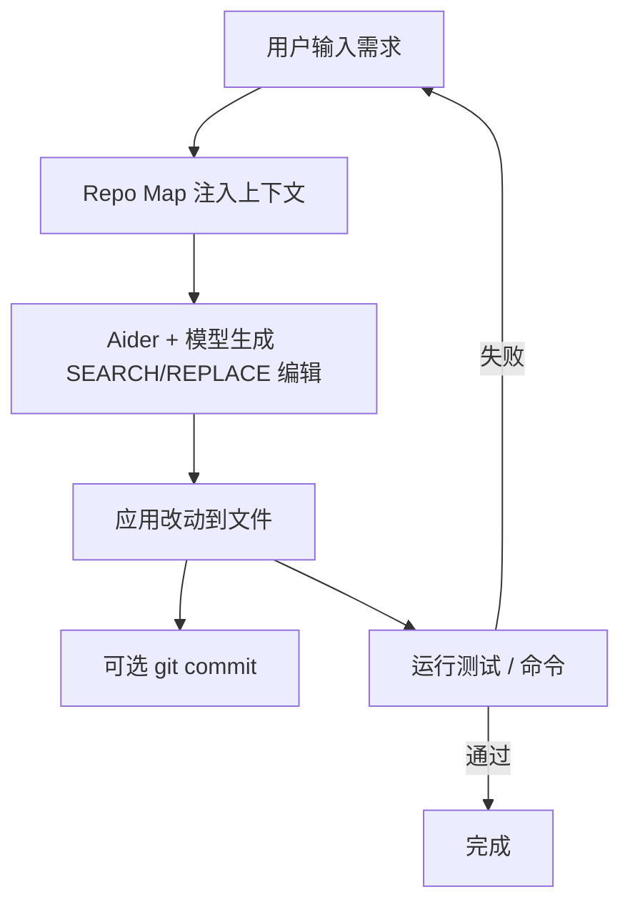

# Aider

> 整理日期：2026-08-21
> 定位：终端内的 AI 结对编程工具（开源，Paul Gauthier 主导）
> 风格：中文为主，术语保留英文原文；介绍工具定位、核心概念与基本用法

Aider 是一款**在终端中运行的 AI 编程助手**，直接在你的本地 Git 仓库里工作：读懂代码结构、编辑文件、自动提交改动。它不依赖特定编辑器，通过命令行与模型交互，强调"可复现、可版本化"的编程体验，是开发者在终端环境下最轻量的"成品 harness"之一。

## 核心概念

| 概念 | 说明 |
|------|------|
| **Edit Format（编辑格式）** | Aider 与模型约定的改文件方式：`diff`（整文件 diff）、`whole`（整文件重写）、`search-replace`（最常用，SEARCH/REPLACE 块） |
| **Repo Map（仓库地图）** | 自动抽取代码库结构（文件 / 类 / 函数签名）注入上下文，让模型理解大项目 |
| **Git 集成** | 每次改动可自动 `git commit`，保留可追溯的演进历史 |
| **Architect 模式** | 用强模型做规划，弱模型做编辑，分工降本 |
| **Voice / Commands** | 支持语音输入与 `/add`、`/drop`、`/test` 等斜杠命令 |

## 工作模型

Aider 在本地仓库上下文中读取、编辑、提交，形成"理解-编辑-验证"闭环。

## 关键能力

- **精准文件编辑**：SEARCH/REPLACE 块定位修改，比整文件重写更稳更省 token。
- **仓库级理解**：Repo Map 让模型掌握跨文件结构。
- **版本可控**：改动自动提交，便于回滚与审查。
- **模型无关**：支持 GPT、Claude、本地模型（Ollama）等。

## 典型工作流

1. 在仓库目录启动 `aider`（可指定 `--model`）。
2. 用 `/add` 把相关文件加入上下文（或依赖 Repo Map 自动识别）。
3. 用自然语言描述需求，Aider 生成编辑并应用。
4. 审查 diff，确认后由 Aider 自动 commit。
5. 用 `/test` 运行测试验证；失败则继续对话修复。

## 适用场景

终端党的日常编码、已有代码库的增量修改、希望改动自动进入 Git 历史的开发流。

## 相关资源

- 上游索引：[Harness 总览](../../README.md)
- 同类对比：见 [Cursor](../Cursor/README.md)、[Cline](../Cline/README.md)、[Claude Code](../Claude Code/README.md)
- 官网：https://aider.chat/
