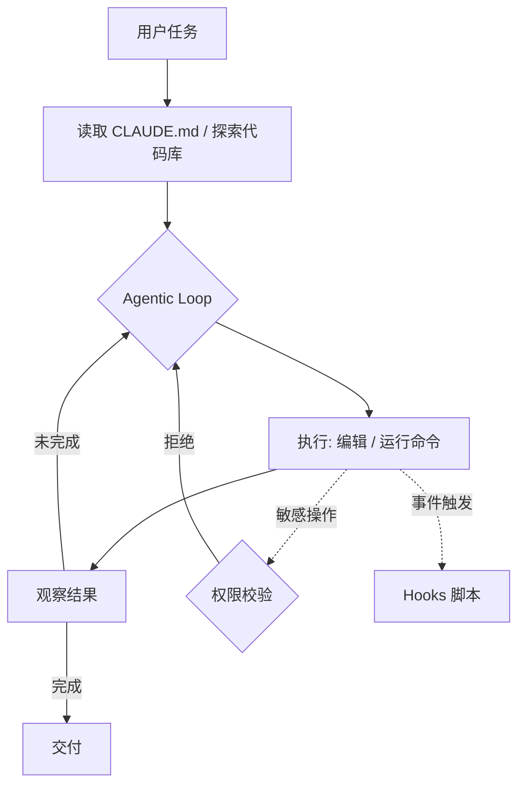

# Claude Code

> 整理日期：2026-08-21
> 定位：Anthropic 推出的终端智能体式（Agentic）编程 CLI
> 风格：中文为主，术语保留英文原文；介绍工具定位、核心概念与基本用法

Claude Code 是 Anthropic 官方的**智能体式命令行编程工具**，直接在终端理解你的代码库、编辑文件、运行命令、操作 Git 与测试。它具备自主规划与执行能力（可多步循环），并通过权限系统、子代理（Subagents）、Hooks、MCP 等机制保证可控性与可扩展性。

## 核心概念

| 概念 | 说明 |
|------|------|
| **Agentic Loop（智能体循环）** | 自主规划 → 执行命令 / 改文件 → 观察结果 → 继续，直到任务完成 |
| **Permission（权限系统）** | 对文件读写、命令执行按规则授权，敏感操作需确认 |
| **Subagents（子代理）** | 派生子 Agent 并行处理子任务，互不干扰上下文 |
| **Hooks（钩子）** | 在特定事件（如编辑前 / 提交前）触发自定义脚本 |
| **MCP** | 通过 Model Context Protocol 接入外部工具与数据源 |
| **CLAUDE.md** | 项目级指令文件，记录约定、结构、常用命令 |

## 工作模型

Claude Code 以"感知-规划-执行-反馈"的智能体循环驱动，并受权限与钩子约束。

## 关键能力

- **代码库级理解**：自动检索与阅读相关文件，跨文件改动。
- **自主执行**：能跑测试、构建、Git 操作，形成自纠错闭环。
- **强可控**：权限分级、Human-in-the-loop、Hooks 审计。
- **可扩展**：Subagents 并行、MCP 接入任意工具。

## 典型工作流

1. 在仓库中运行 `claude`，阅读 `CLAUDE.md` 了解项目约定。
2. 用自然语言给任务（如"修复登录 bug 并加测试"）。
3. Claude Code 自主探索、编辑、运行命令验证。
4. 敏感操作弹窗确认；用 Hooks 做提交前检查。
5. 交付后审查改动，必要时继续对话迭代。

## 适用场景

中大型代码库的端到端开发、重构、Bug 修复、测试补全；需要高度自主又可控的团队。

## 相关资源

- 上游索引：[Harness 总览](../../README.md)
- 同类对比：见 [Cursor](../Cursor/README.md)、[Cline](../Cline/README.md)、[Aider](../Aider/README.md)
- 官网：https://claude.com/claude-code
