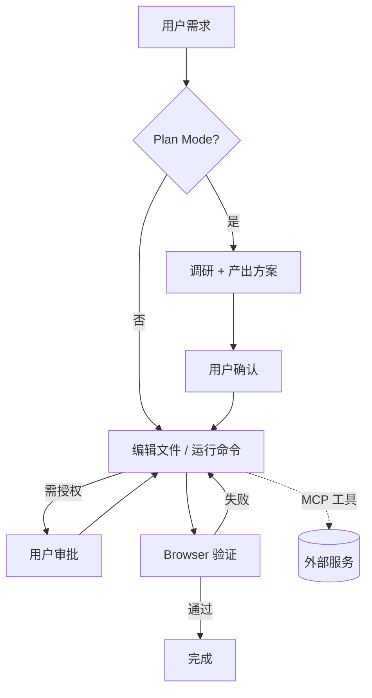

# Cline

> 整理日期：2026-08-21
> 定位：开源的 VS Code AI 编程智能体扩展（原 Claude Dev）
> 风格：中文为主，术语保留英文原文；介绍工具定位、核心概念与基本用法

Cline 是一款**开源的 VS Code AI 编程 Agent 扩展**，能自主创建 / 编辑文件、执行终端命令、操作浏览器，并通过"计划模式（Plan Mode）"与人工审批保证可控。它模型无关（可接任意兼容 API），并通过 **MCP** 扩展能力，是社区活跃的可自托管"成品 harness"。

## 核心概念

| 概念 | 说明 |
|------|------|
| **Plan Mode（计划模式）** | 先调研代码库、产出分步方案，经用户确认后再执行 |
| **Approval（审批）** | 文件写、命令执行等动作需用户逐次或批量授权 |
| **Browser Action** | 可启动浏览器、截图、点击，用于端到端验证 UI |
| **MCP** | 通过 Model Context Protocol 接入自定义工具 / 服务 |
| **Model Agnostic** | 支持 OpenAI、Anthropic、Gemini、本地模型等任意兼容端点 |
| **Custom Modes** | 可定义"架构师 / 提问者 / 调试者"等角色模式 |

## 工作模型

Cline 在编辑器中以"计划 → 审批执行 → 验证"循环工作，MCP 提供额外工具。

## 关键能力

- **自主编码**：在编辑器内增删改文件、跑命令，闭环开发。
- **可控安全**：计划模式 + 逐步审批，避免盲目改动。
- **模型自由**：不锁定厂商，可自托管与本地推理。
- **生态扩展**：MCP 接入数据库、浏览器、部署等工具。

## 典型工作流

1. 在 VS Code 安装 Cline，配置模型 API（或本地模型）。
2. 开启 Plan Mode 让它先理解任务并给出方案。
3. 确认方案后，Cline 在审批下创建 / 修改文件、运行命令。
4. 用浏览器动作验证界面效果。
5. 通过 MCP 接入额外能力（如查询文档、部署）。

## 适用场景

偏好 VS Code、希望开源可自托管、需要计划-审批可控流的开发者与团队。

## 相关资源

- 上游索引：[Harness 总览](../../README.md)
- 同类对比：见 [Cursor](../Cursor/README.md)、[Claude Code](../Claude Code/README.md)、[Aider](../Aider/README.md)
- 开源地址：https://github.com/cline/cline
