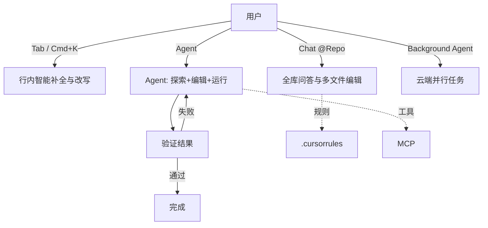

# Cursor

> 整理日期：2026-08-21
> 定位：AI 优先的代码编辑器（基于 VS Code 深度定制）
> 风格：中文为主，术语保留英文原文；介绍工具定位、核心概念与基本用法

Cursor 是一款**以 AI 为核心的代码编辑器**（VS Code 分支），把大模型能力深度融入编辑体验：从行内补全（Tab）、局部改写（Cmd+K）、对话（Chat）到自主 Agent 与后台 Agent。它强调"理解整个代码库"，并通过索引、规则文件（`.cursorrules`）与 MCP 实现个性化与可扩展。

## 核心概念

| 概念 | 说明 |
|------|------|
| **Tab** | 基于上下文的智能补全，可一次跨多行 / 多文件建议 |
| **Cmd+K（Inline Edit）** | 在光标处局部改写选中代码 |
| **Chat / Composer** | 对话式问答与多文件编辑；Composer 可跨文件应用改动 |
| **Agent** | 自主探索代码库、编辑、运行命令、验证的编程智能体 |
| **Background Agent** | 在云端后台并行处理任务（如修复、重构） |
| **Codebase Indexing（@Repo）** | 对代码库语义索引，支持 `@` 引用与全库问答 |
| **.cursorrules / MCP** | 项目规则文件与协议扩展，定制行为与工具 |

## 工作模型

Cursor 把 AI 嵌入编辑动作，Agent / 后台 Agent 以"理解-编辑-验证"闭环工作。

## 关键能力

- **全库感知**：代码库索引让 AI 理解跨文件上下文。
- **多形态 AI**：补全、改写、对话、Agent、后台 Agent 覆盖各场景。
- **个性化**：`.cursorrules` 注入团队约定，MCP 接外部工具。
- **流畅体验**：编辑器级集成，改动即时可见。

## 典型工作流

1. 用 Cursor 打开项目，等待代码库索引完成。
2. 日常用 Tab 补全、Cmd+K 局部改写。
3. 复杂改动用 Chat（@ 相关文件）或 Composer 跨文件编辑。
4. 端到端任务交 Agent / Background Agent 自主完成并验证。
5. 用 `.cursorrules` 固化规范，MCP 扩展能力。

## 适用场景

希望"编辑器即 AI 工作台"的个人与团队，覆盖从补全到自主 Agent 的全流程开发。

## 相关资源

- 上游索引：[Harness 总览](../../README.md)
- 同类对比：见 [Cline](../Cline/README.md)、[Claude Code](../Claude Code/README.md)、[Aider](../Aider/README.md)
- 官网：https://cursor.com/
