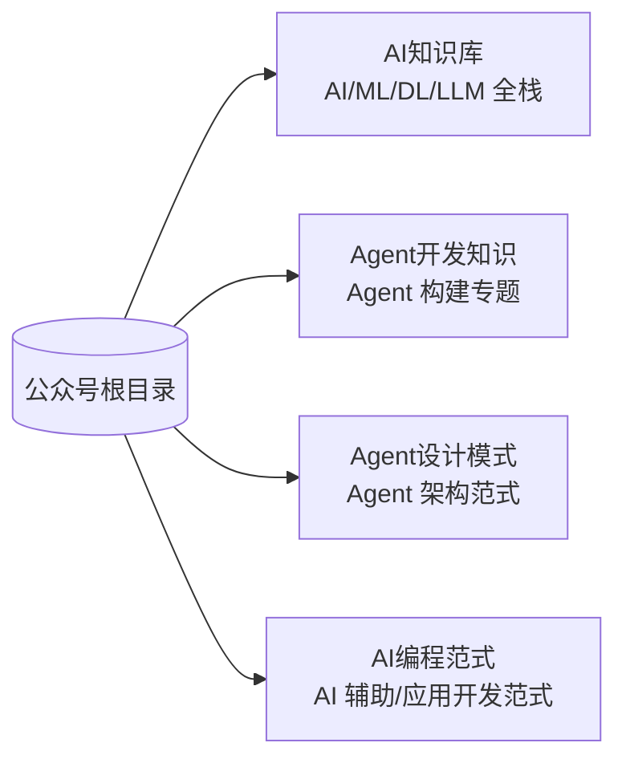

# 公众号知识库总索引

> 整理日期：2026-07-06
> 范围：本仓库收录四大主题知识库——**AI 知识库**、**Agent 开发知识**、**Agent 设计模式**、**AI 编程范式**，共 70+ 篇系统化笔记
> 风格：中文为主，术语保留英文原文；每篇含定义、原理、要点、示例、注意事项

本根 README 是全仓库的**总入口**，按知识库分块索引所有文章。每个子库另有自己的 README，含学习路线与使用建议。

## 四个知识库一览

| 知识库 | 定位 | 篇数 | 入口 |
|--------|------|------|------|
| **AI 知识库** | AI/ML/DL/LLM 全栈基础到前沿，15 个模块 | 35 篇 | [AI知识库/README.md](AI知识库/README.md) |
| **Agent 开发知识** | Agent 开发专题，12 个模块 | 14 篇 | [Agent开发知识/README.md](Agent开发知识/README.md) |
| **Agent 设计模式** | Agent 架构设计模式，含原理+场景+示例代码 | 9 篇 | [Agent设计模式/README.md](Agent设计模式/README.md) |
| **AI 编程范式** | AI 辅助编程 + AI 应用开发范式 | 16 篇 | [AI编程范式/README.md](AI编程范式/README.md) |

---

## 一、AI 知识库（AI/ML/DL/LLM 全栈）

### 01 AI 基础概念
| 文件 | 主题 |
|------|------|
| [01-AI发展简史.md](AI知识库/01-AI基础概念/01-AI发展简史.md) | 从符号主义到深度学习到 LLM 的演进 |
| [02-AI-ML-DL关系.md](AI知识库/01-AI基础概念/02-AI-ML-DL关系.md) | 人工智能/机器学习/深度学习层级关系 |
| [03-AGI与超级智能.md](AI知识库/01-AI基础概念/03-AGI与超级智能.md) | 通用人工智能、对齐、超级智能 |

### 02 数学基础
| 文件 | 主题 |
|------|------|
| [01-线性代数.md](AI知识库/02-数学基础/01-线性代数.md) | 向量、矩阵、特征值、张量 |
| [02-概率与统计.md](AI知识库/02-数学基础/02-概率与统计.md) | 分布、贝叶斯、期望、方差 |
| [03-微积分与优化.md](AI知识库/02-数学基础/03-微积分与优化.md) | 梯度、偏导、梯度下降、凸优化 |

### 03 机器学习基础
| 文件 | 主题 |
|------|------|
| [01-监督学习.md](AI知识库/03-机器学习基础/01-监督学习.md) | 分类、回归、损失函数 |
| [02-无监督学习.md](AI知识库/03-机器学习基础/02-无监督学习.md) | 聚类、降维、生成模型 |
| [03-模型评估与过拟合.md](AI知识库/03-机器学习基础/03-模型评估与过拟合.md) | 训练/验证/测试、指标、正则化 |

### 04 深度学习基础
| 文件 | 主题 |
|------|------|
| [01-神经网络基础.md](AI知识库/04-深度学习基础/01-神经网络基础.md) | 神经元、前向传播、反向传播 |
| [02-激活与损失函数.md](AI知识库/04-深度学习基础/02-激活与损失函数.md) | ReLU/Sigmoid/Softmax、交叉熵、MSE |
| [03-优化器与训练技巧.md](AI知识库/04-深度学习基础/03-优化器与训练技巧.md) | SGD/Adam、学习率、BatchNorm、Dropout |

### 05 Transformer 与注意力
| 文件 | 主题 |
|------|------|
| [01-注意力机制.md](AI知识库/05-Transformer与注意力/01-注意力机制.md) | Self-Attention、Multi-Head、QKV |
| [02-Transformer架构.md](AI知识库/05-Transformer与注意力/02-Transformer架构.md) | Encoder-Decoder、位置编码、FFN |
| [03-从Transformer到LLM.md](AI知识库/05-Transformer与注意力/03-从Transformer到LLM.md) | Decoder-only、GPT 演化 |

### 06 大语言模型 LLM
| 文件 | 主题 |
|------|------|
| [01-什么是LLM.md](AI知识库/06-大语言模型LLM/01-什么是LLM.md) | LLM 定义、能力、涌现、规模 |
| [02-Token与分词.md](AI知识库/06-大语言模型LLM/02-Token与分词.md) | Token、BPE、分词、词表 |
| [03-Embedding与表示.md](AI知识库/06-大语言模型LLM/03-Embedding与表示.md) | 词向量、嵌入空间、语义相似 |
| [04-上下文窗口.md](AI知识库/06-大语言模型LLM/04-上下文窗口.md) | 上下文长度、长上下文、Lost in Middle |
| [05-Scaling-Laws.md](AI知识库/06-大语言模型LLM/05-Scaling-Laws.md) | 缩放定律、Chinchilla、计算最优 |

### 07 训练范式
| 文件 | 主题 |
|------|------|
| [01-预训练.md](AI知识库/07-训练范式/01-预训练.md) | 自监督、MLM/CLM、数据配比 |
| [02-SFT监督微调.md](AI知识库/07-训练范式/02-SFT监督微调.md) | 指令微调、数据格式 |
| [03-RLHF与对齐.md](AI知识库/07-训练范式/03-RLHF与对齐.md) | RLHF、PPO、奖励模型 |
| [04-DPO与偏好优化.md](AI知识库/07-训练范式/04-DPO与偏好优化.md) | DPO、RLAIF、直接偏好优化 |

### 08 提示工程
| 文件 | 主题 |
|------|------|
| [01-提示工程基础.md](AI知识库/08-提示工程/01-提示工程基础.md) | 角色、Few-shot、格式约束 |
| [02-高级提示技术.md](AI知识库/08-提示工程/02-高级提示技术.md) | CoT、Self-Consistency、Prompt Chaining |

### 09 RAG 与上下文
| 文件 | 主题 |
|------|------|
| [01-RAG检索增强生成.md](AI知识库/09-RAG与上下文/01-RAG检索增强生成.md) | 检索-生成、向量库、切分、重排 |
| [02-上下文工程.md](AI知识库/09-RAG与上下文/02-上下文工程.md) | 上下文选材、压缩、记忆管理 |
| [03-向量数据库.md](AI知识库/09-RAG与上下文/03-向量数据库.md) | 向量库概念、ANN 索引、主流选型、RAG 集成 |

### 10 微调与适配
| 文件 | 主题 |
|------|------|
| [01-微调方法对比.md](AI知识库/10-微调与适配/01-微调方法对比.md) | 全参/PEFT/LoRA/QLoRA |
| [02-LoRA原理.md](AI知识库/10-微调与适配/02-LoRA原理.md) | 低秩适配、参数高效微调 |

### 11 推理与部署
| 文件 | 主题 |
|------|------|
| [01-推理优化.md](AI知识库/11-推理与部署/01-推理优化.md) | KV Cache、量化、投机解码 |
| [02-模型服务化.md](AI知识库/11-推理与部署/02-模型服务化.md) | vLLM、TGI、推理框架、部署 |

### 12 Agent 与工具
| 文件 | 主题 |
|------|------|
| [01-Agent基础.md](AI知识库/12-Agent与工具/01-Agent基础.md) | Agent 定义、组件、循环 |
| [02-Function-Calling.md](AI知识库/12-Agent与工具/02-Function-Calling.md) | 函数调用、工具设计 |
| [03-MCP协议.md](AI知识库/12-Agent与工具/03-MCP协议.md) | 模型上下文协议 |
| [04-多智能体.md](AI知识库/12-Agent与工具/04-多智能体.md) | 多 Agent 协作 |

### 13 多模态
| 文件 | 主题 |
|------|------|
| [01-多模态基础.md](AI知识库/13-多模态/01-多模态基础.md) | 图文、CLIP、对齐 |
| [02-扩散模型.md](AI知识库/13-多模态/02-扩散模型.md) | Diffusion、DDPM、Stable Diffusion |

### 14 评估与安全
| 文件 | 主题 |
|------|------|
| [01-模型评估.md](AI知识库/14-评估与安全/01-模型评估.md) | 基准、MMLU、HumanEval、幻觉 |
| [02-对齐与安全.md](AI知识库/14-评估与安全/02-对齐与安全.md) | 对齐、红队、Prompt Injection、护栏 |

### 15 前沿与趋势
| 文件 | 主题 |
|------|------|
| [01-推理模型.md](AI知识库/15-前沿与趋势/01-推理模型.md) | o1/R1、Test-time 计算、思维链训练 |
| [02-AGI路径与未来.md](AI知识库/15-前沿与趋势/02-AGI路径与未来.md) | AGI、超级对齐、未来展望 |

---

## 二、Agent 开发知识（Agent 构建专题）

### 01 基础概念
| 文件 | 主题 |
|------|------|
| [01-什么是Agent.md](Agent开发知识/01-基础概念/01-什么是Agent.md) | Agent 的定义、与 LLM/聊天机器人的区别、能力边界 |
| [02-Agent核心组件.md](Agent开发知识/01-基础概念/02-Agent核心组件.md) | LLM + 工具 + 记忆 + 循环 四大组件详解 |

### 02 推理范式
| 文件 | 主题 |
|------|------|
| [01-CoT与ReAct.md](Agent开发知识/02-推理范式/01-CoT与ReAct.md) | 思维链 CoT、ReAct 推理-行动交错 |
| [02-反思与进阶推理.md](Agent开发知识/02-推理范式/02-反思与进阶推理.md) | Reflexion、Plan-and-Solve、Tree-of-Thoughts 等 |

### 03 工具调用
| 文件 | 主题 |
|------|------|
| [01-Function-Calling.md](Agent开发知识/03-工具调用/01-Function-Calling.md) | 函数调用机制、工具设计原则 |
| [02-MCP协议.md](Agent开发知识/03-工具调用/02-MCP协议.md) | Model Context Protocol 标准化工具生态 |

### 04 记忆系统
| 文件 | 主题 |
|------|------|
| [01-记忆系统.md](Agent开发知识/04-记忆系统/01-记忆系统.md) | 短期/长期记忆、向量记忆、记忆管理策略 |

### 05 规划与任务分解
| 文件 | 主题 |
|------|------|
| [01-规划与任务分解.md](Agent开发知识/05-规划与任务分解/01-规划与任务分解.md) | 任务拆解、DAG、规划策略与重规划 |

### 06 多智能体
| 文件 | 主题 |
|------|------|
| [01-多智能体协作.md](Agent开发知识/06-多智能体/01-多智能体协作.md) | 角色分工、编排模式、协作机制 |

### 07 RAG 与知识集成
| 文件 | 主题 |
|------|------|
| [01-RAG与知识集成.md](Agent开发知识/07-RAG与知识集成/01-RAG与知识集成.md) | 检索增强生成、知识库、与 Agent 结合 |

### 08 评估与调试
| 文件 | 主题 |
|------|------|
| [01-评估与调试.md](Agent开发知识/08-评估与调试/01-评估与调试.md) | 评测基准、可观测性、调试方法 |

### 09 安全与护栏
| 文件 | 主题 |
|------|------|
| [01-安全与护栏.md](Agent开发知识/09-安全与护栏/01-安全与护栏.md) | Prompt Injection、权限、审批、数据安全 |

### 10 框架与工具
| 文件 | 主题 |
|------|------|
| [01-主流框架对比.md](Agent开发知识/10-框架与工具/01-主流框架对比.md) | LangChain/LangGraph/AutoGen/CrewAI 等对比 |

### 11 工程实践
| 文件 | 主题 |
|------|------|
| [01-工程实践.md](Agent开发知识/11-工程实践/01-工程实践.md) | 部署、成本、监控、迭代、落地建议 |

### 12 补充概念
| 文件 | 主题 |
|------|------|
| [01-Skill技能系统.md](Agent开发知识/12-补充概念/01-Skill技能系统.md) | Skill 技能包：封装指令+工具+知识的可复用能力模块 |
| [02-Agent.md与Memory.md规范.md](Agent开发知识/12-补充概念/02-Agent.md与Memory.md规范.md) | Agent.md 配置文件与 Memory.md 持久化记忆的 Markdown 实践 |

---

## 三、AI 编程范式（AI 辅助编程 + AI 应用开发）

### 一、AI 辅助编程范式
| 文件 | 范式 | 一句话定位 |
|------|------|-----------|
| [01-vibe-coding.md](AI编程范式/AI辅助编程范式/01-vibe-coding.md) | Vibe Coding（氛围编程） | 自然语言驱动，"凭感觉"让 AI 生成代码，弱审查 |
| [02-agentic-coding.md](AI编程范式/AI辅助编程范式/02-agentic-coding.md) | Agentic Coding（智能体编程） | AI 自主规划-执行-迭代，人监督而非逐行写 |
| [03-pair-programming.md](AI编程范式/AI辅助编程范式/03-pair-programming.md) | AI Pair Programming（结对编程） | 人机实时协作，AI 作为副驾驶补全/建议 |
| [04-spec-driven-development.md](AI编程范式/AI辅助编程范式/04-spec-driven-development.md) | Spec-Driven Development（规格驱动） | 先写规格/计划，AI 按规格实现 |
| [05-context-engineering.md](AI编程范式/AI辅助编程范式/05-context-engineering.md) | Context Engineering（上下文工程） | 精心编排上下文，让模型在正确信息下推理 |
| [06-loop-engineering.md](AI编程范式/AI辅助编程范式/06-loop-engineering.md) | Loop Engineering（循环工程） | 把 Agent 的 think-act-observe 循环本身作为工程对象 |
| [07-openspec.md](AI编程范式/AI辅助编程范式/07-openspec.md) | OpenSpec（开放规格驱动开发） | 轻量级 SDD 落地框架，以"变更制品"驱动 explore→propose→apply→archive 闭环 |
| [08-superpowers.md](AI编程范式/AI辅助编程范式/08-superpowers.md) | Superpowers（超能力技能驱动开发） | 以可组合"技能"自动触发 brainstorming→planning→TDD→review 工作流 |

### 二、AI 应用开发范式
| 文件 | 范式 | 一句话定位 |
|------|------|-----------|
| [02-rag.md](AI编程范式/AI应用开发范式/02-rag.md) | RAG（检索增强生成） | 检索外部知识注入上下文，缓解幻觉 |
| [03-agent.md](AI编程范式/AI应用开发范式/03-agent.md) | Agent（智能体工作流） | LLM + 工具 + 循环，自主完成多步任务 |
| [04-cot-react.md](AI编程范式/AI应用开发范式/04-cot-react.md) | CoT / ReAct（思维链/推理-行动） | 显式推理链与行动交错 |
| [05-mcp.md](AI编程范式/AI应用开发范式/05-mcp.md) | MCP（模型上下文协议） | 标准化模型与外部资源/工具的连接 |
| [06-fine-tuning.md](AI编程范式/AI应用开发范式/06-fine-tuning.md) | Fine-tuning（微调） | 在基座模型上继续训练以适配领域 |
| [07-function-calling.md](AI编程范式/AI应用开发范式/07-function-calling.md) | Function Calling（函数调用） | 模型输出结构化调用，连接外部 API |
| [08-multi-agent.md](AI编程范式/AI应用开发范式/08-multi-agent.md) | Multi-Agent（多智能体） | 多个 Agent 分工协作完成复杂任务 |
| [09-llm-api.md](AI编程范式/AI应用开发范式/09-llm-api.md) | LLM API 接口与调用实例 | 主流厂商 API 形态与 Node.js/Python 最小可运行示例 |

---

## 四、Agent 设计模式（Agent 架构范式）

| 序号 | 模式 | 核心思想 | 适用场景 |
|------|------|----------|----------|
| 01 | [ReAct](Agent设计模式/01-ReAct模式.md) | 思考→行动→观察，交替进行 | 需要工具和外部信息的多步任务 |
| 02 | [Plan-and-Execute](Agent设计模式/02-Plan-and-Execute模式.md) | 先制定完整计划，再逐步执行 | 复杂多步骤任务，可并行子任务 |
| 03 | [Reflection](Agent设计模式/03-Reflection模式.md) | 生成→反思→改进，迭代优化 | 需要高质量输出的生成任务 |
| 04 | [Multi-Agent Collaboration](Agent设计模式/04-Multi-Agent-Collaboration模式.md) | 多专业 Agent 协作完成任务 | 需要多领域协作的复杂项目 |
| 05 | [Tool Use / Function Calling](Agent设计模式/05-Tool-Use-Function-Calling模式.md) | Agent 调用外部工具获取能力 | 所有需要外部数据/操作的场景 |
| 06 | [Memory-Augmented](Agent设计模式/06-Memory-Augmented模式.md) | 持久化记忆，跨会话保持上下文 | 个性化助手、长期交互 |
| 07 | [Tree of Thoughts](Agent设计模式/07-Tree-of-Thoughts模式.md) | 探索多条推理路径，选择最优 | 需要创造性或策略性思考的难题 |
| 08 | [Self-Ask](Agent设计模式/08-Self-Ask模式.md) | 拆解为子问题，逐步自问自答 | 多跳问答、对比分析 |
| 09 | [Router / Subagent](Agent设计模式/09-Router-Subagent模式.md) | 意图路由到专业子代理处理 | 多功能平台、多领域服务 |

> 每篇含模式原理、使用场景、完整 Python 示例代码、优点与局限。详细选型指南见 [Agent设计模式/README.md](Agent设计模式/README.md)。

---

## 阅读建议

- **零基础入门 AI**：从 [AI 知识库](AI知识库/README.md) 01→15 顺序通读。
- **想搭 Agent**：先看 [AI 知识库 12-Agent与工具](AI知识库/12-Agent与工具/) 建立概念，再进 [Agent 开发知识](Agent开发知识/README.md) 系统学习。
- **想学 Agent 架构**：看 [Agent 设计模式](Agent设计模式/README.md) 了解常见设计范式及选型。
- **想用 AI 写代码**：看 [AI 编程范式 · 辅助编程](AI编程范式/README.md) 选适合自己的协作姿态。
- **想构建 AI 应用**：看 [AI 编程范式 · 应用开发](AI编程范式/README.md) 选架构模式（RAG/Agent/MCP 等）。
- **速查**：直接跳到对应模块，每篇开头有"一句话定义"。

## 术语约定

- 正文中文为主，专有名词、协议名、模型名保留英文原文（如 LLM、RAG、MCP、ReAct）。
- 四个知识库主题有交叉（如 RAG、Agent、MCP 在多处出现），各篇会从不同视角展开，可互为补充。