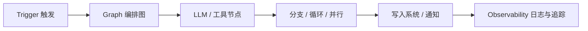

# 什么是 WorkFlow（AI 工作流）

> 一句话定义：WorkFlow 是用可视化或声明式编排，把 LLM、工具与业务系统串成可触发、可观测、可复用流水线的范式。

## 1. 定义

在 AI 应用语境下， **WorkFlow（工作流）** 指：

- 用 **节点（Node）** 表示一步操作（调模型、查库、HTTP、条件分支、代码块等）；
- 用 **边（Edge）** 表示数据与控制流；
- 由 **触发器（Trigger）** 启动整条流水线；
- 在运行时维护 **状态/变量** ，把中间结果传到下游节点。

它更接近「自动化流水线 + LLM 能力」，而不是「会聊天的助手」。

常见产品形态：

| 形态 | 说明 | 代表 |
|------|------|------|
| 通用自动化 + AI 节点 | iPaaS/自动化平台接入 LLM | n8n、Make、Zapier |
| AI 原生编排平台 | 专为 LLM 应用设计的 Workflow | Dify Workflow、FastGPT Workflow |
| LLM 画布 / 低代码 Agent | 偏 RAG/Agent 链路可视化 | Flowise、Langflow |
| 代码级图编排 | 用代码定义状态图 | LangGraph、Temporal + LLM |

## 2. 核心组件

1. **Trigger** ：Webhook、定时 Cron、消息队列、表单提交、上游系统事件。
2. **Nodes** ：LLM、Prompt、HTTP、数据库、代码、邮件、IM、向量检索等。
3. **Control Flow** ：条件分支、循环、并行、错误重试、人工审批（Human-in-the-loop）。
4. **State / Variables** ：节点间传参、会话外状态、密钥与环境变量。
5. **Runtime** ：执行引擎、队列、超时、重试、幂等。
6. **Observability** ：运行日志、token 用量、失败告警、回放。

## 3. 典型工作流程

1. **触发** ：例如「新工单创建」Webhook。
2. **准备上下文** ：拉取工单详情、历史记录、知识库检索。
3. **LLM 处理** ：分类、摘要、生成回复草稿或结构化字段。
4. **业务动作** ：写回 CRM、通知负责人、创建子任务。
5. **收尾** ：记录结果、失败重试或转人工。

## 4. 与相关概念的边界

| 概念 | 关系 | 差异 |
|------|------|------|
| **ChatFlow** | 同属「编排」，交互形态不同 | ChatFlow 围绕多轮对话与会话状态；WorkFlow 围绕任务触发与流水线 |
| **Agent** | WorkFlow 可内嵌 Agent 节点 | Agent 强调自主循环与动态选工具；WorkFlow 更强调预定义路径与可控性 |
| **RAG** | 常作为 WorkFlow 中的一段子链路 | RAG 解决「知识注入」；WorkFlow 解决「端到端自动化」 |
| **传统 BPM / iPaaS** | 能力重叠 | AI WorkFlow 把 LLM 当作一等公民节点，支持 Prompt、工具调用、结构化输出 |

**选型直觉** ：

- 路径相对固定、要可控可审计 → 优先 WorkFlow。
- 路径高度动态、需模型自主决策 → 优先 Agent（或 WorkFlow 内嵌 Agent 节点）。
- 面向终端用户多轮问答 → 优先 ChatFlow。

## 5. 适用场景

- 内容生产流水线：采集 → 清洗 → 生成 → 审核 → 发布
- 运营自动化：线索评分、工单分流、日报汇总
- 数据管道：ETL + LLM 抽取/标注
- 内部集成：把 CRM、飞书/Slack、数据库、邮件串起来
- 批处理任务：定时对一批文档做摘要/分类

## 6. 优点与局限

### 优点

- **可控** ：路径可视化，分支与权限清晰。
- **可复用** ：模板化后可在多业务线复制。
- **易集成** ：与现有 SaaS/API 生态结合紧密。
- **可观测** ：比黑盒 Agent 更容易排查与审计。

### 局限

- **灵活性有限** ：未预见的分支要改图，不如 Agent 动态。
- **图复杂度爆炸** ：节点过多时难维护。
- **模型不确定性** ：仍需处理幻觉、超时、结构化解析失败。
- **成本** ：长链路多次调模型，token 与延迟需治理。

## 7. 设计要点

1. **先画业务路径，再挂 LLM** ：不要一上来堆模型节点。
2. **结构化输出优先** ：JSON Schema / 函数调用，减少自由文本解析。
3. **失败可恢复** ：重试、死信队列、人工兜底。
4. **密钥与权限分离** ：模型节点最小权限访问业务系统。
5. **把「对话」和「流水线」拆开** ：用户聊天走 ChatFlow，后台任务走 WorkFlow。

## 8. 学习要点

- WorkFlow = Trigger + Graph + Runtime + Observability。
- 与 ChatFlow、Agent 是互补关系，不是互相替代。
- 选型时先问：触发方式是什么？路径固定吗？要不要人在环上？

## 9. 参考资料

- Dify 文档：Chatflow vs Workflow 概念区分
- n8n 官方文档：Workflow、AI nodes
- Anthropic：《Building Effective Agents》（工作流 vs Agent 的取舍）
- 本仓库：[ChatFlow 知识库](../ChatFlow/README.md)、[Agent 设计模式](../Agent设计模式/README.md)
