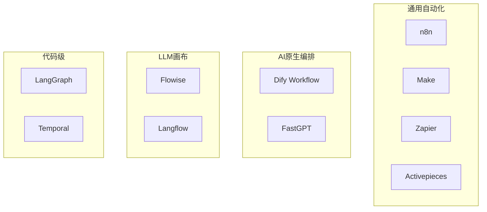

# WorkFlow 主流工具全景

> 一句话定义：盘点当前主流 AI / 自动化工作流工具的定位、特点与选型建议。

## 1. 工具地图

| 工具 | 类型 | 开源 | 一句话定位 | 更适合 |
|------|------|------|-----------|--------|
| **n8n** | 通用自动化 + AI | 是（可自托管） | 开发者友好的工作流自动化 | 自托管集成、复杂分支、AI Agent 节点 |
| **Dify Workflow** | AI 原生编排 | 是 | LLM 应用平台中的后台流水线 | RAG/Agent 应用的批处理与编排 |
| **Make** | 通用自动化 | 否（SaaS） | 可视化场景自动化 | 非研发快速集成 SaaS |
| **Zapier** | 通用自动化 | 否（SaaS） | 海量 App 连接器 | 轻量触发式自动化、生态优先 |
| **Flowise** | LLM 画布 | 是 | 拖拽式 LangChain 编排 | 快速搭 RAG/Agent 原型 |
| **Langflow** | LLM 画布 | 是 | 可视化 LLM 流水线 | 实验与教学、组件化拼装 |
| **Activepieces** | 通用自动化 | 是 | 开源 Zapier 替代 | 自托管、插件扩展 |
| **Windmill** | 脚本/工作流平台 | 是 | 以代码为中心的自动化 | 工程团队、脚本编排 |
| **LangGraph** | 代码级图编排 | 是 | 状态图 Agent/工作流 | 生产级可控 Agent |
| **Temporal** | 工作流引擎 | 是 | 可靠长时运行工作流 | 需要强一致性/长任务的后端 |

## 2. 重点工具说明

### 2.1 n8n

- **定位** ：开源工作流自动化平台，近年大力补齐 AI 能力（AI Agent、LangChain 节点、向量库等）。
- **特点** ：
  - 自托管友好，数据可控。
  - 节点生态丰富（HTTP、数据库、IM、云服务）。
  - 支持 Code 节点，工程可扩展性强。
  - 可把 LLM 当作普通节点嵌入既有自动化。
- **典型场景** ：Webhook 接入 → 检索知识 → LLM 生成 → 写回业务系统。
- **注意** ：复杂 Agent 循环要自己设计护栏；权限与密钥管理需按生产标准建设。

### 2.2 Dify Workflow

- **定位** ：Dify 平台中的 **Workflow** 应用类型，面向非对话的编排与批处理（与 Chatflow 并列）。
- **特点** ：
  - 内置 LLM、知识库、工具、代码、HTTP、迭代等节点。
  - 与 Dify 的模型管理、RAG、工具生态一体。
  - 适合「已用 Dify 做应用，再补后台流水线」。
- **典型场景** ：文档入库流水线、批量摘要、定时运营任务、被 API 调用的编排服务。
- **注意** ：对话型产品应优先用 Dify Chatflow；后台任务才用 Workflow。

### 2.3 Make（原 Integromat）

- **定位** ：SaaS 可视化自动化，场景（Scenario）编排能力强。
- **特点** ：UI 成熟、模块多；适合业务侧快速连通多系统。
- **局限** ：深度定制与自托管弱于 n8n；AI 能力多依赖外部 LLM 模块。

### 2.4 Zapier

- **定位** ：连接器生态最广的自动化 SaaS。
- **特点** ：Zap + AI Actions / Chatbots 等能力，上手极快。
- **局限** ：复杂分支与成本控制在大规模场景下需仔细评估；不适合强数据主权场景。

### 2.5 Flowise

- **定位** ：基于 LangChain 的低代码可视化搭建器。
- **特点** ：拖拽快速拼 RAG、Agent、工具调用；适合原型与 PoC。
- **局限** ：复杂生产治理（版本、权限、可观测）通常还要二次建设。

### 2.6 Langflow

- **定位** ：开源可视化 LLM 应用构建器，组件化拼装 Prompt/模型/检索/Agent。
- **特点** ：实验友好、社区活跃；可导出/对接代码侧。
- **局限** ：与 Flowise 类似，偏「搭链路」而非「企业自动化 iPaaS」。

### 2.7 Activepieces / Windmill

- **Activepieces** ：开源自动化，强调插件与自托管，Zapier 替代选项。
- **Windmill** ：以脚本（TS/Python 等）+ 工作流为核心，适合工程团队把内部脚本产品化。

### 2.8 代码级：LangGraph / Temporal

- **LangGraph** ：把流程建成显式状态图，适合需要精细控制、人在环上、持久化的 Agent/工作流。
- **Temporal** ：经典可靠工作流引擎，适合长时任务、重试与补偿；AI 能力需自行接入 LLM SDK。

> 代码级方案不替代 n8n/Dify 的低代码价值，而是在「要强工程可控」时的下一档选择。详见 [主流框架对比](../Agent开发知识/10-框架与工具/01-主流框架对比.html)。

## 3. 横向对比维度

| 维度 | 关注点 |
|------|--------|
| 部署形态 | SaaS / 自托管 / 混合 |
| 触发能力 | Webhook、Cron、队列、App 事件 |
| AI 深度 | 是否一等公民支持 Prompt、工具调用、RAG、Agent |
| 集成广度 | 现成连接器数量 vs 自定义 HTTP/代码 |
| 可观测性 | 运行历史、token、告警、回放 |
| 协作与权限 | 多环境、角色、审计 |
| 扩展方式 | 自定义节点 / 插件 / SDK |
| 成本模型 | 按执行次数、按座位、按基础设施 |

## 4. 选型建议

| 你的情况 | 更推荐 |
|----------|--------|
| 要自托管、集成多系统、团队会写一点代码 | **n8n** |
| 已在 Dify 体系内，要做后台编排/批处理 | **Dify Workflow** |
| 业务同学主导、快速连 SaaS | **Make / Zapier** |
| 快速验证 RAG/Agent 链路 | **Flowise / Langflow** |
| 生产级复杂 Agent，要代码可控 | **LangGraph** |
| 长时可靠任务 + 自研编排 | **Temporal + LLM SDK** |
| 开源 Zapier 替代 | **Activepieces** |

## 5. 实践建议

1. **PoC 用低代码，生产再评估是否下沉代码级** 。
2. **把 LLM 节点当「不可靠步骤」设计** ：校验输出、重试、降级。
3. **对话入口与后台流水线拆分** ：ChatFlow 收请求，WorkFlow 做事。
4. **统一密钥与模型网关** ：避免每个工具各配一套 Key。
5. **先度量再优化** ：记录每条链路的延迟、成功率、token。

## 6. 后续文档计划

- n8n：安装、AI Agent 节点、与知识库联调
- Dify Workflow：节点手册、API 触发、与 Chatflow 协作
- Flowise / Langflow：RAG 画布实战
- 与 LangGraph 的边界与迁移路径

## 7. 参考资料

- [n8n](https://n8n.io/)
- [Dify](https://dify.ai/)
- [Make](https://www.make.com/)
- [Zapier](https://zapier.com/)
- [Flowise](https://flowiseai.com/)
- [Langflow](https://www.langflow.org/)
- [Activepieces](https://www.activepieces.com/)
- [Windmill](https://www.windmill.dev/)
- 本仓库：[什么是 WorkFlow](00-什么是WorkFlow.html)、[ChatFlow 主流工具](../ChatFlow/01-主流工具全景.html)
